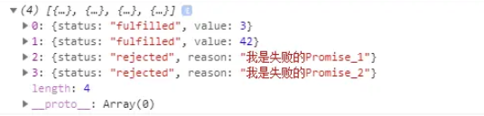
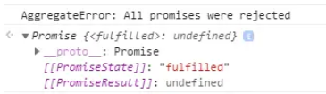

# ES6

## 1 let关键字

1. 语法 `let 变量名`
2. 变量不能重复声明
3. 块级作用域，声明的变量只在代码块里有用
4. 不存在变量提升
5. 不影响作用域链

## 2 const关键字

1. 声明值不能修改的量
2. 语法 `const 变量名=初始值`
3. 声明时必须赋初始值
4. 一般常量使用大写
5. 常量值不能修改
6. 块级作用域
7. 对于数组和对象的元素修改，不算对常量的修改，不会报错

## 3 变量解构赋值

1. 允许按照一定模式从数组和对象中提取值，对变量进行赋值
2. 数组解构 `let [zero,one,two.three] = [0,1,2,3]`
3. 对象解构

```javascript
const sample ={
    name:'sample',
    age:15,
    log:function(){
        console.log('234445')
    }
};
let {name,age,log}= sample;
```

## 4 模板字符串

1. 新的声明字符串的方式 let str = `字符串`
2. 内容里可以直接出现换行符
3. 可以直接进行变量拼接 let out = `${str}其他字符串`

## 5 简化对象

1. ES6允许在大括号里直接写入变量和函数，作为对象的属性和方法
2. 语法

```javascript
let name = '学校'
let change = function(){
    console.log(111111)
}
const school = {
    name,
    change,
    improve(){
        console.log("简化对象里声明函数的语法")
    }
}
```

## 6 箭头函数

1. ES6允许使用箭头定义函数
2. 语法 `let fn = (形参) => {代码体}`
3. 箭头函数this是静态的，this始终指向函数声明时所在作用域下的this值，不可被改变
4. 可以使用call方法调用，但箭头函数this不能被改变
5. 箭头函数不能作为构造实例化对象
6. 不能使用arguments变量
7. 箭头函数简写
   * 省略小括号，当形参有且只有一个式可以省略 `let fn = n =>{return n+n}`
   * 省略花括号，当代码体只有一条语句 `let fn =(n) => n*n`
8. 箭头函数适合与this无关的回调
9. 箭头函数不适合与this有关的回调，比如事件回调，对象方法

## 7 函数参数默认值

1. 形参初始值，具有默认值的参数一般位置要靠后 `function add(a,b,c=10){}`，放在前面会导致后面的没有默认值的形参在实参个数<形参个数的时候接收不到实参
2. 与解构赋值结合

```javascript
function connect({host="localhost",username,password,port}){

}
connect({
    username:'root',
    password:'root',
    port:3306
})
```

## 8 扩展运算符

1. `...`扩展运算符能将数组转换为逗号分割的参数序列
2. 运用于数组的合并
3. 运用于数组的克隆，拷贝的内容有引用数据的话是浅拷贝
4. 将伪数组转为真正的数组

```javascript
const front = ['1','2']
const end = ['3','4']
const total = [...front,...end]
const copy = [...total]
```

## 9 Symbol数据类型

1. ES6引入了一种新的原始数据类型Symbol，来表示独一无二的值
2. 特点
   1. Symbol的值是唯一的，用来解决命名冲突的问题
   2. Symbol值不能与其他数据进行运算
   3. Symbol定义的对象属性不能使用for...in循环遍历，但可以使用Reflect.ownKeys来获取对象的所有键名
3. 创建Symbol

```javascript
let s = Symbol()
let s2 = Symbol('123')
let s3 = Symbol('123')
//s2 != s3
let s4 = Symbol.for('123')
let s5 = Symbol.for('123')
//s4 === s5
```

4. 运用向对象添加方法，安全且快速，不会破坏原有属性

```javascript
let game = {
    //此处省略很多，不确定是否有想要添加的同名方法
    [Symbol('up')]: function(){
        console.log(11)
    }
}
let methods = {
    up: Symbol(),
    down:Symbol()
}
game[methods.up] = function(){}
game[methods.down] = function(){}
```

5. Symbol内置值：控制对象在特定场景下的属性

```javascript
//hasInstance
class Person{
    static [Symbol.hasInstance](param){
        console.log(param); //输出o的内容：{}
        return true;
    }
}
let o = {};
console.log(o instanceof Person); //输出前面你return的内容：true

//isConcatSpreadable
const arr = [1,2,3]
const arr2 = [4,5,6]
console.log(arr.concat(arr2)) //输出[1,2,3,4,5,6]
arr2[Symbol.isConcatSpreadable] = false
console.log(arr.concat(arr2)) //输出[1,2,3,[4,5,6]]
```

## 10 模块化

支持export、import

## 11 promise

异步编程解决方案，链式调用，避免使用callback出现的回调地狱

## 12 迭代器

1. 迭代器（Iterator）是一种接口，任何数据结构只要部署Iterator接口就可以完成遍历操作
2. for of 循环，Iterator接口主要供for of消费
3. 原生具备Iterator接口的数据结构：Array、Arguments、Set、Map、String、TypedArray、NodeList

### 12.1 for of使用

```javascript
const arr = ['一号','三号','二号']
for(let v of arr){
    console.log(v) //输出'一号' '三号' '二号'
}
```

### 12.2 工作原理

1. 创建一个指针对象，指向当前数据结构的起始位置；
2. 第一次调用对象的 next 方法，指针自动指向数据结构的第一个成员；
3. 接下来不断调用 next 方法，指针一直往后移动，直到指向最后一个成员；
4. 每调用 next 方法返回一个包含 value 和 done 属性的对象；

# ES7（2016）

## 1 Array.prototype.includes()

判断一个数组是否包含一个指定的值，如果包含则返回 true，否则返回false

## 2 指数运算符 **

a ** b 与 Math.pow(a, b)相同

# ES8 (2017)

## 1 async/await

promise的同步写法

## 2 Object.values()

遍历对象的值

## 3 Object.entries()

返回一个给定对象自身可枚举属性的键值对的数组

## 4 String padding

```js
// padStart
'hello'.padStart(10); // "     hello"
// padEnd
'hello'.padEnd(10) //"hello     "
```

## 5 函数参数列表结尾允许逗号

## 6 Object.getOwnPropertyDescriptors()

获取一个对象的所有自身属性的描述符,如果没有任何自身属性，则返回空对象

# ES9（2018）

## 1 异步迭代

```js
//在同步循环中调用异步函数，不会正常运行
async function process(array){
  for(let i of array){
    await do Something(i);
  }
}

//异步迭代器，支持以串行的方式执行异步操作
async function process(array) {
  for await (let i of array) {
    doSomething(i);
  }
}
```

## 2 Promise.finally()

无论Promise运行成功还是失败，最后都能运行相同的代码

## 3 rest参数

1. ES5中获取实参通过arguments，返回的是对象
2. 使用rest参数，需要写形参，返回的是数组

```javascript
function date5(){
    console.log(arguments)
}
date5('1','2','3')
function date6(...args){
    console.log(args)
}
date6('1','2','3')
```

3. rest参数必须要放在形参的最后

# ES10（2019）

## 1 Array的flat()方法和flatMap()方法

flat() 展开多重数组

flatMap() 首先使用映射函数映射每个元素，然后将结果压缩成一个新数组。它与 map 和 深度值1的 flat 几乎相同，但效率稍高

本质上就是是归纳（reduce） 与 合并（concat）的操作

## 2 String的trimStart()方法和trimEnd()方法

分别去除字符串首尾空白字符

# ES11（2020）

## 1 Nullish coalescing Operator(空值处理)

表达式在 ?? 的左侧 运算符求值为undefined或null，返回其右侧。

```js
let user = {
    u1: 0,
    u2: false,
    u3: null,
    u4: undefined
    u5: '',
}
let u2 = user.u2 ?? '用户2'  // false
let u3 = user.u3 ?? '用户3'  // 用户3
let u4 = user.u4 ?? '用户4'  // 用户4
let u5 = user.u5 ?? '用户5'  // ''
```

## 2 Optional chaining（可选链）

?. 用户检测不确定的中间节点

```js
let user = {}
let u1 = user.childer.name // TypeError: Cannot read property 'name' of undefined
let u1 = user.childer?.name // undefined
```

## 3 Promise.allSettled

返回一个在所有给定的promise已被决议或被拒绝后决议的promise，并带有一个对象数组，每个对象表示对应的promise结果

```js
const promise1 = Promise.resolve(3);
const promise2 = 42;
const promise3 = new Promise((resolve, reject) => reject('我是失败的Promise_1'));
const promise4 = new Promise((resolve, reject) => reject('我是失败的Promise_2'));
const promiseList = [promise1,promise2,promise3, promise4]
Promise.allSettled(promiseList)
.then(values=>{
  console.log(values)
});
```



## 4 新的基本数据类型BigInt

## 5 import()

按需导入

## 6 globalThis

* 浏览器：window
* worker：self
* node：global

# ES12（2021）

## 1 replaceAll

返回一个全新的字符串，所有符合匹配规则的字符都将被替换掉

```js
const str = 'hello world';
str.replaceAll('l', ''); // "heo word"
```

## 2 Promise.any

Promise.any() 接收一个Promise可迭代对象，只要其中的一个 promise 成功，就返回那个已经成功的 promise 。如果可迭代对象中没有一个 promise 成功（即所有的 promises 都失败/拒绝），就返回一个失败的 promise

```js
const promise1 = new Promise((resolve, reject) => reject('我是失败的Promise_1'));
const promise2 = new Promise((resolve, reject) => reject('我是失败的Promise_2'));
const promiseList = [promise1, promise2];
Promise.any(promiseList)
.then(values=>{
  console.log(values);
})
.catch(e=>{
  console.log(e);
});
```



## 3. WeakRefs

使用WeakRefs的Class类创建对对象的弱引用(对对象的弱引用是指当该对象应该被GC回收时不会阻止GC的回收行为)

## 4. 逻辑运算符和赋值表达式结合

逻辑运算符和赋值表达式，新特性结合了逻辑运算符（&&，||，??）和赋值表达式，JavaScript已存在的复合赋值运算符有：

```js
a ||= b
//等价于
a = a || (a = b)

a &&= b
//等价于
a = a && (a = b)

a ??= b
//等价于
a = a ?? (a = b)
```

## 5. 数字分隔符

数字分隔符，可以在数字之间创建可视化分隔符，通过_下划线来分割数字，使数字更具可读性

```js
const money = 1_000_000_000;
//等价于
const money = 1000000000;

1_000_000_000 === 1000000000; // true
```

# ES13(2022)

## 1 Top-level Await（顶级 await）

await外面不用包async

## 2 Object.hasOwn()

比 `Object.hasOwnProperty.call(object, key)` 更简洁、更可靠的检查属性是否直接设置在对象上的方法

## 3 at()

向所有基本可索引类（Array、String、TypedArray）添加 .at() 方法

## 4 类class

### 公共属性

不用写constructor直接写属性

### 私有属性和方法

属性和方法前加 #

# ES14(2023)

## 1 由后往前查找数组的方法：findLast() 和 findLastIndex()

`find()` 和 `findIndex` 会是从数组开头开始找寻符合条件的元素，而 `findLast()` 和 `findLastIndex()` 这两个新的数组方法是从数组的尾部开始查找元素

* `findLast()` 方法返回该元素的值 / `undefined`
* `findLastIndex()` 返回从尾部查找中符合条件的第一个元素的索引 /  -1

## 2 新增 4 个不改动原数组的操作方法

ES2023 引入了四种新的数组操作方法，这些方法不会修改原始数组，而是会返回一个原始数组的拷贝。

* `toReversed()`：将数组中的元素反转（相对应会改变数组的方法：`reverse()`）
  ```js
  const numbers =[1,2,3,4,5];

  // 反转数组
  const reversedNumbers = numbers.toReversed();
  console.log(reversedNumbers);// Output: [5, 4, 3, 2, 1]
  ```
* `toSorted(fn)`：将数组中的元素排序（相对应会改变数组的方法：`sort()`）
  ```js
  const numbers =[1,2,3,4,5];

  // 将数组排序
  const sortedNumbers = numbers.toSorted();
  console.log(sortedNumbers);// Output: [1, 2, 3, 4, 5]
  ```
* `toSpliced(start, deleteCount, ...items)`：从数组中指定位置开始删除指定数量的元素，并可选择在删除后新增新元素（相对应会改变数组的方法：`splice()`）
  ```js
  const numbers =[1,2,3,4,5];

  // 删除从数组中索引 2 开始两个元素 - 2 和 3，并在删除后新增 10 和 20
  const splicedNumbers = numbers.toSpliced(1,2,10,20);
  console.log(splicedNumbers);// Output:  [1, 10, 20, 4, 5]
  ```
* `with(index, value)`：将数组索引处的值，替换为新值
  ```js
  const fruits =["Apple","Orange","Lemon","Mango","Cherry"];

  // 将 fruits 数组索引 2 的值 "Lemon" 替换为 10
  const newFruits = fruits.with(2,"Watermelon");
  console.log(newFruits);
  // Output: ['Apple', 'Orange', 'Watermelon', 'Mango', 'Cherry']
  ```

## 3 Hashbang 语法（Hashbang Grammar）

Hashbang 注释是一种特殊的注释语法，它会以 `#!` 开头，后面仅跟着解释器(interpreter) 的路径，并且只会在脚本或是模组的最开始有效。以下方代码为例，这段代码是告诉系统，用 Node.js 来执行文件：

```js
#!/usr/bin/env node

console.log("Hello world");
```

## 4 WeakMap 新增支持 Symbol 作为键名 (key)

WeakMap 是一种与 Map 相似的资料结构，用于储存键值对（key-value pair）。两者的主要差别在于：

* Map 的键名可以是任何数据类型
* ES2023 之前，WeakMap 的键名必须是对象; ES2023 允许 WeakMap 使用 Symbol 作为键名

# ES15(2024)

## 1 Object.groupBy、Map.groupBy

分组（将lodash里的方法变为原生方法）

```js
//Math.sign() 方法用于判断一个数的符号，即正负性
Object.groupBy([0, -5, 3, -4, 8, 9], x => Math.sign(x)) 
```

## 2 Promise.withResolvers

把 Promise实例、resolve、reject 解构出来供我们使用

```js
const { promise, resolve, reject } = Promise.withResolvers();
```

## 3 String.prototype.isWellFormed、String.prototype.toWellFormed

JavaScript 中的字符串是 `UTF-16`编码的

`isWellFormed()` 测试一个字符串是否是格式正确的

 `toWellFormed()`将字符串转换为格式正确的字符串

## 4 Atomics.waitAsync()

## 5 正则表达式 /v 标识

在 JavaScript 中，使用 "u" 标志的正则表达式进入 Unicode 模式，它扩展了正则表达式的处理能力以包含 Unicode 序列，而非仅限于 ASCII 字符集

RegExp v 标志是 u 标志的超集，并提供了另外两个功能：

* 字符串的 Unicode 属性：通过 Unicode 属性转义，可以使用字符串的属性。
* 设置符号：允许在字符类之间进行集合操作。
