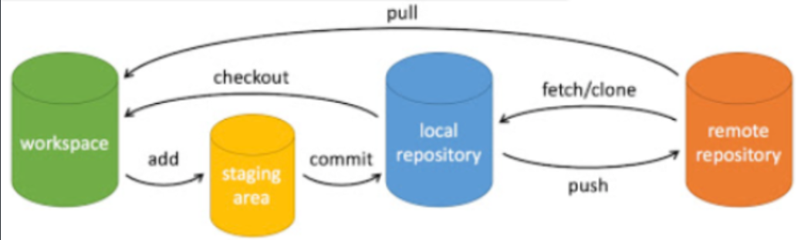

# Git命令

工作区 - 暂存区 - 本地仓库 - 远程仓库

add\commit\push

pull\clone\checkout

branch-创建or列出or删除(-d)分支\checkout-切换分支or放弃修改\merge-合并分支\rebase-改变基底，变成一条线

reset-回退版本(后面提交的版本会删除)\revert-反做(修改之前版本不影响已提交版本)

**git clone、fetch**、**pull**的区别：

1. git clone：用于拷贝远程仓库到本地，复制下来是整个版本库
2. git fetch：相当于是从远程获取最新版本的代码到本地，不会自动合并
3. git pull：相当于是从远程获取最新版本并merge到本地，git pull = git fetch + git merge

### 创建仓库命令

| 命令               | 说明                                                                                                                               |
| :----------------- | :--------------------------------------------------------------------------------------------------------------------------------- |
| `git init`       | 初始化仓库，在当前目录新建一个Git代码库，基本上是创建一个具有 `objects`，`refs/head`，`refs/tags`和模板文件的 `.git`目录。 |
| `git clone`[url] | 拷贝一份**远程仓库** ，也就是下载一个项目和它的整个代码历史。                                                                |

### 配置

| 命令                                                                                         | 说明                               |
| :------------------------------------------------------------------------------------------- | :--------------------------------- |
| `git config --list`                                                                        | 显示当前的**Git配置**        |
| git config -e [--global]                                                                     | 编辑Git配置文件。                  |
| git config [--global] user.name "[name]"``git config [--global] user.email "[email address]" | 设置提交代码时的**用户信息** |

### 增加 / 删除文件

| 命令                                  | 说明                                                                                |
| :------------------------------------ | :---------------------------------------------------------------------------------- |
| `git add [file1] [file2] ...`       | 添加**指定文件**到暂存区                                                      |
| git add [dir]                         | 添加**指定目录**到暂存区，包括子目录                                          |
| git add .                             | 添加当前目录的**所有文件**到暂存区                                            |
| git add -p                            | 添加每个变化前，都会要求确认`` 对于同一个文件的多处变化，可以实现**分次提交** |
| git rm [file1] [file2] ...            | **删除**工作区文件，并且将这次删除放入暂存区                                  |
| git rm --cached [file]                | 停止追踪指定文件，但该文件会保留在工作区                                            |
| git mv [file-original] [file-renamed] | **改名**文件，并且将这个改名放入暂存区                                        |

### 代码提交

| 命令                                        | 说明                                                                                         |
| :------------------------------------------ | :------------------------------------------------------------------------------------------- |
| `git commit -m [message]`                 | 提交暂存区到仓库区                                                                           |
| git commit [file1] [file2] ... -m [message] | 提交暂存区的**指定文件**到仓库区                                                       |
| git commit -a                               | 提交工作区**自上次commit之后**的变化，直接到仓库区                                     |
| git commit -v                               | 提交时显示**所有diff信息**                                                             |
| git commit --amend -m [message]             | 使用一次新的commit，替代上一次提交``如果代码没有任何新变化，则用来改写上一次commit的提交信息 |
| git commit --amend [file1] [file2] ...      | **重做上一次commit** ，并包括指定文件的新变化                                          |

### 分支

| 命令                                                                       | 说明                                         |
| :------------------------------------------------------------------------- | :------------------------------------------- |
| git branch                                                                 | 列出所有**本地分支**                   |
| git branch -r                                                              | 列出所有**远程分支**                   |
| git branch -a                                                              | 列出所有本地分支和**远程分支**         |
| git branch [branch-name]                                                   | 新建一个分支，但依然停留在当前分支           |
| git checkout -b [branch]                                                   | 新建一个分支，并切换到该分支                 |
| git branch [branch] [commit]                                               | 新建一个分支，指向指定commit                 |
| git branch --track [branch] [remote-branch]                                | 新建一个分支，与指定的远程分支建立追踪关系   |
| git checkout [branch-name]                                                 | 切换到指定分支，并更新工作区                 |
| git checkout -                                                             | **切换**到上一个分支                   |
| git branch --set-upstream [branch] [remote-branch]                         | 建立追踪关系，在现有分支与指定的远程分支之间 |
| git merge [branch]                                                         | **合并**指定分支到当前分支             |
| git cherry-pick [commit]                                                   | 选择一个commit，合并进当前分支               |
| git branch -d [branch-name]                                                | **删除分支**                           |
| git push origin --delete [branch-name]``或``git branch -dr [remote/branch] | **删除远程分支**                       |

### 标签

| 命令                                 | 说明                      |
| :----------------------------------- | :------------------------ |
| git tag                              | 列出所有tag               |
| git tag [tag]                        | 新建一个tag在当前commit   |
| git tag [tag] [commit]               | 新建一个tag在指定commit   |
| git tag -d [tag]                     | 删除**本地tag**     |
| git push origin :refs/tags/[tagName] | 删除**远程tag**     |
| git show [tag]                       | 查看tag信息               |
| git push [remote] [tag]              | 提交**指定tag**     |
| git push [remote] --tags             | 提交**所有tag**     |
| git checkout -b [branch] [tag]       | 新建一个分支，指向某个tag |

### 查看信息和历史

| 命令                                                | 说明                                                       |
| :-------------------------------------------------- | :--------------------------------------------------------- |
| git status                                          | 显示有变更的文件                                           |
| git log                                             | 显示当前分支的版本历史                                     |
| git log --stat                                      | 显示commit历史，以及每次commit发生变更的文件               |
| git log -S [keyword]                                | 搜索提交历史，根据关键词                                   |
| git log [tag] HEAD --pretty=format:%s               | 显示某个commit之后的所有变动，每个commit占据一行           |
| git log [tag] HEAD --grep feature                   | 显示某个commit之后的所有变动，其"提交说明"必须符合搜索条件 |
| git log --follow [file]``或``git whatchanged [file] | 显示某个文件的版本历史，包括文件改名                       |
| git log -p [file]                                   | 显示指定文件相关的每一次diff                               |
| git log -5 --pretty --oneline                       | 显示过去5次提交                                            |
| git shortlog -sn                                    | 显示所有提交过的用户，按提交次数排序                       |
| git blame [file]                                    | 显示指定文件是什么人在什么时间修改过                       |
| git diff                                            | 显示**暂存区和工作区**的差异                         |
| git diff --cached [file]                            | 显示**暂存区和上一个commit**的差异                   |
| git diff HEAD                                       | 显示**工作区与当前分支最新commit之间**的差异         |
| git diff [first-branch]...[second-branch]           | 显示**两次提交之间**的差异                           |
| git diff --shortstat "@{0 day ago}"                 | **显示今天你写了多少行代码**                         |
| git show [commit]                                   | 显示某次提交的元数据和内容变化                             |
| git show --name-only [commit]                       | 显示某次提交发生变化的文件                                 |
| git show [commit]:[filename]                        | 显示某次提交时，某个文件的内容                             |
| git reflog                                          | 显示当前分支的最近几次提交                                 |

### 远程同步

| 命令                                                                                         | 说明                                                            |
| :------------------------------------------------------------------------------------------- | :-------------------------------------------------------------- |
| git fetch [remote]                                                                           | 下载远程仓库的所有变动（**远程新增或删除分支都能显示** ） |
| git remote -v                                                                                | 显示**所有远程仓库**                                      |
| git config [--global] user.name "[name]"``git config [--global] user.email "[email address]" | 设置提交代码时的用户信息                                        |
| git remote show [remote]                                                                     | 显示某个远程仓库的信息                                          |
| git remote add [shortname] [url]                                                             | 增加一个新的远程仓库，并命名                                    |
| git pull [remote] [branch]                                                                   | 取回远程仓库的变化，并与本地分支合并                            |
| git push [remote] [branch]                                                                   | 上传本地指定分支到远程仓库                                      |
| git push [remote] --force                                                                    | 强行推送当前分支到远程仓库，即使有冲突                          |
| git push [remote] --all                                                                      | 推送所有分支到远程仓库                                          |

### 撤销

| 命令                         | 说明                                                                                 |
| :--------------------------- | :----------------------------------------------------------------------------------- |
| `git checkout [file]`      | 恢复暂存区的指定文件到工作区                                                         |
| git checkout [commit] [file] | 恢复某个commit的指定文件到暂存区和工作区                                             |
| git checkout .               | 恢复暂存区的所有文件到工作区                                                         |
| git reset [file]             | 重置暂存区的指定文件，与上一次commit保持一致，但工作区不变                           |
| git reset --hard             | 重置暂存区与工作区，与上一次commit保持一致                                           |
| git reset [commit]           | 重置当前分支的指针为指定commit，同时重置暂存区，但工作区不变                         |
| git reset --hard [commit]    | 重置当前分支的HEAD为指定commit，同时重置暂存区和工作区，与指定commit一致             |
| git reset --keep [commit]    | 重置当前HEAD为指定commit，但保持暂存区和工作区不变                                   |
| git revert [commit]          | 新建一个commit，用来撤销指定commit``后者的所有变化都将被前者抵消，并且应用到当前分支 |
| git stash                    | 暂时将未提交的变化移除，稍后再移入                                                   |
| git stash pop                | 暂时将未提交的变化移除，稍后再移入                                                   |

### 其他

| 命令                      | 说明                                                                                                                                                   |
| :------------------------ | :----------------------------------------------------------------------------------------------------------------------------------------------------- |
| git archive               | 生成一个可供发布的压缩包                                                                                                                               |
| git repack                | 打包未归档文件                                                                                                                                         |
| git count-objects         | 计算解包的对象数量                                                                                                                                     |
| git help ``或``git --help | **Git帮助** ，查看git相关命令，如果想看某个特定命令的具体细节，可使用git [命令] --help,如 **git commit --help** 表示查看提交相关命令的帮助 |
