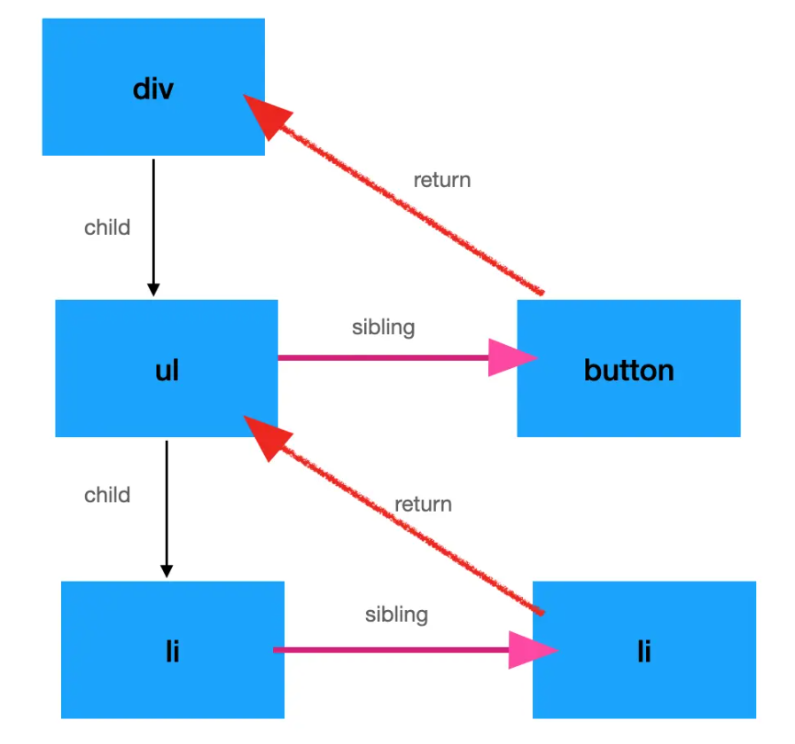

# React基础知识汇总

## 1. React的理解

### 1.1 什么是react

**由facebook开源的解决前端视图层的轻量级js库**

### 1.2 React特点

**声明式编码、组件化编码、高效虚拟dom的diff算法、react native移动端应用**

### 1.3 JSX语法

**jsx语法规则：**

    1.通过标签定义虚拟DOM，而不是引号。

    2.**标签中混入JS表达式时要用{}**

    3.样式的类名指定不要用class，要用**className**。

    4.内联样式，要用style=key:value的形式去写。

    5.只有一个根标签

    6.标签必须闭合

    7.标签首字母

    (1).若小写字母开头，则将该标签转为html中同名元素，若html中无该标签对应的同名元素，则报错。

    (2).若大写字母开头，react就去渲染对应的组件，若组件没有定义，则报错。

    8.浏览器不能直接解析JSX，需使用**babel** 将其转译成js

**jsx**创建虚拟dom：

```js
//1.创建虚拟DOM
const VDOM = (
    <div>
        <h2 className="title" id={myId.toLowerCase()}>
            <span style={{color:'white',fontSize:'29px'}}>{myData.toLowerCase()}</span>
        </h2>
        <h2 className="title" id={myId.toUpperCase()}>
            <span style={{color:'white',fontSize:'29px'}}>{myData.toLowerCase()}</span>
        </h2>
        <input type="text"/>
        <ul>
            {
                data.map((item,index)=>{
                    return <li key={index}>{item}</li>
                })
            }
        </ul>
    </div>
)
//2.渲染虚拟DOM到页面
ReactDOM.render(VDOM,document.getElementById('test'))
```

**js**创建虚拟dom：

```js
//1.创建虚拟DOM
const VDOM = React.createElement('h1',{id:'title'},React.createElement('span',{},'Hello,React'))
//2.渲染虚拟DOM到页面
ReactDOM.render(VDOM,document.getElementById('test'))
```

### 1.4 虚拟dom（对象）

1.本质是Object类型的对象（一般对象），状态变更的时候，重新构造一棵新的对象树。然后用新的树和旧的树进行比较，记录
两棵树差异；  记录的差异应用到所构建的真正的 DOM 树上，视图就更新了 。

2.虚拟DOM比较“轻”，真实DOM比较“重”，因为虚拟DOM是React内部在用，无需真实DOM上那么多的属性。

3.虚拟DOM最终会被React转化为真实DOM，呈现在页面上。

4.渲染dom语法：**ReactDom.render(virtualDOM, containerDOM)**

5.key的重要性

- 旧虚拟DOM中找到了与新虚拟DOM**相同的key**：

  1. 若虚拟DOM中内容没变, 直接使用之前的真实DOM
  2. 若虚拟DOM中内容变了, 则生成新的真实DOM，随后替换掉页面中之前的真实DOM
- 旧虚拟DOM中未找到与新虚拟DOM相同的key

  1. 根据数据创建新的真实DOM，随后渲染到到页面

### 1.5 diff算法

- 把树形结构按照层级分解， **只比较同级元素**。
- 给列表结构的每个单元添加**唯一的 key 属性**， 方便比较。
- React 只会匹配**相同 class 的 component**（这里面的 class 指的是组件的名字）
- 合并操作， 调用 component 的 setState 方法的时候, **React 将其标记为 dirty**.到每一个事件循环结束, React 检查所有标记 dirty 的 component 重新绘制.
- **选择性子树渲染**。 开发人员可以重写 shouldComponentUpdate 提高 diff 的性能。  如果某个props或state改变了并不影响组件的渲染，那么这个时候是不需要重新渲染组件的。 就可以使用这个函数直接告诉 React， 省去 diff 操作， 进一步的提高了效率。

```js
class CounterButton extends React.Component {
    constructor(props) {
        super(props);
        this.state = {count: 1};
    }

    shouldComponentUpdate(nextProps, nextState) {
        if (this.props.color !== nextProps.color) { // 比较新旧props，决定是否重新渲染组件
            return true;
        }
        if (this.state.count !== nextState.count) {
            return true;
        }
        return false;
    }

    render() {
        return (
            <button color={this.props.color}
                    onClick={() => this.setState(state => ({count: state.count + 1}))}>
                    Count: {this.state.count}
            </button>
        );
    }
}
```

**流程**：把每⼀种节点类型抽象成对象，每⼀种节点类型有⾃⼰的属性，也就是prop，

1. 每次进⾏diff的时候， react会先⽐较该节点类型，假如节点类型不⼀样，那么react会直接删除该节点，然后直接创建新的节点插⼊到其中
2. 假如节点类型⼀样，那么会⽐较prop是否有更新，假如有prop不⼀样，那么react会判定该节点有更新，那么重渲染该节点
3. 然后在对其⼦节点进⾏⽐较，⼀层⼀层往下，直到没有⼦节点。

## 2. 组件式编程

### 2.1 类组件和函数组件

1. **函数组件**

   执行了ReactDOM.render(`<MyComponent/>`.......之后，发生了什么？

   1.React解析组件标签，找到了MyComponent组件。

   2.发现组件是使用函数定义的，**随后调用该函数**，将返回的虚拟DOM**转为真实DOM**，随后呈现在页面中。

   ```js
   //1.创建函数式组件
   function MyComponent(){
       console.log(this); //此处的this是undefined，因为babel编译后开启了严格模式
       return <h2>我是用函数定义的组件(适用于【简单组件】的定义)</h2>
   }
   //2.渲染组件到页面
   ReactDOM.render(<MyComponent/>,document.getElementById('test'))
   ```
2. **类组件**

   执行了ReactDOM.render(`<MyComponent/>`.......之后，发生了什么？

   1.React解析组件标签，找到了MyComponent组件。

   2.发现组件是使用类定义的，随后**new出来该类的实例**，并通过该实例调用到原型上的render方法。

   3.将render返回的虚拟DOM转为真实DOM，随后呈现在页面中。

   ```js
   //1.创建类式组件
   class MyComponent extends React.Component {
       render(){
           //render是放在哪里的？—— MyComponent的原型对象上，供实例使用。
           //render中的this是谁？—— MyComponent的实例对象 <=> MyComponent组件实例对象。
           console.log('render中的this:',this);
           return <h2>我是用类定义的组件(适用于【复杂组件】的定义)</h2>
       }
   }
   //2.渲染组件到页面
   ReactDOM.render(<MyComponent/>,document.getElementById('test'))
   ```
3. **区别**

   **类组件的不足：**

   1. 难以复用组件间状态逻辑：为了复用一点逻辑功能，要把整个组件类都进行继承，有些得不偿失
   2. 难以维护复杂组件：很多不相干的逻辑代码，放在同一个生命周期里面，或者说是在写某一个逻辑代码的时候，会写在不同的生命周期里，导致逻辑代码比较分散
   3. this指向问题：class 的方法默认不会绑定 this，当调用 class 的方法时 this 的值为 undefined，为了在方法中访问 this 则必须**在构造器中绑定**或**使用 class fields 语法**
   4. 难以对class进行编译优化：class 组件会让组件预编译过程中变得难以进行优化，如 class 不能很好的压缩，并且会使热重载出现不稳定的情况

   **函数组件的不足：**

   1. 功能没有类组件全，比如错误边界、getDerviedStateFromProps（根据props更新state）、componentDidUpdate等

### 2.2 state

1. 组件中render方法中的**this为组件实例对象**
2. 组件自定义的方法中this为undefined，如何解决？

   a)   强制绑定this: 通过函数对象的bind()

   b)   **箭头函数**
3. state状态数据，**不能直接修改或更新**
4. setState函数是异步的。如果你修改一些 `state` ，然后直接查看它，你会看到之前的 `state`。如果要在set后马上使用state，可在setState中加入回调函数：

   ```js
   this.setState({
     selection: value
   }, this.fireOnSelect)
   ```

   也正是因为异步的，不能依赖他们的值计算下一个state。所以setState第一个参数也建议用回调：

   ```js
   this.setState({
       counter: this.state.counter + this.props.increment,
   });
   // 我们并不能通过上述代码得到想要的值，为了弥补这个问题，使用另一种 setState() 的形式，接受一个函数。这个函数将接收前一个状态作为第一个参数，应用更新时的 props 作为第二个参数，代码如下：
   this.setState((prevState, props) => ({
       counter: prevState.counter + props.increment
   }));
   ```

```js
//1.创建类组件
class Weather extends React.Component{
    //初始化状态
    state = {isHot:false,wind:'微风'}

    render(){
        const {isHot,wind} = this.state
        return <h1 onClick={this.changeWeather}>今天天气很{isHot ? '炎热' : '凉爽'}，{wind}</h1>
    }

    //自定义方法————要用赋值语句的形式+箭头函数
    changeWeather = ()=>{
        const isHot = this.state.isHot
        this.setState({isHot:!isHot}) // 对象式
        this.setState( state => ({isHot:!state.isHot})) // 函数式
    }
}
//2.渲染组件到页面
ReactDOM.render(<Weather/>,document.getElementById('test'))

// 创建函数组件
const App = props => {
    //初始化状态
    const [n,setN] = React.useState(0)
    function addN(){
        setN(n + 1)
    }
    return (
        <div className='App'>
            {n}
            <button onClick={addN}>+1</button>
        </div>
    )
}
```

### 2.3 props

在类组件中，子组件继承于父组件，要在构造函数中调用 super(props)。  便于(在子类中)能在 constructor 访问 this.props。

```js
//创建类组件
class Person extends React.Component{
    render(){
        const {name,age,sex} = this.props
        return (
            <ul>
                <li>姓名：{name}</li>
                <li>性别：{sex}</li>
                <li>年龄：{age+1}</li>
            </ul>
        )
    }
}
//对标签属性进行类型、必要性的限制
Person.propTypes = {
    name:PropTypes.string.isRequired, //限制name必传，且为字符串
    sex:PropTypes.string,//限制sex为字符串
    age:PropTypes.number,//限制age为数值
    speak:PropTypes.func,//限制speak为函数
}
//指定默认标签属性值
Person.defaultProps = {
    sex:'男',//sex默认值为男
    age:18 //age默认值为18
}
//渲染组件到页面
ReactDOM.render(<Person name="jerry" age={19}  sex="男"/>,document.getElementById('test1'))
ReactDOM.render(<Person name="tom" age={18} sex="女"/>,document.getElementById('test2'))
const p = {name:'老刘',age:18,sex:'女'}
ReactDOM.render(<Person {...p} />, document.getElementById('test3'))
------------------------------------------------------------------------------------------------------------
// 创建函数组件
function Person(props) {
    return (
      <ul>
        <li>姓名：{props.name}</li>
        <li>性别：{props.sex}</li>
      </ul>
    );
  }
  ReactDOM.render(<Person name="tom" sex="男" />, document.getElementById("test"));
// 或者
const App = props => {
    const {name,age,sex} = props
    return (
        <ul>
            <li>姓名：{name}</li>
            <li>性别：{sex}</li>
            <li>年龄：{age+1}</li>
        </ul>
    )
}
```

### 2.4 refs

组件内的标签可以定义ref属性来标识自己

```js
//创建组件
class Demo extends React.Component{
    //展示左侧输入框的数据
    showData = ()=>{
        const {input1} = this
        alert(input1.value)
    }
    //展示右侧输入框的数据
    showData2 = ()=>{
        const {input2} = this.refs
        alert(input2.value)
    }
    render(){
        return(
            <div>
                <input ref={c => this.input1 = c } type="text" placeholder="点击按钮提示数据"/> 
                <button onClick={this.showData}>点我提示左侧的数据</button> 
                <input ref="input2" onBlur={this.showData2} type="text" placeholder="失去焦点提示数据"/>
            </div>
        )
    }
}
// React.createRef调用后可以返回一个容器，该容器可以存储被ref所标识的节点,该容器是“专人专用”的
myRef = React.createRef()
//展示左侧输入框的数据
showData = ()=>{
    alert(this.myRef.current.value);
}
render(){
    return(
        <div>
            <input ref={this.myRef} type="text" placeholder="点击按钮提示数据"/> 
            <button onClick={this.showData}>点我提示左侧的数据</button> 
        </div>
    )
}
```

### 2.5 事件处理

 (1).通过onXxx属性指定事件处理函数(注意大小写)

    a.React使用的是自定义(合成)事件, 而不是使用的原生DOM事件 —为了更好的兼容性

    b.React中的事件是通过事件委托方式处理的(委托给组件最外层的元素) —为了高效

(2).通过event.target得到发生事件的DOM元素对象 —不要过度使用ref

```js
myRef = React.createRef()

//展示左侧输入框的数据
showData = (event)=>{
    console.log(event.target);
    alert(this.myRef.current.value);
}

//展示右侧输入框的数据
showData2 = (event)=>{
    alert(event.target.value);
}

render(){
    return(
        <div>
            <input ref={this.myRef} type="text" placeholder="点击按钮提示数据"/> 
            <button onClick={this.showData}>点我提示左侧的数据</button> 
            <input onBlur={this.showData2} type="text" placeholder="失去焦点提示数据"/> 
        </div>
    )
}
```

### 2.6 表单提交（非受控与受控组件）

```js
//创建非受控组件
class Login extends React.Component{
    handleSubmit = (event)=>{
        event.preventDefault() //阻止表单提交
        const {username,password} = this
        alert(`你输入的用户名是：${username.value},你输入的密码是：${password.value}`)
    }
    render(){
        return(
            <form onSubmit={this.handleSubmit}>
                用户名：<input ref={c => this.username = c} type="text" name="username"/>
                密码：<input ref={c => this.password = c} type="password" name="password"/>
                <button>登录</button>
            </form>
        )
    }
}
//渲染组件
ReactDOM.render(<Login/>,document.getElementById('test'))
```

```js
//创建受控组件，input：onChange
class Login extends React.Component{

    //初始化状态
    state = {
        username:'', //用户名
        password:'' //密码
    }

    //保存用户名到状态中
    saveUsername = (event)=>{
        this.setState({username:event.target.value})
    }

    //保存密码到状态中
    savePassword = (event)=>{
        this.setState({password:event.target.value})
    }

    //表单提交的回调
    handleSubmit = (event)=>{
        event.preventDefault() //阻止表单提交
        const {username,password} = this.state
        alert(`你输入的用户名是：${username},你输入的密码是：${password}`)
    }

    render(){
        return(
            <form onSubmit={this.handleSubmit}>
                用户名：<input onChange={this.saveUsername} type="text" name="username"/>
                密码：<input onChange={this.savePassword} type="password" name="password"/>
                <button>登录</button>
            </form>
        )
    }
}
//渲染组件
ReactDOM.render(<Login/>,document.getElementById('test'))
```

## 3. 高阶函数-函数柯里化

高阶函数：如果一个函数符合下面2个规范中的任何一个，那该函数就是高阶函数。

    1.若A函数，**接收的参数是一个函数**，那么A就可以称之为高阶函数。

    2.若A函数，调用的**返回值依然是一个函数**，那么A就可以称之为高阶函数。

    常见的高阶函数有：**Promise、setTimeout、arr.map()** 等等

函数的柯里化：通过函数调用继续返回函数的方式，实现多次接收参数最后统一处理的函数编码形式。

```js
// 函数的柯里化
function sum(a){
    return(b)=>{
      return (c)=>{
        return a+b+c
      }
    }
}

//保存表单数据到状态中=>函数柯里化
saveFormData = (dataType)=>{
    return (event)=>{
        this.setState({[dataType]:event.target.value})
    }
}
render(){
    return(
        <form onSubmit={this.handleSubmit}>
            用户名：<input onChange={this.saveFormData('username')} type="text" name="username"/>
            密码：<input onChange={this.saveFormData('password')} type="password" name="password"/>
            <button>登录</button>
        </form>
    )
}
```

## 4. 生命周期

**类组件旧周期**：

1. 初始化阶段: 由ReactDOM.render()触发---初次渲染

   1. constructor() 获取实例默认属性和初始化状态
   2. componentWillMount() 组件即将挂载
   3. **render()** 生成虚拟dom节点
   4. **componentDidMount()** =====> 组件挂载后，常用： 一般在这个钩子中做一些初始化的事，例如：**开启定时器、发送网络请求、订阅消息**
2. 更新阶段: 由组件内部this.setSate()或父组件render触发

   1. componentWillReceiveProps 组件将要接收到属性时
   2. shouldComponentUpdate() 可以控制组件是否进行更新， 返回true时组件更新， 返回false则不更新
   3. componentWillUpdate()
   4. **render()** =====> 必须使用的一个，组件重绘
   5. componentDidUpdate()
3. 卸载组件: 由ReactDOM.unmountComponentAtNode()触发

   1. **componentWillUnmount()**  =====> 常用： 一般在这个钩子中做一些收尾的事，例如：关闭定时器、取消订阅消息

**类组件新周期：**

1. 初始化阶段: 由ReactDOM.render()触发---初次渲染
   1. constructor()
   2. getDerivedStateFromProps 用 `props` 初始化 `state`
   3. render()
   4. componentDidMount() =====> 常用：一般在这个钩子中做一些初始化的事，例如：开启定时器、发送网络请求、订阅消息
2. 更新阶段: 由组件内部this.setSate()或父组件重新render触发
   1. getDerivedStateFromProps
   2. shouldComponentUpdate() 判断是否需要调用 render 方法重新描绘dom，优化的 dom diff 算法， 可以极大的提高性能3.  render()
   3. getSnapshotBeforeUpdate 在组件发生更改之前从 `DOM` 中捕获一些信息（例如，滚动位置）。此生命周期方法的任何返回值将作为参数传递给 `componentDidUpdate()`。
   4. componentDidUpdate()
3. 卸载组件: 由ReactDOM.unmountComponentAtNode()触发
   1. componentWillUnmount()  =====> 常用：一般在这个钩子中做一些收尾的事，例如：关闭定时器、取消订阅消息

React从v16.3开始废弃 `componentWillMount` `componentWillReceiveProps` `componentWillUpdate` 三个钩子函数

## 5.发布订阅PubSub

1. 工具库: PubSubJS
2. 下载: npm install pubsub-js --save

- 使用:

  import PubSub from 'pubsub-js' //引入

  PubSub.subscribe('delete', function(data){ }); //订阅

  PubSub.publish('delete', data) //发布消息

```js
// search.jsx发布输入内容
search = ()=>{
    //获取用户的输入(连续解构赋值+重命名)
    const {keyWordElement:{value:keyWord}} = this
    //发送请求前通知List更新状态
    PubSub.publish('atguigu',{isFirst:false,isLoading:true})
    //发送网络请求
    axios.get(`/api1/search/users?q=${keyWord}`).then(
        response => {
            //请求成功后通知List更新状态
            PubSub.publish('atguigu',{isLoading:false,users:response.data.items})
        },
        error => {
            //请求失败后通知App更新状态
            PubSub.publish('atguigu',{isLoading:false,err:error.message})
        }
    )
}
render() {
    return (
        <section className="jumbotron">
            <h3 className="jumbotron-heading">搜索github用户</h3>
            <div>
                <input ref={c => this.keyWordElement = c} type="text" placeholder="输入关键词点击搜索"/> 
                <button onClick={this.search}>搜索</button>
            </div>
        </section>
    )
}

//list.jsx订阅输入的变化
// 获取数据更新页面
componentDidMount(){
    this.token = PubSub.subscribe('atguigu',(_,stateObj)=>{
        this.setState(stateObj)
    })
}
// 取消订阅
componentWillUnmount(){
    PubSub.unsubscribe(this.token)
}

render() {
    const {users,isFirst,isLoading,err} = this.state
    return (
        <div className="row">
            {
                isFirst ? <h2>欢迎使用，输入关键字，随后点击搜索</h2> :
                isLoading ? <h2>Loading......</h2> :
                err ? <h2 style={{color:'red'}}>{err}</h2> :
                users.map((userObj)=>{
                    return (
                        <div key={userObj.id} className="card">
                            <a rel="noreferrer" href={userObj.html_url} target="_blank">
                                
                            </a>
                            <p className="card-text">{userObj.login}</p>
                        </div>
                    )
                })
            }
        </div>
    )
}
```

## 6. axios-fetch

**fetch: 原生函数，不再使用XmlHttpRequest对象提交ajax请求**

```js
fetch(url，{
    method: "POST",
    body: JSON.stringify(data),
  }
).then(function(response) {
    return response.json()
  }).then(function(data) {
    console.log(data)
  }).catch(function(e) {
    console.log(e)
  });

```

 **axios: 轻量级, 建议使用。封装XmlHttpRequest对象的ajax，promise风格，可以用在浏览器端和node服务器端。**

```js
axios.get('/user?ID=12345')
  .then(function (response) {
    console.log(response.data);
  })
  .catch(function (error) {
    console.log(error);
  });

```

搜索案例+pubsub

```js
// 搜索search.jsx
search = async()=>{
    //获取用户的输入(连续解构赋值+重命名)
    const {keyWordElement:{value:keyWord}} = this
    //发送请求前通知List更新状态
    PubSub.publish('atguigu',{isFirst:false,isLoading:true})
  
    //发送网络请求---使用axios发送
    axios.get(`/api1/search/users2?q=${keyWord}`).then(
        response => {
            //请求成功后通知List更新状态
            PubSub.publish('atguigu',{isLoading:false,users:response.data.items})
        },
        error => {
            //请求失败后通知App更新状态
            PubSub.publish('atguigu',{isLoading:false,err:error.message})
        }
    ) 

    //发送网络请求---使用fetch发送（未优化）
    fetch(`/api1/search/users2?q=${keyWord}`).then(
        response => {
            console.log('联系服务器成功了');
            return response.json()
        },
        error => {
            console.log('联系服务器失败了',error);
            return new Promise(()=>{})
        }
    ).then(
        response => {console.log('获取数据成功了',response);},
        error => {console.log('获取数据失败了',error);}
    ) 

    //发送网络请求---使用fetch发送（优化）
    try {
        const response= await fetch(`/api1/search/users2?q=${keyWord}`)
        const data = await response.json()
        console.log(data);
        PubSub.publish('atguigu',{isLoading:false,users:data.items})
    } catch (error) {
        console.log('请求出错',error);
        PubSub.publish('atguigu',{isLoading:false,err:error.message})
    }
}

render() {
    return (
        <section className="jumbotron">
            <h3 className="jumbotron-heading">搜索github用户</h3>
            <div>
                <input ref={c => this.keyWordElement = c} type="text" placeholder="输入关键词点击搜索"/> 
                <button onClick={this.search}>搜索</button>
            </div>
        </section>
    )
}
```

## 7. react路由

react-router-dom：react的一个插件库，专门用来实现一个SPA应用。基于react的项目基本都会用到此库。

### 7.1 内置组件

1. `<BrowserRouter>`: 浏览器路由http://localhost:3000/
2. `<HashRouter>`: 哈希路由http://localhost:3000/#/
3. `<Route>`：路由组件， path 属性用于匹配路径
4. `<Routes>`: 包含可以在页面特定部分显示的所有不同的路由。

   ```js
   <div className="App">
     <header>
       <h1>Hello World</h1>
     </header>
     <nav>
       <NavLink to="">首页</NavLink>
       <NavLink to="product">产品</NavLink>
       <NavLink to="about">关于</NavLink>
     </nav>
     <Routes>
       <Route path="/" element={<Home />} />
       <Route path="/product" element={<Product />} />
       <Route path="/about" element={<About />} />
       /*如果想要在所有 Route 都不匹配时就渲染 404 页面，只需将 404 页面对应的 Route 的 path 设置为* */
       <Route path="*" element={<Error />} />
     </Routes>
   </div>
   ```
5. `<Redirect>`：会导航到新位置。新位置将覆盖历史记录堆栈中的当前位置，就像服务器端重定向（HTTP 3xx）一样

   ```js
   /*react-router-dom v5的实现方式*/
   <Redirect to="/about"/>

   /*react-router-dom v6的实现方式*/
   <Route path="*" element={<Navigate to="/about" />} />
   ```
6. `<Link>`：会渲染一个a标签，to属性指定跳转路径，其值既可是字符串，也可以是location对象

   ```js
   <Link to="/about">关于</Link>

   // to为obj
   <Link to={{
     pathname: '/courses',
     search: '?sort=name',
     hash: '#the-hash',
     state: { fromDashboard: true }
   }}/>

   // replace 点击链接后将使用新地址替换掉访问历史记录里面的原地址；
   <Link to="/courses" replace />
   ```
7. `<NavLink>`：当它匹配当前URL时，它会为当前处于激活状态链接添加样式

   ```js
   // activeClassName选中时样式为selected
   <NavLink
     to="/faq"
     activeClassName="selected"
   >FAQs</NavLink>

   // 选中时样式为activeStyle的样式设置
   <NavLink
     to="/faq"
     activeStyle={{
       fontWeight: 'bold',
       color: 'red'
      }}
   >FAQs</NavLink>

   // 当event id为奇数的时候，激活链接
   const oddEvent = (match, location) => {
     if (!match) {
       return false
     }
     const eventID = parseInt(match.params.eventID)
     return !isNaN(eventID) && eventID % 2 === 1
   }

   <NavLink
     to="/events/123"
     isActive={oddEvent}
   >Event 123</NavLink>
   ```
8. `<Switch>`：遇到符合条件的内容后直接跳出 不再进行判断
9. push和replace: push跳转会形成history，可返回到上一层；而replace跳转不会形成history，不可返回到上一层

### 7.2 路由传值

#### params参数: this.props.match.params

浏览器地址： http://localhost:3000/home/message/detail/01/message1

```js
// message.jsx
<div>
    <ul>
        {
            messageArr.map((msgObj)=>{
                return (
                    <li key={msgObj.id}>
                        {/* 向路由组件传递params参数 */}
                        <Link to={`/home/message/detail/${msgObj.id}/${msgObj.title}`}>{msgObj.title}</Link>
                    </li>
                )
            })
        }
    </ul>
    <hr/>
    {/* 声明接收params参数 */}
    <Route path="/home/message/detail/:id/:title" component={Detail}/>
</div>
```

```js
// Detail.jsx
render() {
    console.log(this.props);
    // 接收params参数
    const {id,title} = this.props.match.params
    const findResult = DetailData.find((detailObj)=>{
        return detailObj.id === id
    })
    return (
        <ul>
            <li>ID:{id}</li>
            <li>TITLE:{title}</li>
            <li>CONTENT:{findResult.content}</li>
        </ul>
    )
}
```

#### search参数:this.props.location+qs.parse(search.slice(1))

浏览器地址： http://localhost:3000/home/message/detail?id=01&title='message1'

```js
// message.jsx
<div>
    <ul>
        {
            messageArr.map((msgObj)=>{
                return (
                    <li key={msgObj.id}>
                       {/* 向路由组件传递search参数 */}
					   <Link to={`/home/message/detail/?id=${msgObj.id}&title=${msgObj.title}`}>{msgObj.title}</Link>
                    </li>
                )
            })
        }
    </ul>
    <hr/>
    {/* search参数无需声明接收，正常注册路由即可 */}
    <Route path="/home/message/detail" component={Detail}/>
</div>
```

```js
// Detail.jsx
render() {
    console.log(this.props);
    // 接收search参数
    const {search} = this.props.location // ?id=01&title='message1'
    const {id,title} = qs.parse(search.slice(1))
    const findResult = DetailData.find((detailObj)=>{
        return detailObj.id === id
    })
    return (
        <ul>
            <li>ID:{id}</li>
            <li>TITLE:{title}</li>
            <li>CONTENT:{findResult.content}</li>
        </ul>
    )
}
```

#### state参数:this.props.location.state

**传递state参数不会在地址栏中显示出来**: http://localhost:3000/home/message/detail

```js
// message.jsx
<div>
    <ul>
        {
            messageArr.map((msgObj)=>{
                return (
                    <li key={msgObj.id}>
                      {/* 向路由组件传递state参数 */}
                      <Link to={{pathname:'/home/message/detail',state:{id:msgObj.id,title:msgObj.title}}}>{msgObj.title}</Link>{msgObj.title}</Link>
                    </li>
                )
            })
        }
    </ul>
    <hr/>
    {/* state参数无需声明接收，正常注册路由即可 */}
    <Route path="/home/message/detail" component={Detail}/>
</div>
```

```js
// Detail.jsx
render() {
    console.log(this.props);
    // 接收state参数
    const {id,title} = this.props.location.state || {}
    const findResult = DetailData.find((detailObj)=>{
        return detailObj.id === id
    })
    return (
        <ul>
            <li>ID:{id}</li>
            <li>TITLE:{title}</li>
            <li>CONTENT:{findResult.content}</li>
        </ul>
    )
}
```

### 7.3 编程式导航

**this.props.history.goBack/goForward/go**

```js
back = ()=>{
    this.props.history.goBack()
}
forward = ()=>{
    this.props.history.goForward()
}
go = ()=>{
    this.props.history.go(-2)
}

<button onClick={this.back}>回退</button> 
<button onClick={this.forward}>前进</button> 
<button onClick={this.go}>go</button>
```

**传参**

```js
replaceShow = (id,title)=>{
    //replace跳转+携带params参数
    this.props.history.replace(`/home/message/detail/${id}/${title}`)

    //replace跳转+携带search参数
    this.props.history.replace(`/home/message/detail?id=${id}&title=${title}`)

    //replace跳转+携带state参数
    this.props.history.replace(`/home/message/detail`,{id,title})
}

pushShow = (id,title)=>{
    //push跳转+携带params参数
    this.props.history.push(`/home/message/detail/${id}/${title}`)

    //push跳转+携带search参数
    this.props.history.push(`/home/message/detail?id=${id}&title=${title}`)

    //push跳转+携带state参数
    this.props.history.push(`/home/message/detail`,{id,title})
}
```

### 7.4 history、match、withRouter函数

**history**

```js
this.props.history.location.pathname/search/hash/state/key
/*{
pathname: ‘/here’,
search: ‘?key=value’,
hash: ‘#extra-information’,
state: { modal: true },
key: ‘abc123’
}*/

this.props.history.navigation(url) // 改变当前location
this.props.history.push/replace/go/goBack/goForward
```

**match**

```js
this.props.match.history.push/replace
this.props.match.location.pathname/search/state/key/hash
this.props.match.match.params

// localhost:3000/app/knowledgeManagement/modify/STY20171011124209535/3/1507701970070/0/?s=1&f=7
// localhost:3000/app/knowledgeManagement/modify/:studyNo/:stepId/:randomNum/:isDefault/?s=1&f=7
// 获取 studyNo
this.props.match.match.params.studyNo // STY20171011124209535
// 获取 stepId
this.props.match.match.params.stepId // 3
// 获取 success
const query = this.props.match.location.search // '?s=1&f=7'
const arr = query.split('&') // ['?s=', 'f=7']
const successCount = arr[0].substr(3) // '1'
const failedCount = arr[1].substr(2) // '7'
```

**withRouter**

withRouter是一个高阶组件（HOC）, 其作用是将一个组件包裹进Route里面, 然后react-router的三个对象history, location, match就会被放进这个组件的props属性中，此时这个组件就具备了路由的属性。

当我们某个东西不是一个Router, 但是我们要依靠它去跳转一个页面, 比如点击页面的logo, 返回首页, 这时候就可以使用withRouter来完成。即，解决方法是将span使用withRouter作为一个可点击跳转的Link。

```js
class Nav extends React.Component{
    handleClick = () => {
        // Route 的 三个对象将会被放进来, 对象里面的方法可以被调用
        console.log(this.props);
    }
    render() {
        return (
            <div className={'nav'}>
                <span className={'logo'} onClick={this.handleClick}>掘土社区</span>
                <li><NavLink to="/" exact>首页</NavLink></li>
                <li><NavLink to="/activities">动态</NavLink></li>
                <li><NavLink to="/topic">话题</NavLink></li>
                <li><NavLink to="/login">登录</NavLink></li>
            </div>
        );
    }
}

// 导出的是 withRouter(Nav) 函数执行
export default withRouter(Nav)
```

### 7.4 嵌套路由

```js
// index.jsx
render() {
    return (
      <div className='app'>
        <HashRouter>
            <Switch>
              <Route path='/login' component={Login}></Route>
              <Route path='/home' component={Home}></Route>
              <Route path='/shop' component={Shop}></Route>
              <Route path='/car' component={Car}></Route>
              <Route path='/my' component={My}></Route>
              {/*设置重定向*/}
              <Redirect from='/' to='/home'></Redirect>
              {/*设置404页面*/}
              <Route component={Nofound}></Route>
            </Switch>  
        </HashRouter>   
      </div>
    )
}

// home.jsx
render() {
    return (
      <div>
         <ul className='title'>
            <li>
                <NavLink to='/home/homeChild01' activeClassName='active'>正在上映</NavLink>
            </li>
            <li>
                <NavLink to='/home/homeChild02' activeClassName='active'>即将上映</NavLink>
            </li>
          </ul>
          <Switch>
              <Route path='/home/homeChild01' component={HomeChild01}></Route>
              <Route path='/home/homeChild02' component={HomeChild02}></Route>
              <Redirect to='/home/homeChild01' exact></Redirect>
          </Switch>
      </div>
    )
}
```

## 8. 懒加载Lazy+Suspense

Suspense: 推迟应用程序的呈现，直到数据已获取并准备好显示。即当子组件抛出 Promise 时，切换呈现的加载 UI：Loading

```js
import React, { Component,lazy,Suspense} from 'react'

const Home = lazy(()=> import('./Home') )
const About = lazy(()=> import('./About'))

export default class Demo extends Component {
	render() {
		return (
			<div>
                <div className="list-group">
                    {/* 在React中靠路由链接实现切换组件--编写路由链接 */}
                    <NavLink className="list-group-item" to="/about">About</NavLink>
                    <NavLink className="list-group-item" to="/home">Home</NavLink>
                </div>
                <div className="panel">
                    <Suspense fallback={<Loading/>}>
                        {/* 注册路由 */}
                        <Route path="/about" component={About}/>
                        <Route path="/home" component={Home}/>
                    </Suspense>
                </div>
			</div>
		)
	}
}

// Loading.jsx
export default class Loading extends Component {
	render() {
		return (
			<div>
				<h1 style={{backgroundColor:'gray',color:'orange'}}>Loading....</h1>
			</div>
		)
	}
}
```

## 9. hooks

针对类组件的缺点，为函数组件提供钩子函数（**闭包实现**的）

**hook如何保存状态：** 从fiber tree（单向链表的树形结构）中的currentRenderingFiber中获取。在react中通过currentRenderingFiber来标识当前渲染节点，每个组件都有一个对应的fiber节点，用来保存组件的相关数据信息。

**fiber tree优势**：传统dom tree遍历子节点需要进行递归，会占用大量js调用栈。而用fiber tree遍历链表，**不用递归**。



### 9.1  hook使用规则

- 只能在**函数外层**调用 Hook，不要在循环、条件判断或者子函数中调用
- 只能在 **React 的函数组件**和**自定义 Hook** 中调用 Hook。不要在其他 JavaScript 函数中调用
- 为什么：因为React通过**单链表**（需要**保持顺序**，这样才能使每次渲染的序列对得上）来管理Hooks。每次调用 useState，链表就会执行 next 向后移动一步。如果将 useState 写在条件判断中，假设**条件判断不成立**，没有执行里面的 useState 方法，会导致接下来**所有的 useState 的取值出现偏移**，从而导致异常发生。
- 为什么vue3的setup不存在：Vue3的**渲染函数只执行一次**，然后使用闭包进行缓存。后续的组件渲染会直接使用缓存的渲染函数，所以**Vue的状态始终就存在一个篮子里，顺序也就不会发生变化**。React的函数式组件**每次更新都需要重新执行一次渲染函数**并返回一个新的视图。

### 9.2  useState

通过调用该 Hook 函数可以给函数组件注入状态 state，唯一的参数就是初始 state，会返回当前状态和一个状态更新函数。

```js
const [state, setState] = useState(initialState);
```

useState 返回的状态类似于 class 组件在构造函数中定义 this.state，返回的状态更新函数类似于 class 组件的 this.setState。

initialState也可以是函数：

```js
export default function Counter(props) {
  // 函数只在初始渲染时执行一次，组件重新渲染时该函数不会重新执行
  const initCounter = () => {
    console.log('initCounter');
    return { number: props.number };
  };
  const [counter, setCounter] = useState(initCounter);

  return (
    <div>
      <button onClick={() => setCounter({ number: counter.number - 1 })}>-</button>
      <input type="text" value={counter.number} onChange={(e) => setCounter({ number: e.target.value})} />
      <button onClick={() => setCounter({ number: counter.number + 1 })}>+</button>
    </div>
  );
}
```

### 9.3 useEffect

用于完成改变 DOM、添加订阅、设置定时器、记录日志以及执行其他包含副作用的操作。

```js
// useEffect 内的回调函数会在初次渲染后和更新完成后执行，传给 useEffect 的函数会在浏览器完成布局和绘制之后进行异步执行
// 相当于 componentDidMount 和 componentDidUpdate
  useEffect(() => {
    document.title = `You clicked ${count} times`;
  });

// 通常情况下，组件卸载时需要清除 effect 创建的副作用操作，useEffect Hook 函数可以返回一个清除函数，清除函数会在组件卸载前执行。
 useEffect(() => {
    console.log('start an interval timer')
    const timer = setInterval(() => {
      setCount((count) => count + 1);
    }, 1000);
    // 返回一个清除函数，在组件卸载前和下一个effect执行前执行
    return () => {
      console.log('destroy effect');
      clearInterval(timer);
    };
  }, []);
```

- 默认情况下，effect 会在每一次组件渲染完成后执行。useEffect 可以接收第二个参数，它是 effect 所依赖的值数组，这样就只有**当数组值发生变化才会重新创建订阅**。
- 所有外部作用域中**会发生变化且在 effect 中使用的变量**
- 传递一个**空数组**作为第二个参数可以使 effect 只会在**初始渲染完成后执行一次**

```js
export default function Counter() {
  const [count, setCount] = useState(0);

  useEffect(() => {
    document.title = `You clicked ${count} times`;
  }, [count]); // 仅在 count 更改时更新

  return (
    <div>
      <p>count now is {count}</p>
      <button onClick={() => setCount(count + 1)}>+</button>
    </div>
  );
}
```

### 9.4 useContext

Context 提供了一个无需为每层组件手动添加 props ，就能在**组件树间进行数据传递**的方法，`useContext` 用于函数组件中**订阅上层 context 的变更**，可以获取上层 context 传递的 `value` prop 值

`useContext` 接收一个 context 对象（`React.createContext`的返回值）并返回 context 的当前值，当前的 context 值由**上层组件中距离当前组件最近**的 `<MyContext.Provider>` 的 **`value` prop** 决定

```js
const themes = {
  light: {
    foreground: "#000000",
    background: "#eeeeee"
  },
  dark: {
    foreground: "#ffffff",
    background: "#222222"
  }
};

// 为当前 theme 创建一个 context
const ThemeContext = React.createContext();

export default function Toolbar(props) {
  const [theme, setTheme] = useState(themes.dark);

  const toggleTheme = () => {
    setTheme(currentTheme => (
      currentTheme === themes.dark
        ? themes.light
        : themes.dark
    ));
  };

  return (
    // 使用 Provider 将当前 props.value 传递给内部组件
    <ThemeContext.Provider value={{theme, toggleTheme}}>
      <ThemeButton />
    </ThemeContext.Provider>
  );
}

function ThemeButton() {
  // 通过 useContext 获取当前 context 值
  const { theme, toggleTheme } = useContext(ThemeContext);
  
  return (
    <button style={{background: theme.background, color: theme.foreground }} onClick={toggleTheme}>
      Change the button's theme
    </button>
  );
}
```

### 9.5 useReducer

`useReducer` 作为 `useState` 的代替方案

**const** [state, dispatch] = **useReducer**(reducer, initialArg, init);

```js
import React, { useReducer } from 'react'

const initialState = { count: 0 };

function reducer(state, action) {
  switch (action.type) {
    case 'increment':
      return {count: state.count + 1};
    case 'decrement':
      return {count: state.count - 1};
    default:
      throw new Error();
  }
}

export default function Counter() {
  const [state, dispatch] = useReducer(reducer, initialState);

  return (
    <>
      <p>Count: {state.count}</p>
      <button onClick={() => dispatch({type: 'decrement'})}>-</button>
      <button onClick={() => dispatch({type: 'increment'})}>+</button>
    </>
  );
}
```

### 9.6 useRef

用于返回一个可变的 ref 对象, 其 `.current` 属性被初始化为传入的参数（`initialValue`）

`useRef` 创建的 ref 对象就是一个普通的 JavaScript 对象，而 `useRef()` 和自建一个 `{current: ...}` 对象的唯一区别是，`useRef` 会在每次渲染时**返回同一个 ref 对象**

```js
// 绑定dom元素
import React, { useRef } from 'react'

export default function FocusButton() {
  const inputEl = useRef(null);
  const onButtonClick = () => {
    inputEl.current.focus(); // inoutEl.current为input节点
  };

  return (
    <>
      <input ref={inputEl} type="text" />
      <button onClick={onButtonClick}>Focus the input</button>
    </>
  );
}

// 绑定可变值
import React, { useState, useRef, useEffect } from 'react';

export default function Counter() {
  const [count, setCount] = useState(0);

  const currentCount = useRef();
  // 使用 useEffect 获取当前 count
  useEffect(() => {
    currentCount.current = count;
  }, [count]);

  const alertCount = () => {
    setTimeout(() => {
      alert(`Current count is: ${currentCount.current}, Real count is: ${count}`);
    }, 3000);
  }

  return (
    <>
      <p>count: {count}</p>
      <button onClick={() => setCount(count + 1)}>Count add</button>
      <button onClick={alertCount}>Alert current Count</button>
    </>
  );
}
```

### 9.7 useCallback+useMemo

`useCallback` 用于创建返回一个回调函数，该回调函数只会在某个依赖项发生改变时才会更新，可以把回调函数传递给经过优化的并使用引用相等性去避免非必要渲染的子组件，在 props 属性相同情况下，React 将跳过渲染组件的操作并直接复用最近一次渲染的结果

```js
export const Parent = () => {
  const [count, setCount] = useState(0);
  const [name, setName] = useState("小明");
  const increment = () => setCount(count + 1);
//使用useCallback钩子包裹的回调函数是memoized函数，他初次调用该函数时，缓存参数和计算结果，再次调用这个函数时，如果第二个参数依赖项没有发生改变，则直接返回缓存结果，不会重新渲染
  const onClick = useCallback((name: string) => {
    setName(name);
  }, []);

  return (
    <div>
      <button onClick={increment}>点击次数：{count}</button>
      <Child name={name} onClick={onClick} />
    </div>
  );
};
```

**对比useCallback() 和useMemo()**

useCallback(fn, deps) 返回该回调函数的 `memoized回调函数`

```js
const onClick = useCallback((name: string) => {
   setName(name);
 }, []);
```

useMemo(() => fn, dep) 返回的是一个 memoized 值。如果没有提供依赖项数组，`useMemo` 在每次渲染时都会计算新的值。

```js
const userInfo = useMemo(() => ({ name: "小明", age: 18 }), []);
```

### 9.8 自定义hook

```js
// 自定义hook获取鼠标位置
import { useEffect, useState } from "react"

export const useMouse = () => {
  const [position, setPosition] = useState({
    x: null,
    y: null
  });

  useEffect(() => {
    const moveHandler = (e) => {
      setPosition({
        x: e.screenX,
        y: e.screenY
      });
    };

    document.addEventListener('mousemove', moveHandler);
    return () => {
      document.removeEventListener('mousemove', moveHandler);
    };
  }, []);

  return position;
}

// 使用
import React from 'react';
import { useMouse } from '../hooks/useMouse';

export default function MouseMove() {
  const { x, y } = useMouse();
  return (
    <>
      <p>Move mouse to see changes</p>
      <p>x position: {x}</p>
      <p>y position: {y}</p>
    </>
  );
}
```

## 10. Fragment

允许你对一组子元素进行分组，而无需向 DOM 添加额外的节点

```js
render() {
    return (
        <Fragment key={1}>
            <input type="text"/>
            <input type="text"/>
        </Fragment>
    )
}
```

## 11. Context

组件间数据的共享，不用通过props

**const MyContext = React.createContext()**

**const {Provider,Consumer} = MyContext**

```js
//创建Context对象
const MyContext = React.createContext()
const {Provider,Consumer} = MyContext
export default class A extends Component {

	state = {username:'tom',age:18}

	render() {
		const {username,age} = this.state
		return (
			<div className="parent">
				<h3>我是A组件</h3>
				<h4>我的用户名是:{username}</h4>
                /*Provider提供数据*/
				<Provider value={{username,age}}>
					<B/>
				</Provider>
			</div>
		)
	}
}

class B extends Component {
	render() {
		return (
			<div className="child">
				<h3>我是B组件</h3>
				<C/>
			</div>
		)
	}
}

function C(){
	return (
		<div className="grand">
			<h3>我是C组件</h3>
			<h4>我从A组件接收到的用户名:
            /*Consumer使用数据*/
			<Consumer>
				{value => `${value.username},年龄是${value.age}`}
			</Consumer>
			</h4>
		</div>
	)
}
```

**与useContext对比：**

1. **定义context：** const MyContext = React.createContext()
2. **提供数据：**

   useContext：

   ```js
   <MyContext.Provider value={{theme, toggleTheme}}> `<ThemeButton />`</MyContext.Provider>
   ```

   Context：

   ```js
   const {Provider,Consumer} = MyContext
   <Provider value={{username,age}}><B/></Provider>
   ```
3. **使用数据：**

   useContext：

   ```js
   const { theme, toggleTheme } = useContext(MyContext);
   ```

   Context：

   ```js
   <Consumer>{value => `${value.username},年龄是${value.age}`}</Consumer>
   ```

## 12. PureComponent

**自动加载shouldComponentUpdate函数**，当组件更新时，shouldComponentUpdate**对props和state进行了一层浅比较**。如果组件的props和state都没有发生改变，render方法就不会触发，省去Virtual DOM的生成和对比过程，达到提升性能的目的。

会比较 `Object.keys(state | props)` 的长度是否一致，及每一个 `key` 是否两者都有，并且是否是一个引用，也就是只比较了第一层的值，确实很浅，所以深层的嵌套数据是对比不出来的。

大部分情况下，可以使用React.Component来代替手写shouldComponentUpdate，由于只是浅比较，对于**数据结构足够复杂**（比如对象或数组，**修改其中某一个项的值或push一个值并不会触发更新**），当然这种情况可以通过对props和state的正确使用来避免，使**用concat或赋值一个新对象来触发重新渲染**。

```js
/ 子组件
class ListOfWords extends React.PureComponent {
  render() {
    return <div>{this.props.words.join(',')}</div>;
  }
}

// 父组件
class WordAdder extends React.Component {
  constructor(props) {
    super(props);
    this.state = {
      words: ['marklar']
    };
    this.handleClick = this.handleClick.bind(this);
  }

  handleClick() {
    const words = this.state.words;
    words.push('marklar');
    this.setState({words: words});// push一个值，对于浅比较来说，对象并没有改变
  }

  render() {
    return (
      <div>
        <button onClick={this.handleClick} />
        <ListOfWords words={this.state.words} />
      </div>
    );
  }
}
// 如果需要被浅比较识别变化，可以采用以下两种写法
// 1
 this.setState(state => ({
    words: state.words.concat(['marklar'])
  }));
// 2
this.setState(state => ({
    words: [...state.words, 'marklar'],
  }));
```

## 13. renderProps

```js
export default class Parent extends Component {
	render() {
		return (
			<div className="parent">
				<h3>我是Parent组件</h3>
				<A render={(name)=><B name={name}/>}/>
			</div>
		)
	}
}

class A extends Component {
	state = {name:'tom'}
	render() {
		console.log(this.props);
		const {name} = this.state
		return (
			<div className="a">
				<h3>我是A组件</h3>
				{this.props.render(name)} // <B name={name}/>
			</div>
		)
	}
}

class B extends Component {
	render() {
		console.log('B--render');
		return (
			<div className="b">
				<h3>我是B组件,{this.props.name}</h3>
			</div>
		)
	}
}
```

## 14. ErrorBoundary

```js
state = {
    hasError:'' //用于标识子组件是否产生错误
}

//当Parent的子组件出现报错时候，会触发getDerivedStateFromError调用，并携带错误信息
static getDerivedStateFromError(error){
    console.log('@@@',error);
    return {hasError:error}
}

componentDidCatch(){
    console.log('此处统计错误，反馈给服务器，用于通知编码人员进行bug的解决');
}

render() {
    return (
        <div>
            <h2>我是Parent组件</h2>
            {this.state.hasError ? <h2>当前网络不稳定，稍后再试</h2> : <Child/>}
        </div>
    )
}
```

## 15. react性能优化

1. 重写shouldComponentUpdate，避免不必要的dom操作
2. 使用production版本的react.js
3. 使用key识别列表子组件的最小变化

## 16. redux

redux缺点：

1. 一个组件需要的数据必须从父组件传过来，不能直接从store上取
2. 子组件数据更新，即使父组件不需要用到这个组件，也会重新渲染

## 17. flux

最大特点， 就是数据的"**单向流动**"

1. 用户访问 View
2. View 发出用户的 Action
3. Dispatcher 收到 Action， 要求 Store 进行
4. Store 更新后， 发出一个"change"事件
5. View 收到"change"事件后， 更新页面


## 18. flux与redux区别

**flux看做一种应用程序中的数据流的设计模式，而Redux正是基于Flux的核心思想实现的一套解决方案**


1. Redux并**没有 dispatcher**。它依赖纯函数来替代事件处理器，也不需要额外的实体来管理它们。Flux尝尝被表述为：`(state, action) => state`，而纯函数也是实现了这一思想。
2. Redux为不可变数据集。在每次Action请求触发以后，Redux都会生成一个新的对象来更新State，而**不是在当前状态上进行更改**。
3. Redux有且**只有一个Store对象**。它的Store**储存了整个应用程序的State**。

## 19. 展示组件和容器组件

- 展示组件：关心组件看起来是什么。 展示专门通过 props 接受数据和回调， 并且几乎不会有自身的状态， 但当展示组件拥有自身的状态时， 通常也只关心 UI 状态而不是数据的状态。
- 容器组件：关心组件是如何运作的。 容器组件会为展示组件或者其它容器组件提供数据和行为(behavior)， 它们会调用 Flux actions， 并将其作为回调提供给展示组件。 容器组件经常是有状态的， 因为它们是(其它组件的)数据源

## 20. 数据绑定

## 20.1 双向绑定（vue）

数据模型和视图之间的双向绑定，用户在视图上的修改会自动同步到数据模型中去，同样的，如果数据模型中的值发生了变化，也会立刻同步到视图中去

优点：无需进行和单向数据绑定的那些CRUD（Create，Retrieve，Update，Delete）操作

缺点：都是“暗箱操作”，我们无法追踪局部状态的变化(虽然大部分情况下我们并不关心)，潜在的行为太多也增加了出错时 debug 的难度。

应用场景：表单，当用户在前端页面完成输入后，不用任何操作，我们就已经拿到了用户的数据存放到数据模型中了

## 20.2 单向绑定（react）

先有写好的模板，然后把模板和数据（可能来自后台数据）整合到一起形成HTML代码，再将HTML代码插入到文档流里

优点：单向数据流，这样做的好处是所有状态变化都可以被记录、跟踪，状态变化通过手动调用通知，源头易追溯，没有“暗箱操作”

缺点：HTML代码生成完后就难以改变，如果有新数据就必须把之前的HTML代码去掉，让新数据和模板重新整合插入到文档流里

## 21. Fiber（react16）

通过对象记录组件上需要做或者已经完成的更新，⼀个组件可以对应多个Fiber。

- 在render函数中创建的React Element树在第⼀次渲染的时候会创建⼀颗结构⼀模⼀样的Fiber节点树。

⼀个React Element可以对应不⽌⼀个Fiber，因为Fiber在update的时候，会从原来的Fiber（我们称为current） clone出⼀个新的Fiber（我们称为alternate）。  在更新结束后alternate会取代之前的current的成为新的current节点

**hook如何保存状态：** 从fiber tree（单向链表的树形结构）中的currentRenderingFiber中获取。在react中通过currentRenderingFiber来标识当前渲染节点，每个组件都有一个对应的fiber节点，用来保存组件的相关数据信息。

- **fiber tree优势**：传统dom tree遍历子节点需要进行递归，会占用大量js调用栈。而是用fiber tree遍历链表，不用递归。

react16前，react 会采用递归对比虚拟DOM树，找出需要变动的节点，然后同步更新它们，在这期间，react 会一直占用浏览器资源，会导致用户触发的事件得不到响应。这种遍历是递归调用，执行栈会越来越深，而且不能中断，中断后就不能恢复了。递归如果非常深，就会十分卡顿。

- react16后，引入了 Fiber ，把渲染/更新过程拆分为一个个小块的任务，通过合理的调度机制来调控时间，指定任务执行的时机，从而降低页面卡顿的概率，提升页面交互体验。
- FiberRoot: 上述触发的挂载或则更新将初始化一个FiberRoot对象，是此次任务FiberTree的根节点。
- FiberTree: 多个node节点组成。是事件涉及的所有节点的更新动作的集合。
- 每执行完一个FiberNode更新后，线程的控制权将转交给调度器，由调度器来选择下一个执行的任务
- 当整个FiberTree中的节点都被处理后，统一提交所有FiberNode更新。
- 好处：细粒度的任务调度能力=>细化了任务的粒度=>降低了任务阻塞的时长，对任务整体来说没有提速。

### 21.1 React16中使用了 Fiber，但是 Vue 是没有 Fiber 的，为什么呢？原因是二者的优化思路不一样：

1. Vue 是基于 template 和 watcher 的组件级更新，把每个更新任务分割得足够小，不需要使用到 Fiber 架构，将任务进行更细粒度的拆分
2. React 是不管在哪里调用 setState，都是从根节点开始更新的，更新任务还是很大，需要使用到 Fiber 将大任务分割为多个小任务，可以中断和恢复，不阻塞主进程执行高优先级的任务

## 22. react与vue

**相同点：**

1. 声明式编程，js编程，组件化开发
2. 虚拟dom和diff算法的配合
3. 支持组件间通信
4. 支持ssg
5. 数据驱动视图

**不同点：**

1. react为单向数据流，vue为双向绑定
2. 响应式原理不同
3. diff算法不同

   vue：节点的两侧向中间对比；如果节点的key值与元素类型相同，属性值不同，就会认为是不同节点，就会删除重建

   react：从节点左侧开始对比，如果节点的key值与元素类型相同，属性值不同，react会认为是同类型节点，只是修改节点属性
4. 代码模板不同，template和jsx
5. vue封装程度更高，提供很多指令，react更加灵活，更适合大型项目，涉及手动调控。
