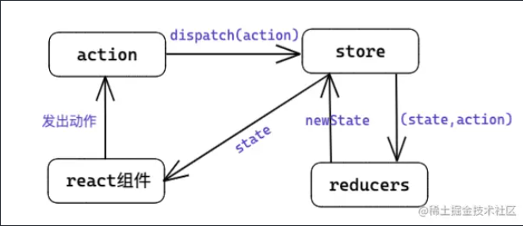

# 百度一面

## 1. 简单自我介绍（个人情况+技术栈+项目）

## 2. 青岛项目（角色+具体内容）

1. 前处理：参数的输入校验与预填、资源预览（2d、3d）、用户管理
2. 后处理：视频流渲染

## 3. 整个项目如何搭建

1. 确定技术栈：react（对js要求更高）+umi（多终端自适应）+ant-design（适配react）
2. 环境准备：node，yarn管理npm依赖
3. 创建项目：yarn create @umijs/umi-app
4. 配置文件：config.ts基于umi官方文档配置，配置路由、baseurl、publicPath等
5. 打包部署：umi build（基于webpack）输出dist文件夹

## 4. 青岛项目数据管理怎么做的

采用的是umi提供的一个插件。

一种基于 `hooks` 范式的简易数据管理方案（部分场景可以取代 `dva`），通常用于中台项目的全局共享数据。

它约定在src/model文件夹中的文件为model文件。每个文件需要默认导出一个 function，该 function 定义了一个 Hook。就是自定义 `hooks` 模块。

 `@umijs/plugin-model` 把自定义hook里的状态变成了『全局状态』，多个组件中使用该 `model`文件 时，拿到的同一份状态。从而实现全局数据的管理。

## 5. useModel怎么把数据和组件串联起来的

1. **基于 `React.Context` 创建一个全局的 `Context`**;
2. **使用 `Context.Provider` 包裹根组件，并执行所有的 `useModel` 对应的 `hooks`**
3. **在 `useModel` 函数中通过 `useContext` 获取到 `dispatcher`, 并更新数据**

## 6. 数据如何做抽离，哪些放全局，哪些放私有作用域

多个组件都要用到的我就会把它放在全局，比如有车辆、轨道等组件，它们的数据我会放在全局，因为在后处理界面中，有一个结果导出，需要用到。但projectlist就只会放到项目组件中。

## 7. token放在哪，为什么

放在了seesionStorage中。cookie每次http请求时会携带，容易受到跨站脚本攻击（XSS），localStorage存储时间长需手动删除。考虑到具体业务需求，对方是想要关闭窗口后重新登录还是说不用登录，并进行加密存储数据、定期更新令牌。

## 8. 视频流如何拿到，websocket用时有没有bug

一般方式：websocket（双向）、服务器推送（服=>客）、客户端轮询(客=>服)

unity stream rendering这个库的通信基础技术是基于signalR，会自动根据客户端状态选择通信方式（websocket>server sent events(SSE)>long polling(长轮询)），同时引入了**断线重连机制**和自定义故障处理机制。

websocket的onopen函数中引入心跳机制，每隔几十秒向服务端发送一个状态，防止断开

将connectionID设为projectId保证连接一对一

## 9. 自定义hook有用过吗

```js
import { useState } from 'react'

const useMyHook = (initValue) => {
  const [value, setValue] = useState(initValue || '')
  const onChange = (e) => {
    setValue(e.target.value)
  }
  return { value, onChange }
}

function App() {
  const myHookValue = useMyHook('myHook')
  return (
    <div className="app">
      <p>value:{myHookValue.value}</p>
      <input value={myHookValue.value} onChange={myHookValue.onChange} />
    </div>
  )
}
```

## 10. 有了解redux以及其他数据管理方式吗

- Redux会将整个应用状态(其实也就是数据)存储到 `Store`
- Store里面保存一棵状态树(`state tree`)
- 组件改变state的唯一方法是通过调用store的 `dispatch`方法，触发一个 `action`，这个action被对应的 `reducer`处理，于是state完成更新



## 11. redux和umi的区别

传统的context数据流不清晰，无法追踪数据由哪个组件更改的。

redux：数据流清晰，改变数据有统一的入口 - dispatch一个action（数据单向流动）

umi：它是基于React.context的二次封装，使得数据流清晰，它更改数据是通过调用自定义hook（model文件）中定义的更改数据的函数实现的，更改函数与数据在一个文件中

## 12. 部署时有做什么配置吗

1. 前端：跨域设置、baseUrl设置、publicPath等
2. 云服务器：usr/local/html/nginx.conf文件进行nginx配置
3. 后端：cors跨域配置，access-control-allow-origin/credential等，express框架很简单app.use(cors())

## 13. 说下cors的了解

浏览器同源策略、前后端配合。

两种请求，简单请求（GET\POST\HEAD）和非简单请求（有一次cors预检请求-OPTIONS方法）

与JSONP比较：功能相同，但JSONP只支持GET请求

## 14. 配置域名时用星号会有什么问题

设置 `*`是最简单粗暴的，但是服务器出于安全考虑，肯定不会这么干，而且，如果是*的话，浏览器将不会发送 `cookies`，即使你的 `XHR`设置了 `withCredentials`

## 15. 跨域在哪一块控制，是因为什么导致的

后端，浏览器导致的，同源策略

## 16. 解决跨域的方法

cors，nginx反向代理、jsonp，前端代理

## 17. 前端配置代理和nginx代理区别

前端代理：正向代理，“一台代理服务器"代替了"客户端”，去和"目标服务器"进行交互

nginx：反向代理，“一台代理服务器"代替了"目标服务器”，去和"客户端"进行交互。此时反向代理服务器与后端服务器是一个整体.

## 18. 原型链

每个对象通过 `__proto__` 指针指向其原型对象，并从中继承方法和属性，同时原型对象也可能拥有原型，这样一层一层，最终指向 null

## 19. es6继承的底层原理

底层的实现原理依然是构造函数和**寄生组合式继承**

## 20. 寄生组合继承分别继承原对象哪些属性，为啥用这个方法

1. 组合式继承（产生两个父类实例）

   ```js
   function People(name,age){
     this.name = name || 'wangxiao'
     this.age = age || 27
   }
   People.prototype.eat = function(){
     return this.name + this.age + 'eat sleep'
   }

   function Woman(name,age){
     People.call(this,name,age) // 构造函数call继承一次
   }
   Woman.prototype = new People(); // 原型链继承一次，父类的实例作为子类的实例
   Woman.prototype.constructor = Woman;
   let wonmanObj = new Woman(ren,27);
   wonmanObj.eat(); 
   ```
2. 寄生组合式继承

   引入一个空类，这个空类的{{proto}}指向父类，这样外部继承只要继承在这个寄生在父类上的空类就好了

   ```js
   //父类
   function People(name,age){
     this.name = name || 'wangxiao'
     this.age = age || 27
   }
   //父类方法
   People.prototype.eat = function(){
     return this.name + this.age + 'eat sleep'
   }
   //子类
   function Woman(name,age){
     //继承父类属性
     People.call(this,name,age)
   }
   //继承父类方法
   (function(){
     // 创建空类代替父类
     let Super = function(){};
     Super.prototype = People.prototype;
     //空类的实例作为子类的原型
     Woman.prototype = new Super();
   })();
   //修复构造函数指向问题
   Woman.prototype.constructor = Woman;
   let womanObj = new Woman();
   ```

## 21. call用来做什么

1. 改变this指向call(this,1,2,3)
2. 类型检测Object.prototype.toString.call()
3. 伪数组转数组Array.prototype.slice.call(arg)

## 22. 对闭包的了解

1. 私有化，库的封装
2. 防止变量污染
3. 变量常驻
4. 形式：函数返回函数、立即执行函数

## 23. 模块化和闭包有什么关系

闭包可以用来创建模块化，使得使用该模块时，不会污染变量，使得外部可以访问内部变量

## 24. 节流防抖和应用

节流：每隔一段时间才执行一次，在此期间又点一次，无效（搜索框联想，鼠标滚动底部加载）

防抖：在未达到时间内又点一次则重新执行（窗口拖动大小，搜索框请求）

## 25. 手撕：节流

```js
function tro(fn, delay){
    let timeout
    return (value)=>{
        if(!timeout){
            timeout = setTimeout(()=>{
            fn(value)
            timeout = null
        })
        }
    }
}
```

## 26. 手撕：算法

## 27. 二叉树的深度和广度遍历

深度：前中后序遍历的逻辑其实都是可以借助**栈使用非递归**的方式来实现的


广度：使用**队列**来实现,就是从左到右一层一层的去遍历二叉树


## 28. 为什么选择前端

1. 课题组方向：本科毕设、项目
2. 姐姐
3. 个人偏好
