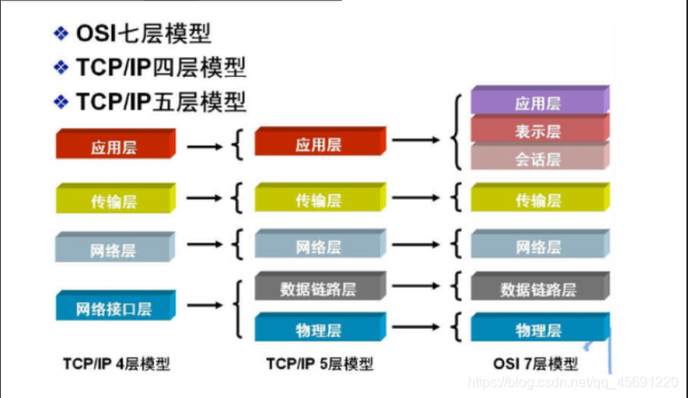
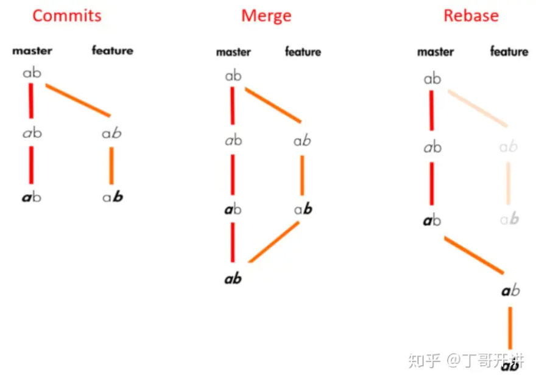

# 阿里飞猪一面

## 阿里飞猪实习一面+笔试

飞猪旅行交通相关方面，技术栈偏react node，主要是移动端，h5，小程序，中后台

### 1. 自我介绍

### 2. 为什么选择前端岗位

### 3. get方法长度限制的原因

http请求本身对get请求数据长度没有限制，url限制取决于浏览器和web服务器设置的。

### 4. get和post请求的区别

用途：get一般为获取数据，post发送数据

数据：get数据放在url上，post放在请求体中

编码：get为url编码，post不限

底层：get发送一个tcp包，header和数据一起发送，post发送2个tcp包，先header后数据

书签历史：get可做书签，有历史记录，可回退，post不可做书签，历史记录，回退需重新提交数据

### 5. http状态码

1xx（状态进行码）

2xx（请求成功码）：200请求成功

3xx（重定向状态码）：301客户端资源永久转移到其他url

4xx（客户端错误状态码）：404资源不存在，403服务器禁止访问

5xx（服务器错误码）：500服务器内部错误

### 6. 网络osi模型

**osi**：应用层-表示层-会话层-传输层-网络层-数据链路层-物理层

**tcp**：

应用层(http,dns,ftp)：dns解析

传输层(tcp,udp)：寻址端口

网络层(ip,igmp)：路由选择、拥塞控制

网络接口层（数据链路层-物理层）：流量控制、差错控制、链路管理（可靠性）



### 7. 块级元素和行内元素的区别

块级元素：独占一行、可设置宽高上下边距，未设置则为父元素宽度

行内元素：不独占一行，自身内容决定空间

块级元素：div，p，section，nav，ul，li，img， form

行内元素：a label input em q strong span

### 8. 浏览器乱码原因

主要原因：编码不一致。比如源代码和里面的中文字编码不一致，页面编码和服务器传来的程序编码不一致

解决方法：使用软件编辑代码，数据库和页面编码不一致要转码，浏览器设置编码类型等

### 9. 浏览器持久化缓存（cookie，webStorage，indexDB）

cookie：用于存储用户信息标识，放在请求中，在客户端与服务端传递。

webStorage：浏览器本地存储

indexDB：浏览器非关系数据库

区别：

存储量：cookie-4k，webStorage-5M（字符串），indexDB-更大（更多类型）

过期时间：cookie有过期时间，到了才过期，没过期时间，关闭窗口才过期；sessionStorage关闭窗口过期；localStorage不主动删除不过期；indexDB不主动删除不过期

安全性：cookie不安全，不设置httponly容易受到跨站请求伪造；但对于容易受到跨站脚本攻击的网站，用webstorage也不安全。

补充：localForage——智能存储方案，封装indexDB的异步操作api。优雅降级indexedDB -> WebSQL -> localStorage

### 10. 在页面上实现圆形点击区

1. css法

   border-radius:50%
2. map法

   img标签中用usemap映射map标签里的area标签，area标签中将shape属性设置为circle

### 11. css实现圆形

border-radius:50%

### 12. 画0.5px的线

1. meta viewport中将scale属性设为0.5px
2. 采用border-image
3. css中transform：scaleY(0.5)

### 13. BFC理解

BFC: 块级格式化上下文。保证bfc里的元素与外部元素互不影响

可解决外边距塌陷、清除浮动等问题

形成BFC的方法有：overflow: hidden；position: absolute/fixed；float: 非none；display: flex

### 14. 事件委托和事件代理

事件委托/代理：基于事件冒泡，父元素统一处理点击子元素时触发的事件

### 15. e.target和e.currentTarget属性区别

target：被点击的元素li （触发事件的元素）

currentTarget：执行当前函数所绑定的元素ul （绑定事件的元素）

parentTarget：被点击的元素的父元素

### 16. use strict作用

严格模式：规范js语法，未定义的变量不能用

### 17. 数组遍历方法和跳出方法

1. for循环+break
2. foreach+try...catch：找到目标值，抛出错误
3. .every+return false

### 18. js设计模式（单例模式、观察者模式、订阅模式）

单例模式：一个类只能new一个实例

观察者模式：观察者（订阅和取消订阅）和被观察者（维护观察者列表和分发消息）=》被观察者直接将观察者加入到自己的列表，触发就是遍历列表执行观察者相应的方法

订阅模式：订阅者-订阅中心-被订阅者，由订阅中心来管理订阅和发送

### 19. react事件与原生html事件的区别

命名方式：原生是全小写，react是驼峰式

接受参数：原生是字符串，react是函数

默认事件阻止：原生可以通过 `e.preventDefault()`和 `return false` 来阻止默认事件；react通过 `e.preventDefault()`阻止默认事件

### 20. jsx编译后什么样

元素=>React.createElement('元素名'，null，元素里的内容)

```js
function FnComp(){
  return <div>A Function Component</div>
  // 被编译为
  return React.createElement("div", null, "A Function Component");
}

class ClassComp extends React.Component{
  render(){
    return <div>
      <h1>A Class Component</h1>
      <FnComp/>
    </div>
    return React.createElement("div", null, React.createElement("h1", null, "A Class Component"), React.createElement(FnComp, null));
  }
}
```

### 21. react父子通信和隔代通信

1.父传子props，ref

```js
// props
1. 在子组件标签上定义 <Son num={num}></Son>
2. 在子组件内部的函数式参数上写上实参props，直接调用 props.num
```

2.子传父：父组件中定义一个函数,然后传到子组件后进行调用

```js
父组件<Son num={num} fn={fn}></Son> //将函数传入子组件
子组件<button onClick={fn}>+1</button> //子组件内调用
```

3.兄弟组件=>状态提升

4.跨组件context和redux

（1）createContext=>Provider和Consumer

```js
// 复用性变差
const MyContext = React.createContext()
const {Provider,Consumer} = MyContext
发送：<Provider value={{username,age}}><B/></Provider>
接受<Consumer>{value => `${value.username},年龄是${value.age}`}</Consumer>
```

（2）redux

### 22. 虚拟dom理解

用 JavaScript 对象结构表示 DOM 树的结构；将查找dom元素变为查找js属性。记录新旧两数的差异，再应用到真正的dom树上

### 23. 原生操作dom的优缺点

优点可能是更加灵活，毕竟更偏近底层，相对于框架着重普适性，原生dom操作更适合一些难实现的逻辑。

缺点就是影响性能。操作dom一定会导致回流重绘，影响性能

### 24. commonJS和ES6模块加载原理

commonJs：导出module.export;导入require

ES6：导出export；导入import

commonJS为**值的拷贝**，模块内的变化不影响输出的值；es6是**值的引用**，动态的，会影响输出的值

commonJS是**运行时加载**，输入时会加载整个模块（生成一个对象），es6是**编译时加载**，可加载指定输出值

### 25. 存在循环环状依赖，哪种更好

两者都是：一旦某个模块被循环加载，就只输出该模块已经执行的部分，没有执行的部分不输出。

但是：commonJS是运行时加载，ES6是编译时加载

循环引用要解决的无非是两个问题，保证不进入死循环以及输出什么值。

- CommonJS借助模块缓存，遇到require函数会先检查是否有缓存，已经有的则不会进入执行，在模块缓存中还记录着导出的变量的拷贝值；
- ES Module借助模块地图，已经进入过的模块标注为获取中，遇到import语句会去检查这个地图，已经标注为获取中的则不会进入，地图中的每一个节点是一个模块记录，上面有导出变量的内存地址，导入时会做一个连接——即指向同一块内存。

### 26. webpack工作流程

webpack将js和非js语言打包为浏览器可以执行的语言。

流程：webpack脚手架启动=>载入核心模块，创建编译对象=>使用编译对象编译项目=>从入口文件entry**解析模块依赖**=>将每个模块将给loader处理=>合并loader处理结果，输出为dist文件夹

### 27. loader和plugin的作用与原理与区别

loader：模块转换器，使**webpack可以加载解析非js代码**，如css-loader（加载css），vue-loader（加载vue），sass-loader（sass=>css），style-loader（css注入js中），url-loader等

plugin：webpack构建流程中**注入扩展逻辑**，如HtmlWebpackPlugin，CleanWebpackPlugin（自动清理输出文件夹），PurgeCSSPlugin（删除没有引用到的选择器及其样式），CompressionPlugin（传输压缩，gzip），HotModuleReplacementPlugin（热更新）

区别：loader本质为函数，对接受的非js内容进行转换，plugin是插件，扩展webpack功能，通过webpack提供的api改变输出结果

### 28. 热更新实现原理

刷新我们一般分为两种：

- 一种是页面刷新，不保留页面状态，就是简单粗暴，直接 `window.location.reload()`。
- 另一种是基于 `WDS (Webpack-dev-server)`的模块热替换，只需要**局部刷新页面上**发生变化的模块，同时可以**保留当前的页面状态**，比如复选框的选中状态、输入框的输入等。

**原理**：webpack通过watch可以监测代码的变化；webpack-dev-middleware可以调用webpack暴露的API检测代码变化，并且告诉webpack将代码保存到内存中；webpack-dev-middleware通过sockjs和webpack-dev-server/client建立webSocket长连接，将webpack打包阶段的各个状态告知浏览器端，最重要的是新模块的hash值。webpack-dev-server/client通过webpack/hot/dev-server中的HMR去请求新的更新模块，HMR主要借助JSONP。先拿到hash的json文件，然后根据hash拼接出更新的文件js，然后HotModulePlugin对比新旧模块和模块依赖完成更新。

总结：webpack检测代码变化=>中间件通过sockjs与webpack-dev-server/client建立websocket连接，并告诉浏览器打包的各阶段状态，特别是新模块hash值=>webpack-dev-server/client通过热模块替换请求新模块=>热模块插件进行新旧模块对比并更新

**简洁**：webpack-dev-server搭配HotModuleReplacementPlugin 实现热更新。webpack开发服务器与客户端建立websocket连接，传递打包信息特别是新模块hash值。热模块替换插件进行新旧模块对比更新。

### 29. babel的作用

高版本js转化为低版本js语言。

高版本js（解析）=>高版本AST（转换）=>低版本A（生成）=>低版本js

### 30. SSR的概念

SSR：服务端发送页面代码给前端渲染。`Node.js` 使用 `ejs` 模板引擎输出一个界面这就是服务端渲染。每次访问一个路由都是请求后台服务，重新加载文件渲染界面。

优点：更好的首屏渲染，更好的SEO

缺点：服务端压力大，开发不方便

### 31. 怎么做到ssr同构渲染

**同构：** 采用一套代码，构建双端（server 和 client）逻辑，最大限度的重用代码，不用维护两套代码。

路由同构，数据同构，渲染同构

客户端：

```js
ReactDom.hydrate(<Home/>,document.getElementById("root"));
// ReactDom.render(<Home/>,document.getElementById("root"));
// 与 render() 相同，但它用于在 ReactDOMServer 渲染的容器中对 HTML 的内容进行 hydrate 操作。 会尝试在已有标记上绑定事件监听器。会保留该节点且只进行事件处理绑定
```

服务端：

```js
const app = express(); 
app.use(express.static('public')) // 开启一个静态资源服务，监听 public 目录，还记得客户端的打包文件就放到了 public 目录了把，这里通过监听，我们就可以 localhost:3000/index.js 访问该静态资源
const content = renderToString(<Home />); // 把 React 组件通过 renderToString 方法生成 HTML
app.get('/',function (req,res) { 
  res.send(`    <!doctype html>    <html lang="en">      <head>          <meta charset="UTF-8">          <meta name="viewport"                content="width=device-width, user-scalable=no, initial-scale=1.0, maximum-scale=1.0, minimum-scale=1.0">          <meta http-equiv="X-UA-Compatible" content="ie=edge">          <title>React SSR</title>      </head>      <body>        <div id="root">${content}</div>        <script src="/index.js"></script>        </body>    </html>  `)
})
// 当用户访问 localhost:3000 时便会返回 res.send 中的 HTML 内容，该 HTML 中把 React 生成的 HTML 片段也插入进去一同返回给用户了，这样就实现了服务端渲染。
// 通过 <script src="/index.js"></script> 这段脚本加载了客户端打包后的 React 代码，这样就实现了客户端渲染，因此一个简单同构项目就这样实现了。
```

### 32. git fetch和pull的区别

git fetch: 远程仓库=>本地仓库，若需放到工作目录需git merge

git pull: 远程仓库=>工作目录

### 33. git merge和rebase的区别

git merge：次分支末端直接连接到主分支末端（分支一多，合并后的线很复杂）

git rebase：以次分支和主分支公共节点为界，次分支之后的commit直接合并到公共节点后，再在后面接主分支公共节点后的commit。注意后面的commit只是修改的内容一样，但commit号都变了。好处是只保留一条线，简洁



### 34. git revert和reset

git revert：提交一个新的回退commit，来取消最新的一次commit（记录仍在）

git reset：直接撤销最新的commit（记录也没了）

### 35. 单元测试相关

从前端角度来看，单元测试就是对一个函数、一个组件、一个类做的测试.

测试框架**Jest**

测试文件名与要测试的文件名相同，后缀为 `.test.js`，放在**test**文件夹中

```js
// package.json
"scripts": {
    "test": "jest",
 }

// main.js
function abs(a) {
    if (typeof a != 'number') {
        throw new TypeError('参数必须为数值型')
    }

    if (a < 0) return -a
    return a
}

// main.test.js
test('abs', () => {
    expect(abs(1)).toBe(1)
    expect(abs(0)).toBe(0)
    expect(abs(-1)).toBe(1)
    expect(() => abs('abc')).toThrow(TypeError) // 类型错误
})
```

执行npm run test开始测试

### 36. 项目中的技术难点

第一个项目使用java原生开发的移动端，需要自己编写铁路舒适度评价指标的算法（傅里叶变换，sperling指标算法，a计权算法）

第二个项目比较简单，主要是第一次全栈，摸索花时间，在实现草稿箱功能、完成图片上传的前后端功能花的事件相对多

第三个项目难点有三个：1.三维模型加载慢 2.轨道预览图可视化 3.视频流上的鼠标交互

### 37. 怎么学的前端

1. 理论学习：视频（狂胜说、动力节点、黑马程序员），书（JavaScript高级程序设计、）
2. 实战：练习git，css，html的网站，项目（大屏，仿写网易云程序，静态个人博客）
3. 平时：逛git网站，平时零碎时间逛逛csdn、稀土掘金社区
4. 请教

### 38. 有什么想问的

1. 对方的技术栈
2. 自己有什么改进的地方
3. 后续面试着重什么方面的考察

## 39. 笔试

笔试两道题比较简单

1.纯js实现数组扁平化

```js
var array = [1, [2, [3, [4, 5]]]];
function flatDeep(arr){
	let result = [];
	for(let i = 0; i < arr.length; i++) {
		if(Array.isArray(arr[i])){
			result = result.concat(flatDeep(arr[i]))
		} else {
			result.push(arr[i])
		}
	}
	return result;
}
console.log(flatDeep(array));

```

2. 实现节流

```js
function trofn(callback, wait){
    let timer
    return function tro(){
        if(!timer){
            timer = setTimeInterval(function(){
                callback()
                timer = null
            },wait)
        }
    }
}
```
