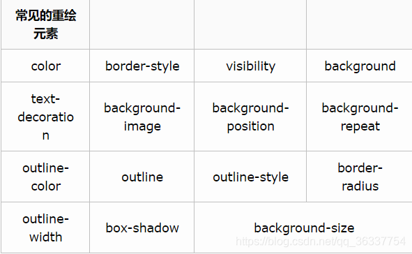
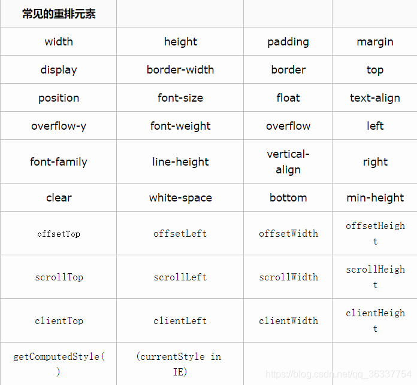
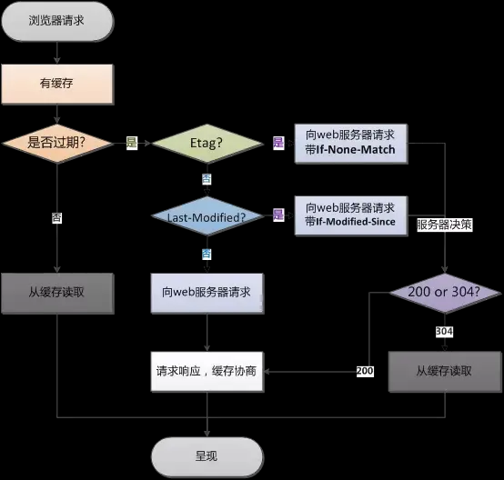

# 百度一面

## 1 自我介绍

## 2 三个项目里做的最好的是哪个，负责哪些模块，做的具体工作

铁道仿真系统 - 实验室真实项目

## 3 了解数组的reduce方法吗

对数组中的每个元素按序执行一个提供的 **reducer** 函数，每一次运行 **reducer** 会将先前元素的计算结果作为参数传入，最后将其结果汇总为单个返回值

## 4 js原型和原型链

每个对象（object）都有一个私有属性指向另一个名为 **原型** （prototype）的对象。原型对象也有一个自己的原型，层层向上直到一个对象的原型为 `null`，形成**原型链**

* 每一个构造函数都一个prototype属性，指向原型对象，这个对象的所有属性和方法都会被构造函数所拥有。
* 每一个对象都会有一个__proto__属性指向构造函数的prototype原型对象，这让对象可以使用构造函数原型对象的属性和方法

> 即对象的 `__proto__`属性等于创建它的构造函数的 `prototype`属性
>
> `__proto__`属性虽然在ECMAScript 6语言规范中标准化，但是不推荐被使用，现在更推荐使用 `Object.getPrototypeOf(obj)`

* 原型对象中默认有一个 `constructor`属性，指回该构造函数

## 5 class来new一个新对象，class和构造函数的区别？编译过程中涉及到this指向、执行作用域、new的过程等的区别，深入讲解

class是构造函数的语法糖

1. 语法：ES6 类使用 `class` 关键字来定义类，传统的构造函数使用函数来定义。
2. 继承：类使用 `extends` 关键字来实现继承，构造函数使用原型链来实现继承，需要更多的手动操作。
3. 定义方法：在类中，方法可以直接在类的内部定义，在构造函数中，方法通常通过添加到构造函数的原型上来定义。
4. 静态方法： 类允许定义静态方法，这些方法可以在类本身上调用，而不需要创建类的实例，构造函数通常不支持直接定义静态方法，需要通过构造函数本身定义静态方法
5. 构造函数：类中，构造函数必须命名为 `constructor`，在构造函数中，构造函数可以有任何名称；类中只能有一个构造函数，构造函数可以拥有多个构造函数，通过不同的参数进行重载。

其他区别：

1. 类的内部所有定义的方法，都是不可枚举的（es5中prototype的方法是可以进行枚举的）
2. 类的构造函数必须通过 new 进行调用，这是它跟普通构造函数的一个主要区别，后者不用new也可以执行
3. 继承的底层区别：ES5的继承，实质是先创造子类的实例对象this，然后再将父类的方法添加到this上面（Parent.apply(this)）。ES6的继承机制完全不同，实质是先创造父类的实例对象this（所以必须先调用super方法），然后再用子类的构造函数修改this。

```js
//1.语法
//class类
class Person{
  constructor(name){
    this.name = name；
  }
  sayHello(){
    console.log(`Hello, my name is ${this.name}.`);
  }
}
//构造函数
function Person(name) {
  this.name = name;
}
Person.prototype.sayHello = function() {
  console.log(`Hello, my name is ${this.name}.`);
}


//2.继承
//类
class Student extends Person {
  constructor(name, grade) {
    super(name); // super关键字继承属性
    this.grade = grade;
  }
}
//构造函数
function Student(name, grade) {
  Person.call(this, name);
  this.grade = grade;
}
Student.prototype = Object.create(Person.prototype);
Student.prototype.constructor = Student;


//3.定义静态方法
//类
class MathUtil {
  static square(x) {
    return x * x;
  }
}
MathUtil.square(4);
//构造函数
function MathUtil() {}
MathUtil.square = function(x) {
  return x * x;
}
MathUtil.square(4);
```

## 6 双等于和三等于区别，分别比较的什么

* 双等于：在比较两个值之前，会先强制转换类型与值（两个引用数据类型之间比较的是 `地址`）
* 三等于：严格比较值和类型

> 还有object.is()方法进行同值比较，`Object.is()` 和 `===` 之间的唯一区别在于它们处理带符号的 0 和 `NaN` 值的时候

```js
+0 === -0;// true
NaN === NaN;// false

Object.is(+0, -0)； // false
Object.is(NaN, NaN); // true
```

## 7 双等于涉及隐式转换，讲一下隐式转换，有哪些场景涉及

场景：`==` 比较、`+/-/>/<` 运算、if判断、`！`取反

转换规则：隐式转换为数字、字符串、布尔形式

1. +/-/==时转换流程：

* Object => String => Number
* Boolean => Number
* undefined/null => Number
* `NaN`较为特殊，js规定它与任何数据比较均为 false，包括其本身

> 当与引用类型 + 时是看做字符串的拼接，但是-运算符只会视为计算，故与引用类型 - 时，只会返回 `NaN`

2. `>/<`时：String 的内容为 Number 时转换为 Number
3. if判断：true、1 被视为 true，false、“”、0、null、undefined、NaN 被视为 false
4. 连续两次取反可以将非布尔值转成布尔值

> null、NaN、undefined和string、number、boolean、object类型比较时，都不做隐式转换，比较的结果**直接为false**

## 8 空数组隐式转换成什么

空数组[]：

* 比较时：空数组 => '' => 0
* 判断、取反时：空数组 => true

空对象{}：

* 比较时：空对象 => '[object Object]' => NaN
* 判断时：true

## 9 函数作用域、作用域链

**作用域**是当前的执行上下文，在其中的值和表达式“可见”（可被访问）。

JavaScript 的作用域分以下四种：

* 全局作用域：脚本模式运行所有代码的默认作用域
* 模块作用域：模块模式中运行代码的作用域
* 函数作用域：由函数创建的作用域
* 块级作用域：用一对花括号创建出来的作用域，块级作用域只对 `let` 和 `const` 声明有效，对 `var` 声明无效。

作用域链：当 JavaScript 使用每一个变量的时候，会先尝试在当前作用域中寻找该变量，若在当前的作用域找不到该变量，会一直往父层作用域寻找，直到全局作用域还是没找到，就会直接报错

问题：输出a为几？

```js
let a = 1
function area(){
console.log(a)
let a = 2
}
area()
```

结果：报错 Cannot access 'a' before initialization

注意：如果函数作用域里没有定义a变量，则输出全局作用域的a变量值1

## 10 不同的this指向情况

* 全局上下文中THIS指的是window[非严格模式] / undefined [ 严格模式（'use strict'）]
* 块级上下文、箭头函数中没有自己的THIS，它的THIS是继承所在上下文中的THIS
* 事件绑定、函数执行时 THIS 是调用方法的对象
* 构造函数体中的THIS是当前类的实例
* call/apply/bind：修改this指向

## 11 promise有哪些方法，promise.race方法介绍

3个状态：**pending、fulfilled、rejected**

九个方法：

1. resolve：**在执行了resolve后，** promise则会从pedding变成 **fulfilled** ，后续会进入.then 的回调函数中，在回调函数的第一个参数函数中可以获取到值
2. reject：**在执行了reject后** ，promise状态会变成 **rejected** ，rejected函数传递的参数，可以在.then的第二个参数函数中获取得到，或者是在.catch获取到，**---业务中，拒绝状态用.then去执行回调，异常用.catch**
3. then：函数回调执行，常用于接收请求接口返回的数据；该回调函数有两个参数（函数），一个是用于处理 Promise 解决时的回调函数，另一个是可选的用于处理 Promise 拒绝（rejected）时的回调函数；用于接收promise对应状态的数据。.then的返回值也是个promis对象
4. catch：用于注册在 Promise 对象拒绝（rejected）时的回调函数。同时也可以用来**捕获代码异常**或者出错
5. all：接收一个promise对象的数组（**同时开始、并行执行**）作为参数，当这个数组里面的promise对象，没有出现rejected状态，则会一直等待**所有resolve成功**后，才执行.then这个回调，如果有一个是rejected状态，则会先执行.all里面的.then中第二个回调函数或者.catch函数，不会等后续跑完再执行
6. any：接收一个promise的数组作为参数，只要 **其中有一个 `Promise`成功执行** ，就会返回已经成功执行的 `Promise`的结果； 若全部为rejected状态 ，则会到最后的promise执行完，全部的promise返回到异常函数中
7. race：接收一个可迭代promise对象的数组，**当任何一个promise的状态先确定（拒绝或者成功），则会执行.race中的回调函数**
8. allsettled：**等所有promise参数确定状态后，才会执行回调函数**
9. finally：用于清理和最终处理逻辑，不关心 Promise 的状态

## 12 css设置哪些属性会导致重绘、回流，改变字体大小会导致重绘或回流吗

重绘：当页面元素样式改变不影响元素在文档流中的位置时（如background-color，border-color，visibility），浏览器只会**将新样式赋予元素并进行重新绘制**操作。

回流：当渲染树render tree中的一部分或全部因为元素的规模尺寸、布局、隐藏等改变时，浏览器**重新渲染部分DOM或全部DOM**的过程

> 回流必将引起重绘，而重绘不一定会引起回流





## 13 浏览器从输入网址到页面渲染之间的过程

1. 输入URL
2. 查找缓存：浏览器先查看浏览器缓存-系统缓存-路由缓存中是否有该地址页面，如果有则显示页面内容。如果没有则进行下一步。

   * 浏览器缓存：浏览器会记录DNS一段时间，因此，只是第一个地方解析DNS请求；
   * 操作系统缓存: 如果在浏览器缓存中不包含这个记录，则会使系统调用操作系统， 获取操作系统的记录(保存最近的DNS查询缓存)；
   * 路由器缓存：如果上述两个步骤均不能成功获取DNS记录，继续搜索路由器缓存；
   * ISP缓存：若上述均失败，继续向ISP搜索。
3. DNS域名解析：浏览器向DNS服务器发起请求，解析该URL中的域名对应的IP地址。`DNS服务器是基于UDP的，因此会用到UDP协议`。
4. 建立TCP连接：解析出IP地址后，根据IP地址和默认80端口，和服务器建立TCP连接
5. 发起HTTP请求：浏览器发起读取文件的HTTP请求，该请求报文作为TCP三次握手的第三次数据发送给服务器
6. 服务器响应请求并返回结果：服务器对浏览器请求做出响应，并把对应的html文件发送给浏览器
7. 关闭TCP连接：通过四次挥手释放TCP连接
8. 浏览器渲染：客户端（浏览器）解析HTML内容并渲染出来，浏览器接收到数据包后的解析流程为：

   * 构建DOM树：词法分析然后解析成DOM树（dom tree），是由dom元素及属性节点组成，树的根是document对象
   * 构建CSS规则树：生成CSS规则树（CSS Rule Tree）
   * 构建render树：Web浏览器将DOM和CSSOM结合，并构建出渲染树（render tree）
   * 布局（Layout）：计算出每个节点在屏幕中的位置
   * 绘制（Painting）：即遍历render树，并使用UI后端层绘制每个节点。

   
9. JS引擎解析过程：调用JS引擎执行JS代码（JS的解释阶段，预处理阶段，执行阶段生成执行上下文，VO，作用域链、回收机制等等）

   * 创建window对象：window对象也叫全局执行环境，当页面产生时就被创建，所有的全局变量和函数都属于window的属性和方法，而DOM Tree也会映射在window的doucment对象上。当关闭网页或者关闭浏览器时，全局执行环境会被销毁。
   * 加载文件：完成js引擎分析它的语法与词法是否合法，如果合法进入预编译
   * 预编译：在预编译的过程中，浏览器会寻找全局变量声明，把它作为window的属性加入到window对象中，并给变量赋值为'undefined'；寻找全局函数声明，把它作为window的方法加入到window对象中，并将函数体赋值给他（匿名函数是不参与预编译的，因为它是变量）。而变量提升作为不合理的地方在ES6中已经解决了，函数提升还存在。
   * 解释执行：执行到变量就赋值，如果变量没有被定义，也就没有被预编译直接赋值，在ES5非严格模式下这个变量会成为window的一个属性，也就是成为全局变量。string、int这样的值就是直接把值放在变量的存储空间里，object对象就是把指针指向变量的存储空间。函数执行，就将函数的环境推入一个环境的栈中，执行完成后再弹出，控制权交还给之前的环境。JS作用域其实就是这样的执行流机制实现的。

## 14 强缓存和协商缓存区别

强缓存：浏览器不会像服务器发送任何请求，直接从本地缓存中读取文件并返回Status Code: 200 OK

协商缓存: 向服务器发送请求，服务器通过请求头中的If-Modified-Since（Last-Modified）或者 If-None-Match（Etag）字段检查资源是否更新，更新则返回新资源和200，没有更新则返回304，告诉浏览器直接从缓存获取资源

## 15 协商缓存有哪些header做判断

强制缓存：

在过期时间内则为强制缓存

* Expires：过期时间（http1.0）
* Cache-Control：max-age=xxx  缓存有效时间（http1.1，会覆盖Expires）

协商缓存：

条件：缓存过期Cache-Control：no-cache

* ETag/If-None-Match ：`ETag`是一个资源版本的唯一标识符，后续请求该资源时，会在请求头中携带 `If-None-Match`字段，其值为先前接收到的 `ETag`，服务器会根据这个值来判断资源是否有更新。（http1.1，优先级更高）
* Last-Modified/If-Modified-Since：类似于 `ETag`机制，但 `Last-Modified`记录的是资源最后修改的时间。浏览器在后续请求时，会在请求头中携带 `If-Modified-Since`字段，其值为先前接收到的 `Last-Modified`时间。服务器会检查资源的最后修改时间是否在这个时间之后。（http1.0）



## 16 get、post区别

1.get请求一般是去取获取数据（其实也可以提交，但常见的是获取数据）； post请求一般是去提交数据。

2.get因为参数会放在url中，所以隐私性，安全性较差，请求的数据长度是有限制的， 不同的浏览器和服务器不同，一般限制在 2~8K 之间，更加常见的是 1k 以内； post请求没有长度限制，请求数据是放在body中。

3.get请求刷新服务器或者回退没有影响，post请求回退时会重新提交数据请求。

4.get请求可以被缓存，post请求不会被缓存。

5.get请求会被保存在浏览器历史记录当中，post不会。get请求可以被收藏为书签，因为参数就在url中，但post不能。它的参数不在url中。

6.get请求只能进行url编码（appliacation-x-www-form-urlencoded）,post请求支持多种（multipart/form-data等）。

深入理解：

1. GET 和 POST都是http请求方式， 底层都是 TCP/IP协议；通常GET 产生一个 TCP 数据包；POST 产生两个 TCP 数据包（但firefox是发送一个数据包），
2. 对于 GET 方式的请求，浏览器会把 http header 和 data 一并发送出去，服务器响应 200 （返回数据）表示成功；而对于 POST，浏览器先发送 header，服务器响应 100， 浏览器再继续发送 data，服务器响应 200 （返回数据）。

## 17 restful约定哪些场景需要用get，哪些需要用post，有了解过吗

Representational State Transfer，简称REST，直译过来表现层状态转换，是一种软件架构风格、设计风格，提供了一组设计原则和约束条件

GET（SELECT）：从服务器取出资源（一项或多项）

POST（CREATE）：在服务器新建一个资源

PUT（UPDATE）：在服务器更新资源

DELETE（DELETE）：从服务器删除资源

## 18 前端跨域，出于什么原因，如何解决

过程：跨域是浏览器拦截的行为，请求已经发送到后端，后端返回的响应数据被浏览器拦截

原因：浏览器同源策略，协议+域名+端口都要相同

解决：CORS、JSONP、Nginx代理、websocket协议

## 19 如果跨域，请求有没有发出

浏览器会发出这个请求，但是它会拦载响应内容，如果发现响应header中"Access-Control-Alow-Origin"设置的允许访问的源没有包含当前源，则拒绝将数据返回给当前源

## 20 代码题

给你一个非空数组，返回此数组中第三大的数。如果不存在，则返回数组中最大的数。（解释：注意，要求返回第三大的数是指在所有不同数字中排第三大的数。）

```js
function max3value (arr) {
  let max1 = arr[0]
  let max2 = null
  let max3 = null
  for ( let i = 0 ; i < arr.length; i++){
    if (arr[i] > max1){
      max3 = max2
      max2 = max1
      max1 = arr[i]
    }
  }
  return max3 === null ? max3 : max1
}
```

我的思路：

```js
function max3 (arr){
  let arr1 = arr.sort((a,b) =>a-b)
  let arr2 = Array.from(new Set(arr1))
  return arr2.length > 3 ? arr2.at(-3) : arr2[0]
}
```

注意：

1. sort 方法排序是按照 utf-16 码元值升序排序，eg：1，1000，2，……
2. 用 Set 去重后还要通过 array.from() 转换为数组

## 21 有什么想问的问题

百度文库技术栈：vue2、vue3都在用，vue2项目升级工作量太大因此不升级
