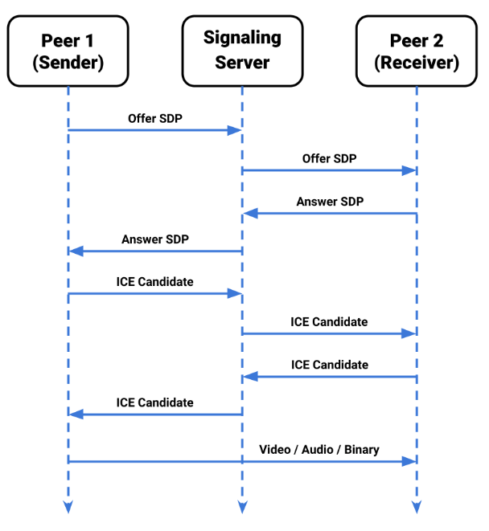

# 腾讯一面

## 手写代码题

1. 实现下面的字符串格式化函数format(String, Object)，避免出现XSS

```js
document.body.innnerHTML = format(
    '<div>I am {name}, my website is <a herf={"website"}>{website}</a>!</div>',{
    name:'jams'
    website:'[http://www.qq.com](http://www.qq.com/)'
})
```

```js
//HTML转义防止XSS攻击
function escapeHTML(str) {
  return str.replace(/[&<>"'`=\/]/g, function (s) {
    return {
      '&': '&',
      '<': '<',
      '>': '>',
      '"': '"',
      "'": ''',
      '/': '/',
      '`': '`',
      '=': '='
    }[s];//回调函数，在每次匹配到字符时调用，s为匹配到的字符
  });
}

function format(template, replacements) {
  const regex = /\[(.*?)\]\((.*?)\)/;
  let match = regex.exec(replacements.website);
  if (match) {
    const firstPart = match[1];
    const secondPart = match[2];
    let counter = 0;

    let result = template.replace(/{(\w+)}/g, function (match, key) {
      if (key === 'website') {
        counter++;
        return counter === 1 ? firstPart : secondPart;
      }
      return replacements[key] || match;
    });
    return escapeHTML(result);
  }
  return escapeHTML(template);
}
```

3. 函数柯里化

```js
function a(...args){
}
console.log(`num:${a(1,2,3)(4)(5)}`) //num:15
```

```js
function a(...args) {
  // 初始总和
  let sum = args.reduce((acc, curr) => acc + curr, 0);

  function innerFunction(...innerArgs) {
    // 每次调用innerFunction都增加sum
    sum += innerArgs.reduce((acc, curr) => acc + curr, 0);
    return innerFunction;
  }

  // 重写innerFunction的toString方法，console.log 在最终需要字符串时，会调用 innerFunction.toString，从而返回当前的总和
  innerFunction.toString = function () {
    return sum;
  };

  return innerFunction;
}

console.log(`num:${a(1, 2, 3)(4)(5)}`);
```

3. 编写一个方法实现以下输入输出

```js
//输入：
arr{
[id:1, name:教师1, pid:0]
[id:2, name:教师2, pid:1]
[id:3, name:教师3, pid:1]
[id:4, name:教师4, pid:3]
[id:5, name:教师4, pid:4]
}
//输出：
{
id:1
name:教师1
children:{
{
id:2
name:教师2
}
{
id:3
name:教师3
children:{
{
id:4
name:教师4
children:{
{
id:5
name:教师5
}
}
}
}
}
```

## cors跨域

原因：同源策略，必须要协议、域名、端口都相同才能进行资源存取

CORS解决跨域方法：后端工程师在服务器端做 CORS 请求头的设定

分为简单请求（get、post、head）和非简单请求（除简单请求以外的其他请求先发送预检请求OPTIONS，满足条件后再发送CORS请求）

1. `Access-control-allow-origin`：设置允许跨域请求的源，要么是请求时 `Origin`字段的值，要么是*
2. `Access-control-allow-credentials：true` // 允许跨域发送cookie，此时origin不能设置为*
3. `Access-Control-Allow-Methods: GET, POST, PUT ` // 服务器支持的所有跨域请求的方法，对应 `Access-Control-Request-Method`
4. `Access-Control-Allow-Headers: X-Custom-Header` // 服务器所支持的所有头信息字段，对应 `Access-Control-Request-Headers`对应 `Access-Control-Request-Header`
5. `Access-Control-Max-Age` // 指定本次预检请求的有效期，单位为秒

## unity和网页端视频流如何传输

视频流获取：Unity 使用VideoStreamSender组件来获取视频流的源，即 camera 中渲染的画面，并进行编解码、分辨率等的设置

webRTC连接：通过 Signaling 信令服务器(基于websocket，可选其他方式)与网页端进行连接和通信。

1. 为通话的每一端创建一个 ` RTCPeerConnection`对象(对等体)，并在每一端添加各自的本地流。
2. 交换网络信息：寻找候选者，即使用ICE框架寻找网络接口和端口，潜在的连接端点被称为 `ICECandidate`，当收到候选消息时，调用 `addIceCandidate()`，将候选添加到远程对等方描述
3. 交换本地和远程描述：通过RTCPeerConnection `createOffer()`、`createAnswer()`方法交换数据。包括 SDP（Session Description Protocol，会话描述协议）交换，用于协商视频编解码器、数据通道等参数。

视频流传输：通过 RTCPeerConnection 的 `DataChannel`进行视频流传输

网页端渲染：将视频流嵌入在 HTML 的 `video` 标签中进行实时展示

交互：网页端通过 `RTCDataChannel (api)` 传输数据，反向发送控制指令回到 Unity 端

webRTC特点：

1. 实时通信
2. 点对点连接，通过最直接的路径进行连接。WebRTC API 使用 STUN 服务器获取计算机的 IP 地址，并使用 TURN 服务器在点对点通信失败时充当中继服务器。
3. 安全：所有 WebRTC 组件都必须加密，并且其 JavaScript API 只能从安全来源（HTTPS 或本地主机）使用



## 介绍最近的项目具体内容
