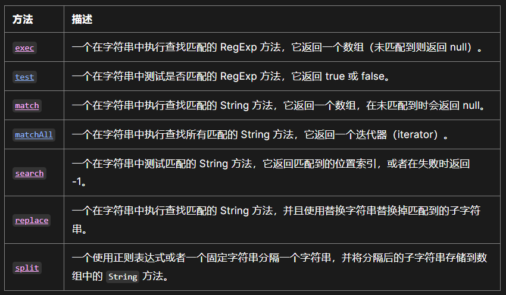

# 蔚来一面

## 1 自我介绍

## 2 描述青岛项目创建、开发、部署全过程

项目创建：

* 确定技术栈：react（对js要求更高）+umi（多终端自适应）+ant-design（适配react）
* 环境准备：node，yarn管理npm依赖
* 创建项目：yarn create @umijs/umi-app
* 配置文件：config.ts基于umi官方文档配置，配置路由（根据src/pages目录下的文件结构自动生成路由配置）、baseurl、publicPath等

内容开发：

* 组件：antd
* 数据管理：dva(基于 Redux 的轻量级状态管理框架)
* 请求：useRequest(基于axios和ahooks(react的hooks库))，在请求拦截器中添加 `authorization` 头部，从 `sessionStorage` 中获取token。
* 二维轨道：fabric.js
* 三维模型：three.js
* unity画面：unity render streaming

打包部署：

* umi build（基于webpack）输出dist文件夹

## 3 二维轨道展示开发过程

1. `data.d.ts`：轨道数据结构、类型定义
2. `models/track.ts`：全局数据管理：useTrack中通过useState声明全局状态track，定义saveTrack方法
3. `index.tsx`：PageContainer 和 ProCard 进行页面布局，useEffect 实现项目ID变化时获取新的轨道数据
4. `components/`：平断面、纵断面的参数设置表组件设置：EditableProTable组件中，rowKey定义每行数据的key；columns属性进行表格列配置，title定义表头，dataIndex对应数据，以及一些表格列属性，包括对齐方式、值类型和表单项的验证规则；value属性为表格数据源；onChange属性设定数据源变化时的回调函数，即将更新的数据存入全局变量
5. `components/`：轨道预览组件设置：fabric.Canvas创建画布，fabric.line画线
6. `@/utils/canvas`：图像自动缩放居中，`objects[i].getBoundingRect()`获取图像边界，`canvas.absolutePan({ x:panX, y:panY })`平移，`canvas.zoomToPoint(zoomPoint, zoom)`缩放
7. `service.ts`：获取数据请求

## 4 二维轨道展示页面布局

flex布局

父ProCard组件设置拆分卡片方式： `split={'vertical'}`，套两个子ProCard

## 5 简述flex的使用方法

父元素：

* `display: flex`
* 换行：`flex-wrap: wrap`
* 主轴方向：`flex-direction: row/column`
* 简写：`flex-flow: row wrap`
* 对齐设置：`align-items`、`justify-content`

子元素：

* `flex: flex-grow flex-shrink flex-basis`
* `flex: 1` 相当于  `flex: 1 1 0`
* `flex: auto` 相当于  `flex: 1 1 auto`
* `flex: none` 相当于 `flex: 0 0 auto`，元素不可伸缩
* 位置调整：`align-self`，默认继承父元素的`align-items`

## 6 用fabric如何绘制直线和曲线

```js
 //画线段
const drawLine = (
  startPoint: Vector2,
  endPoint: Vector2,
  canvas: fabric.Canvas
) => {
  const line = new fabric.Line(
    [startPoint.x, startPoint.y, endPoint.x, endPoint.y],
    {
      fill: 'black',
      stroke: 'black',
      strokeWidth: STROKE_WIDTH,
    }
  );

  canvas.add(line);
};
 //画圆形
  const circle = new fabric.Circle({
    top: 100,
    left: 100,
    radius: 50, // 圆的半径 50
    fill: 'green'
  })
```

## 7 如何从左侧获取输入数据给fabric对象

useModel获取全局状态，EditableProTable组件中输入数据，onChange事件将数据存入全局变量，触发全局状态更新，通过useEffect函数使相关组件重新渲染

umi数据管理：

* 通过 dva 进行数据管理和状态共享，它是一个基于 Redux 的轻量级状态管理框架
* 它约定在src/model文件夹中的文件为model文件。每个文件需要默认导出一个 function，该 function 定义了一个 Hook。就是自定义 `hooks` 模块。
*  `@umijs/plugin-model` 把自定义hook里的状态变成了『全局状态』，多个组件中使用该 `model`文件时，拿到同一份状态，从而实现全局数据的管理。

## 8 数据有做校验吗，怎么校验的

1. 正则表达式，校验数字：/d
2. 表单组件自带的验证规则定义：`type: 'number'`

```tsx
const commonProps: ProColumns = {
  align: 'center',
  valueType: 'digit',
  formItemProps: {
    rules: [
      {
        required: true,
        message: '必填项',
      },
      {
        type: 'number',
        message: '请输入数字',
      },
    ],
  },
};
```

## 9 正则的基本使用方法，match的返回值

正则表达式可以被用于 `RegExp` 的 [`exec`](https://developer.mozilla.org/zh-CN/docs/Web/JavaScript/Reference/Global_Objects/RegExp/exec) 和 [`test`](https://developer.mozilla.org/zh-CN/docs/Web/JavaScript/Reference/Global_Objects/RegExp/test) 方法，以及 [`String`](https://developer.mozilla.org/zh-CN/docs/Web/JavaScript/Reference/Global_Objects/String) 的 [`match`](https://developer.mozilla.org/zh-CN/docs/Web/JavaScript/Reference/Global_Objects/String/match)、[`matchAll`](https://developer.mozilla.org/zh-CN/docs/Web/JavaScript/Reference/Global_Objects/String/matchAll)、[`replace`](https://developer.mozilla.org/zh-CN/docs/Web/JavaScript/Reference/Global_Objects/String/replace)、[`search`](https://developer.mozilla.org/zh-CN/docs/Web/JavaScript/Reference/Global_Objects/String/search) 和 [`split`](https://developer.mozilla.org/zh-CN/docs/Web/JavaScript/Reference/Global_Objects/String/split) 方法



## 10 js基本数据类型

## 11 遍历数组的方法

基本方法：for、forEach、for...of(值)、for...in(键，不一定按顺序)

高阶函数：map、filter、find/findIndex、every/some、reduce

## 12 三维模型展示实现流程，threejs如何加载模型的object对象，拖拽旋转如何实现

设置相机、光源和渲染器

```js
const scene = new Three.Scene();

//设置摄像机可视范围（为锥体），PerspectiveCamera（fov, aspect, near, far）:摄像机视锥体垂直视野j角度，长宽比，近端面，远端面
const camera = new Three.PerspectiveCamera(
  25,
  (window.innerWidth * 3) / 4 / (window.innerHeight / 2),
  0.1,
  1000
);
camera.position.set(0, 0, 10);
scene.add(camera);

const light = new Three.SpotLight();
scene.add(light);
const ambient = new Three.AmbientLight(0xffffff, 0.4);
scene.add(ambient);

const renderer = new Three.WebGLRenderer();
renderer.setClearColor(0xffffff, 0.01);
```

模型加载：借助插件STLLoader

```js
  function loadSTL() {
      const objLoader = new STLLoader();
      objLoader.load(props.stlurl, function (geometry) {
        const material = new Three.MeshPhongMaterial({ color: 0xa0a0a0 });
        mesh = new Three.Mesh(geometry, material);
        mesh.scale.set(props.scale, props.scale, props.scale);
        mesh.rotateY(props.rotateY);
        mesh.rotateX(props.rotateX);
        mesh.rotateZ(props.rotateZ);
        mesh.position.set(props.positionX, props.positionY, props.positionZ);
        scene.add(mesh);
        render();
      });
    }
```

拖拽旋转功能：轨道控制插件OrbitControls

```js
//控制视角
const controls = new OrbitControls(camera, renderer.domElement); //传入要控制的相机和监视的对象
controls.enableDamping = true; //给控制器增加阻尼感,配合动画render()中加update（）

// 每一帧都渲染，适用于改变视角后，重新渲染内容
function render() {
  controls.update();
  renderer.render(scene, camera);
  //渲染下一帧执行
  requestAnimationFrame(render);
  document.getElementById('12')?.appendChild(renderer.domElement);
}
```

## 13 antd基础组件中form组件、table组件如何使用，table表头如何声明

* 在使用Form组件时，需要使用 `Form.Item`来包裹每个表单项，并设置 `name`属性，以便在提交表单时获取表单数据。
* 在使用Table组件时，需要设置 `columns`和 `dataSource`属性，分别表示表格的列和数据。
* 可以使用 `Form.Item`的 `rules`属性来设置表单项的验证规则

## 14 前端如何向后端发送网络通信

axios

umi：`useRequest` 基于axios和ahooks(React的hooks库)，提供了一套统一的网络请求和错误处理方案

```tsx
//获取轨道数据
export async function fetchTrackById(
  id: string,
  options?: RequestOptionsInit
): Promise<TrackDto> {
  return request(`/api/cttsim/tracks/${id}`, {
    ...options,
    method: 'GET',
  });
}
//上传轨道数据
export async function updateTrack(
  id: string,
  data: TrackCreateDto,
  options?: RequestOptionsInit
) {
  return request(`/api/cttsim/tracks/${id}`, {
    ...options,
    method: 'PUT',
    data,
  });
}
```

## 15 git的基本用法有哪些

## 16 typescript有什么用法，如何声明一个Union Types(联合类型)

1. 类型声明
2. 类型推断

联合类型： `var val:string|number`

交叉类型：`type B = A & { bar: number }`，用于合成对象

## 17 手撕

力扣 695.岛屿的最大面积 - 递归

## 18 js可以获取到鼠标哪些点击事件

点击/双击：`click/dblclick`

按下/释放：`mousedown/mouseup`

移入/移出：`mouseover/mouseout`

元素上移动：`mousemove`

## 19 反问

技术栈：react+ts+antd+threejs+高德地图

个人发展：10年，技术只是赚取劳务费

前端页面展示方向：web页面，汽车上的页面用unity或安卓原生等

建议：多具体实现项目
