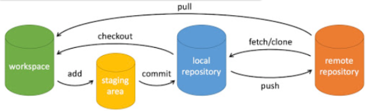

# 前端面试题汇总

## 1 HTML

1. 标签类型与作用：!DOCTYPE（标准声明）、head、body
2. H5新特性：语义化标签、webStorage存储、多媒体标签、canvas、websocket、表单增强、地理API、拖拽释放API
3. HTML语义化标签：可读性高、有利于SEO、便于开发
4. 网页组成：结构层、表现层、行为层，对应标准为HTML、CSS、ECMAScript
5. HTML4、HTML5、XHTML版本区别：4标签允许不结束，X标签必须结束（要求最高）
6. src、href引用外部资源区别：src将资源嵌入文档，href建立链接
7. `<script>`标签的 `defer`与 `async`属性的区别：都是异步加载脚本， `defer`是“渲染完再执行”，`async`是“下载完就执行”。如果有多个 `defer`脚本，会按照它们在页面出现的顺序加载，而多个 `async`脚本是不能保证加载顺序的。

## 2 CSS

##### 预处理器

less、sass（scss）、stylus中至少记住某一种的具体使用（优点/不同：语法上-嵌套、引入；作用域-变量操作；混入-抽象，可复用性高）

less：支持变量 `@变量名: 值`；支持嵌套；支持简单运算

##### display属性

none, block(`<div>`、 `<h1>`、`<p>`), inline(`<a>`、``、`<span>`), inline-block(同行排列，但同时拥有 block 元素可以设定宽高的特性), flex, grid, table...

##### position属性

static, relative（通过 `top`、 `bottom`、 `left` 、 `right`进行偏移）, absolute(相对于position不为static的父级), fixed（浏览器视窗固定位置）, sticky（相对定位和固定定位切换）

absolute与fixed差别：absolute会随滚动条移动，fixed不会

##### 自适应布局

1）媒体查询@media分别设置；2）使用相对单位(百分比、rem)；3）弹性布局；4）流式布局 eg：圣杯、双飞翼

##### 标准盒模型与怪异盒模型区别

标准的宽高不包含padding和border，怪异的包含（box-sizing: content-box/border-box）

##### css可继承属性

字体、文本、元素、列表布局、光标

##### BFC块级格式化上下文

解决边距重叠问题。原理？如何创建？（display、position、float、overflow）使用场景？（margin重叠、内部浮动、自适应多列布局）

##### 盒子塌陷

出现原因：父元素高度不足，子元素浮动。解决方案？（父元素clear：both；父元素overflow；父元素添加伪元素）

##### 样式类型

行内（内联）> 内部（style标签）> 外部引入

权重：1000-行内（style=""）；0100-ID选择器(#) ；0010-类(.)、伪类( : )、属性选择器；0001-标签(div)、伪元素选择器( :: )；0000-通配符(*)、相邻选择器(+)、子选择器(>)、后代选择器(空格)

浏览器解析css选择器流程：从右向左

##### 伪类和伪元素

伪类(:)是在已有元素上不同状态添加样式（:hover, :link, :visited, :disabled, :enabled, :first-child），伪元素(::)是创建不在DOM树中的元素并添加样式（::before, :: after, ::placeholder提示文字, ::first-letter首字母）

##### 单位

px-绝对单位，em/rem-相对父节点字体大小（用在width等中时若设定了当前元素字体大小则为相对当前元素字体大小）/HTML根元素字体大小，vw/vh-窗口宽/高

##### 页面中隐藏与显示

display:none(删除)；visibility:hidden(隐藏)；opacity:0(透明度0)；height&weight=0；position:absolute + top&left=-9999px(移出)

##### 浏览器默认设置、解除

##### 水平垂直居中实现

1）父position:relative+子position:absolute+top/left/right/bottom:0+margin:auto；

2）父...+子position:absolute+left/top:50%+margin-left/top:负宽高的一半；

3）父...+子position:absolute+left/top:50%+transform:translate(-50%,-50%)：

4）父元素display:flex+justify-content:center+align-items:center；

5）文字居中：父text-align:center+子line-height:父元素行高；

6）父元素display:grid,子元素align-self:center+justify-self:center或父元素align-items:center+justify-items:center或place-content:center

7）在浏览器视窗居中：position:fixed+inset:0px(上下左右都为0)+margin:auto

##### 三栏布局

1）弹性布局：父display:flex+左右固定宽度+中flex:1；

2）grid布局：父display:grid+grid-template-columns:200px 1fx 200px+左右width:200px+中width:100%；

3）圣杯布局：父padding:0 200px+子float:left+中width:100%+左width:200px+position:relative+margin-left:-100%+left:-200px+右width:200px+position:relative+margin-right:-200px；（缺点：宽度过小时左右会掉行）

4）双飞翼布局：中间元素加子元素div+子float:left+中width:100%+div-padding:0 200px+左width:200px+margin-left:-100%+右width:200px+margin-right:-200px

##### 实现loading动画

1）svg；

2）旋转：animation:spin 2s linear infinite+@keyframes spin {0%{ transform: rotate(0deg)}100%{ transform:rotate(360deg)}}；

3）点阵：父display:flex+justify-content:space-around+align-items:center+子animation:load 2s ease-in-out infinite+@keyframes load{0%,100%{ transform:scale(0)}50%{ transform:scale(1)}}+时延 子animation-delay:-0.45/0.3/0.15s

##### 图片格式选择JPG、PNG、Webp、SVG

JPG、PNG、WebP 是属于点阵图，SVG为矢量图

* 点阵图：JPG有损压缩，PNG无损压缩，WebP有损/无损（文件最小）
* 点阵动画：WebM：GIF的替代方案，文件更小
* 向量图：适用于固定的图形且图片中的颜色变化不多的，eg：logo、icon

##### 特殊形状实现

等腰三角形、扇形、圆形(border-radius)、旋转45度(-webkit-transform: rotate(45deg))、画0.5px的线(transform: scaleY(0.5)+transform-origin: left top)

##### 切换主题

引入新文件覆盖、用不同的类进行切换、写配置文件配置主题、主题调色板保存颜色变量

## 3 JS

1. 闭包：可以访问外部函数的变量
2. 事件委托：利用事件冒泡机制来管理事件处理程序 。将事件处理程序添加到一个父元素，而不是每个子元素，以提高性能和简化代码
3. 异步编程：promise（ES6），async/await（ES8引入的语法糖，用于简化promise，将异步变为同步写法）
4. 原型链、继承
5. ajax、 XMLHttpRequest、fetch、axios区别：[https://juejin.cn/post/7086325194934976519](https://juejin.cn/post/7086325194934976519)

## 4 框架

1. 你理解的框架？React - 组件化提高了代码的复用性和可维护性，适合大型复杂项目；Vue - 渐进式易上手，双向数据绑定，适合快速开发和迭代项目

### React

##### 纯函数

1. 输入相同内容时得到的输出也相同
2. 不改变函数以外的存在（没有副作用）

##### JSX

将UI与js逻辑相融

本质：生成 React 元素(elements)，是 `React.createElement(component, props, ...children)` 函式的语法糖

规则：1. return单一根元素；2. 所有标签都要闭合；3. 所有属性名都用小驼峰形式（`class `→  `className`、`stroke-width`  →  `strokeWidth`）

##### 虚拟DOM

使用：先更新虚拟dom，通过diff算法比较新旧虚拟dom后，再将更新部分应用到真实dom中

优点：可以使用声明式语法编写React，避免频繁直接操作DOM

缺点：多一层操作，跟原生操作 DOM 相比，通常会比较慢

##### hooks

用 `use` 开头的函数，只能在React函数的最顶层或自定义hook中使用

* **useState** ：用于定义和保存元件中状态(state)，接收一个初始值，返回一个包含两个值的数组，第一个值是现在 state 的值，第二个值是一个 setter function，可以通过这个 setter function 更新 state 值并触发 re-render。
* **useEffect** ：当想执行副作用时，会通过 useEffect 处理，例如：fetch api、记录追踪、setInterval()。需要传送两个参数在 `useEffect` 中，第一是一个 setup function，代表我们想执行的副作用代码，如果最后要清除这个副作用，需要return一个 cleanup function; 第二个参数是一个依赖数组，可选，可传入props或state，不填时每次组件渲染后执行一次，填[]时初始渲染后执行一次，有依赖时初始渲染和指定的变量发生变化时执行。
* **useContext** ：接收上级传递的Context数据
* **useReducer** ：也是一种管理 state 的 hook，可作为 `useState` 替代方案，适用于复杂状态管理（`useState` 是使用 `useReducer` 构建的）。接收两个参数，第一个是 reducer函数，第二个为初始值。会返回两个值，现在 state 的值和 `dispatch`  方法（传递值给reducer函数执行）。
* **useCallback** ：缓存函数。会返回一个被 memoized 的 callback 函数，使用useCallback钩子包裹的回调函数是memoized函数，初次调用该函数时，缓存参数和计算结果，再次调用这个函数时，如果第二个参数依赖项没有发生改变，则直接返回缓存结果，不会重新渲染。
* **useMemo** ：缓存计算结果。传入一个创建函数和依赖项目，创建函数会需要返回一个值，只有在依赖发生变化时，才会更新值。
* **useRef** ：获取DOM节点 或 保存变量，通常用于保存不需要渲染的变量，如计时器id。会返回一个可变的 ref 对象，内含 `.current` 属性，会被初始化为传入的参数值(initialValue)。

```js
const [count, setCount] = useState(0)
const [name, setName] = useState('')
const [count, dispatch] = useReducer(reducer, initialState)

useEffect(() => {
  console.log('useEffect - update title')
  document.title = `You clicked ${count} times`
}, [count])

//app.tsx创建Context
export const UserContext = React.createContext('')

const App = () => {
  return (
    <div className="App">
      <UserContext.Provider value={'chuanshi'}>
        <ComponentC /> //数据传给ComponentC
      </UserContext.Provider>
    </div>
  )
}

//ComponentE组件消费数据
import {UserContext} from '../App'

function ComponentE() {
  const user = useContext(UserContext)
  return (
    <div>
      {user} - {channel}
    </div>
  )
}


const onClick = useCallback((name: string) => {
   setName(name);
 }, []);

const userInfo = useMemo(() => ({ name: "小明", age: 18 }), []);

//获取DOM eg：进入页面时input获取焦点
const inputRef = useRef<HTMLInputElement>(null)
  useEffect(() => {
    inputRef.current && inputRef.current.focus()
  }, [])

//存储变量
const intervalRef = useRef(null) as { current: number }
```

**[https://juejin.cn/post/6844904157892050957](https://juejin.cn/post/6844904157892050957)**

##### 渲染列表时需要加上key属性

key 可以让 React 知道，哪些子元件被新增、 移除，或是修改。这一来可以避免一些跟状态改变有关的 bug，二来也可以让 React 在更新时的渲染更有效率

### Vue

1. 组件间通信：父子-props接收数据，`$emit`触发事件；兄弟-通过共同父组件传递，或状态管理工具Vuex；全局-EventBus-`$emit`传递数据，`$on`接收数据

## 5 浏览器

##### 浏览器输入网址后流程

查找本地是否有缓存 → DNS解析域名获得对应ip → 建立TCP连接 → 对该ip发送http请求 → 收到服务器端响应 → 关闭TCP连接 → 浏览器渲染 → JS引擎执行JS代码

##### 浏览器渲染流程

DOM树 + CSSOM树 → 渲染树 → 布局（布局树） → 绘制 → 合成

##### 回流重绘

* 回流（布局阶段）：改变布局时，eg：改变 `width`、`height`、`font-size` 等
* 重绘（绘制阶段）：改变颜色或其他不影响布局的属性时，eg：改变 `outline`、`visibility`、`color`、`background-color`等

减少回流重绘：避免频繁操作DOM

##### SPA

优点：用户体验好、前后端分离

缺点：SEO较差、JS文件过大

解决方法：

1. SSR (Server-side Rendering) 或 SSR (Server-side Rendering) + CSR (Client-side Rendering)
2. 懒加载(lazy loading) 、 代码分割(code splitting) 、压缩等

##### 事件委托、捕获、冒泡

**事件冒泡**：当一个元素接收到事件的时候，会把他接收到的事件传给自己的父级，一直到 `window` （注意这里传递的仅仅是事件，例如 `click、focus`等等这些事件， 并不传递所绑定的事件函数。）

eg：给三个盒子依次绑定点击事件，当点击盒子的时候，会依次触发父级元素的点击事件

**事件捕获**：当鼠标点击或者触发 `dom`事件时（被触发 `dom`事件的这个元素被叫作事件源），浏览器会从根节点 =>事件源（由外到内）进行事件传播

先事件捕获再事件冒泡

**事件委托**：也称为 `事件代理`。就是利用 `事件冒泡`，把子元素的事件都绑定到父元素上。如果子元素阻止了事件冒泡，那么委托就无法实现。

##### DOM生命周期

HTML 文件完全载入、解析 → `DOMContentLoaded` → CSS 样式表、图片等各类资源载入 → `load`

使用者离开网页前 → `beforeunload` → 离开或关闭网页 → `unload`

##### 存储

cookie：服务器生成sessionid，存储在浏览器，每次请求时都会被夹带在 HTTP header 中。通过 `Expires` 标明失效时间、或 `Max-Age` 标明有效时间长度，没有设置的话，预设是关闭浏览器之后失效。4KB 左右。

localStorage：键值对形式存储字符串，除非在用户端被手动删除，否则将永久保存。5MB~10MB 左右。用于存储内容稳定的资源，如logo、base64的照片。

sessionStorage：键值对形式存储字符串，在每次关闭该页面后就会自动被清除。5MB~10MB 左右。用于表单信息维护、本地浏览记录。

IndexedDB：浏览器端非关系型数据库，可存储所有格式，异步存取，可存取大型数据

增加cookie安全性：1. `Secure` ：只有通过HTTPS协议时才会传送给服务器；2. `HttpOnly` ：避免 JavaScript 的 `Document.cookie`方法取得 `HttpOnly cookies`，可以避免跨站脚本攻击XSS

##### 缓存

**强缓存：**

浏览器不会像服务器发送任何请求，直接从本地缓存中读取文件并返回Status Code: 200 OK

条件：在过期时间内则为强制缓存

* Expires：过期时间（http1.0）
* Cache-Control：max-age=xxx  缓存有效时间（http1.1，会覆盖Expires）

**协商缓存:**

向服务器发送请求，服务器通过请求头中的If-Modified-Since（Last-Modified）或者 If-None-Match（Etag）字段检查资源是否更新，更新则返回新资源和200，没有更新则返回304，告诉浏览器直接从缓存获取资源

条件：缓存已过期 或者 Cache-Control：no-cache

* ETag/If-None-Match ：`ETag`是一个资源版本的唯一标识符，后续请求该资源时，会在请求头中携带 `If-None-Match`字段，其值为先前接收到的 `ETag`，服务器会根据这个值来判断资源是否有更新。（http1.1，优先级更高）
* Last-Modified/If-Modified-Since：类似于 `ETag`机制，但 `Last-Modified`记录的是资源最后修改的时间。浏览器在后续请求时，会在请求头中携带 `If-Modified-Since`字段，其值为先前接收到的 `Last-Modified`时间。服务器会检查资源的最后修改时间是否在这个时间之后。（http1.0）

`cache-control: no-store` // 不缓存，直接每次都请求最新资源

### 操作系统

1. 32位系统和64位系统的区别：32位系统每次最多处理32位（二进制位）的数据，最多支持4GB的物理内存。64位系统每次最多处理64位的数据，最高支持到约18.4亿GB的内存寻址。
2. 进程和线程：进程是操作系统中运行的程序的独立实例，每个进程都有独立的地址空间、数据段、代码段和堆栈。线程是进程中的执行单元，一个进程可以包含多个线程，所有线程共享进程的内存空间。
3. 进程间通信：消息队列、管道、共享内存、信号、套接字
4. 线程间通信：全局变量/共享内存、锁（互斥锁、读写锁、自旋锁）、条件变量、事件机制

## 6 计算机网络

### HTTP

##### HTTP/1

1. 使用标头中的 `If-Modified-Since`、`Expires` 来做为缓存的判断标准，这两者都是以时间作为依据

##### HTTP/1.1

1. 实现持久连接；
2. 添加状态码 `100 (Continue)` 机制：先发送请求头到服务器，若无问题则响应100，再发送带正文的请求，以减少浪费；
3. 快取缓存：引入更多的缓存策略，例如：`Etag`、`If-Unmodified-Since`、`If-Match`、`If-None-Match`；
4. 增加了 Host 字段，用来指定服务器的域名，可以将请求发往同一台服务器上的不同网站；
5. 新增了许多请求方法，如 `CONNECT`、`TRACE` 、`OPTIONS` 等。

##### HTTP/2

1. 多路复用：让同一个 TCP 连接中，同时发送和接受多个请求，并且不用等到前一个请求收到回应，透过这个机制，解决了过往在 HTTP 层级的的头部阻塞问题
2. 优先请求顺序：每个数据包在发送的时候会带上一个唯一的数据流编号 ID (`stream ID`)，客户端可以指定数据流的优先级
3. 请求头压缩：HPACK 算法使用一份索引表来定义常用的 http header，并把 http header 存放在表里，请求的时候只需要发送在表里的索引位置即可，不须用传完整的标头
4. 服务器主动推送数据，减少客户端的请求次数

### 跨域

产生原因：同源策略限制网页只能存取同源的资源，同源指协议、域名、端口都相同

##### CORS

后端工程师在服务器端做 CORS 请求头的设定

分为简单请求（get、post、head）和非简单请求（除简单请求以外的其他请求先发送预检请求OPTIONS，满足条件后再发送CORS请求）

1. `Access-control-allow-origin`：设置允许跨域请求的源，要么是请求时 `Origin`字段的值，要么是*
2. `Access-control-allow-credentials：true` // 允许跨域发送cookie，此时origin不能设置为*
3. `Access-Control-Allow-Methods: GET, POST, PUT ` // 服务器支持的所有跨域请求的方法，对应 `Access-Control-Request-Method`
4. `Access-Control-Allow-Headers: X-Custom-Header` // 服务器所支持的所有头信息字段，对应 `Access-Control-Request-Headers`
5. `Access-Control-Max-Age` // 指定本次预检请求的有效期，单位为秒。

##### JSONP

通过 `<script>` 的src 填上目标地址从而发出 GET 请求

##### PROXY正向代理

vpn

##### nginx反向代理

iframe

websocket

## 7 数据结构和算法

排序

二叉树

哈希表

深度优先遍历、广度优先遍历

防抖

节流

promise

## 8 开发工具

### 工具版本汇总

1. HTML：2.0-3.2-4.0-4.01-XHTML1.0-5.0
2. CSS：3
3. JS：ECMAScript2015（ES6）- ECMAScript 2024 (ES14)
4. TS：5.3
5. React：18.2，umi：4
6. Vue：3.3.4
7. Node.js：18+
8. webpack：6
9. http：1.0-1.1-2-3

### git

**git命令：**

add\commit\push

pull\clone\checkout



branch-创建or列出or删除(-d)分支\checkout-切换分支or放弃修改\merge-合并分支\rebase-改变基底

reset-回退版本(后面提交的版本会删除)\revert-反做(修改之前版本不影响已提交版本)

### 前端模块化规范

##### CommonJS

* Node.js环境
* `require`、`module.export`
* 同步载入
* 一个文件为一个模块

##### AMD

* Async Module Definition - 非同步模组定义
* 浏览器环境
* 可在一个文件中定义多个模块

##### CMD

Common Module Definition，结合 `CommonJS` 和 `AMD` 规范的优点

* 浏览器环境
* 异步模块加载
* 一个文件为一个模组

##### UMD

Universal Module Definition，解决使用不同标准产生的问题，可以让 `AMD` 和 `CommonJS` 使用同一份文件

##### **ES Module(ESM)**

ES6实现了模块的功能，并结合了 `CommonJS` 和 `AMD` 的两者优点

* 类似 `CommonJS`，引入简单的语法如 `export` 和 `import`，并且也是一个文件为一个模块
* 类似于 `AMD` ，为异步加载
* 多用于浏览器环境，nodejs环境也支持

### 打包

#### webpack

1. 打包流程：1）解析配置文件webpack.config.js；2）Entry-读取入口文件及依赖模块，构建依赖图；3）Module-递归解析模块依赖；4）Loader-使用相应Loader加载模块源代码；5）Plugin-通过插件对加载的模块进行打包优化等处理；6）Output-打包后文件输出到指定目录
2. module，chunk 和 bundle 区别：同一份逻辑代码在不同转换场景下的三个名字：直接写出来的是 module，webpack 处理时是 chunk，最后生成浏览器可以直接运行的 bundle
3. 优化打包速度：1）使用生产模式；2）代码拆分成多个bundle；3）用Tree Shaking移除未使用的代码；4）缓存
4. loader和plugin区别：loader本质为函数，对接受的非js内容进行转换（使用 style-loader 和 css-loader 来处理），plugin是插件，扩展webpack功能，通过webpack提供的生命周期钩子改变输出结果
5. 自写loader

**Loaders** : 用于转换模块的源代码，常见的有：

* `babel-loader`: 转换ES6+代码为兼容旧浏览器的JavaScript代码。
* `css-loader`: 允许你 `import`或 `require`CSS文件。
* `style-loader`: 将CSS注入到DOM中。
* `file-loader`: 处理图片、字体等文件，并返回URL。

 **Plugins** : 用于执行更复杂的任务，常见的有：

* `HtmlWebpackPlugin`: 自动生成HTML文件并注入打包后的资源。
* `CleanWebpackPlugin`: 在每次构建前清理输出目录。
* `MiniCssExtractPlugin`: 将CSS提取到单独的文件中。

#### vite

优点：本地开发、热模块更新，通过Rollup打包

基本上除了 Next （React）与 Angular 之外，热门的框架都是选 Vite

#### glup

## 9 登录问题

登录页面需注意内容：

信息加密：对称、非对称

token鉴权、jwt

第三方登录

## 10 web安全

##### DDos攻击（分散式阻断服务攻击）

攻击方式：多台计算机发送大量的合法请求造成资源过载，导致服务停止

防御措施：

1. 增加网站可承受容量（使用可扩展资源临时扩大）；
2. 反向代理（现在云端厂商多半有机器学习的解决方案，会去对流量做分析，可以辨认哪些访客是真的，哪些是假的）；
3. CDN

##### XSS攻击（跨站脚本攻击）

攻击方式：从客户端注入攻击脚本，最常见的是把 JavaScript 的脚本注入到输入框中，来达到某种目的，例如：窃取 Cookie、Session、密码，篡改网页内容

防御措施：

1. 将输入框中的HTML标签转换为字符串格式（如果攻击者输入 `<script>alert(1)</script>` ，则把 `<` 转成 `&lt`）；
2. 通过 CSP (content security policy) 来设定有哪些域名中的脚本会被浏览器认为是该被执行的，然后浏览器只执行那些该被执行的脚本；
3. 任何允许用户输入的内容都要检查，删除相关的关键字，如 `<script>` 、 `onerror` 等指令

##### CSRF攻击（跨站请求伪造）

攻击方式：强迫使用者在已经验证身份的网站中，执行某些恶意的伪造操作

防御措施：

1. 增加验证
2. 不用GET请求做关键操作，改为POST请求后必须用户提交请求才会被攻击
3. 检查HTTP 请求头中的 Referrer 字段，确保请求不是来自于其他网站（也可能被篡改）
4. 使用CSFR token：让网站用另外的 token 验证使用者的身份，而不是通过 cookie
5. SameSite Cookie：限制cookie只能被自己网站使用，即限制其他域来的请求不带上 Cookie

##### SQL注入攻击

攻击方式：通过修改 SQL 语句，达到对数据库的恶意攻击

防御措施：

1. 用正则表达式对用户输入进行检查，如果有符合 SQL 语句的关键字，就替换成合法字符
2. Query Parameterization（参数化查询）：先将 SQL 语句进行编译，最后再将参数丢入做执行
3. Object Relational Mapping (ORM，把数据库映射成对象)：使用 ORM 而非原始的 SQL 语句可以直接避免 SQL Injection

## 11 性能优化！

1. web页面性能优化措施：1）代码拆分为多个bundle，减少初始加载事件；2）懒加载；3）压缩文件大小；4）使用CDN（内容分发网络）；5）缓存；6）减少http请求；7）使用HTTP/2
2. 减少页面首屏时间（FCP）：1）代码拆分；2）懒加载；3）压缩；4）使用CDN；5）服务器端渲染（SSR）；6）预加载（preload）
3. 性能监测和优化工具：Chrome DevTools
4. 单元测试和集成测试框架：Jest

## 12 新技术

##### Bun

js运行环境：Nodejs → Deno → Bun

优点：

* 集js执行、测试、打包、包管理一体化
* 速度快
* 支持TS
* 兼容CJS和ESM
