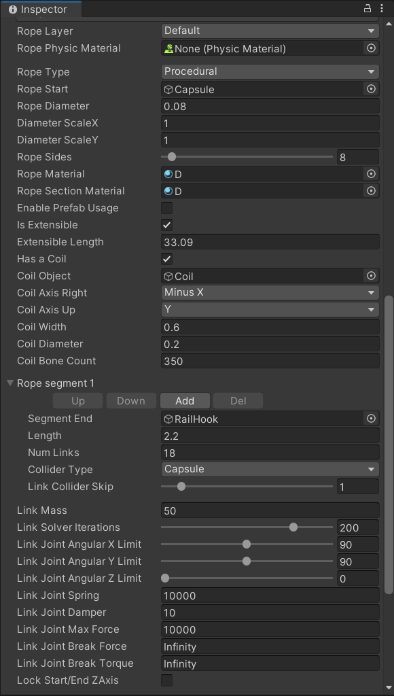
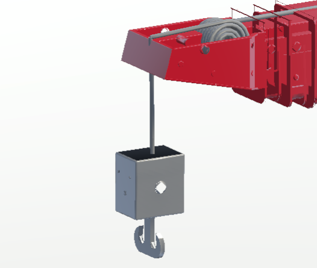

# Unity插件Ultimate Rope Editor实现绳索效果

### 一、**绳子主要控制脚本组件Ultimate Rope**

 **1.**  **Rope Layer：** 设定绳子的层Layer

 **2.**  **Rope Physic Material：** 绳子物理材质

 **3.**  **Rope Type：** 绳子类型（一般选择Procedural程序上的控制类型）

 **4.**  **Rope Start：** 绳子起始点（需要场景中的Transform组件的游戏物体拖入）

 **5.**  **Rope Diameter：** 绳子直径

 **6.**  **Diameter ScaleX：** 直径X轴向缩放比例

 **7.**  **Diameter ScaleY：** 直径Y轴向缩放比例

 **8.**  **Rope Sides：** 绳子横截面的的边数（数值越大越圆滑）

 **9.**  **Rope Material：** 绳子材质

 **10.Rope Section Material：** 绳子部分截面材质（一般不用）

 **11.**  **Enable Prefab Usage：** 是否将自定义好的绳子做成预制体（做成预制体后变成死模型）

 **12.**  **是否扩充：** 扩充长度、是否盘成卷

 **13.**  **Rope segment 0 - n:** 组成绳子的节点数，没两个节点之间产生一条绳索

　　(1) **Up/Down/Add/Del** 将此节点进行上移/下移/增加节点/删除节点

　　(2)  **Segment End：** 节点位置（场景中游戏物体Transform组件）

　　(3)  **Length:** 组成上一节点与此节点之间线段的每节长度

　　(4)  **Num Links：** 组成上一节点与此节点之间线段的链节数

　　(5)  **Collider Type：** 碰撞体类型

 **14.**  **Link Mass：** 链节质量

 **15.**  **Link Solver Iterations：** 链节计算迭代次数

 **16.**  **Link Joint Angular X Lim：** 链节X轴向旋转角度限制

 **17.**  **Link Joint Angular Y Lim：** 链节Y轴向旋转角度限制

 **18.**  **Link Joint Angular Z Lim：** 链节Z轴向旋转角度限制

 **19.**  **Link Joint Spring：** 链节弹力

 **20.**  **Link Joint Damper：** 链节阻力

 **21.**  **Link Joint Max Force：** 链节间最大作用力

 **22.**  **Link Joint Break Force：** 链节断裂力

 **23.**  **Link Joint Break Torque：** 链节断裂扭矩

 **24.**  **Lock Start/End ZAxis：** 锁定起始于终止节点处的旋转

 **25.**  **Send Rope Events：** 是否发送绳子断裂触发事件

　　(1)  **Events Object Receiver：** 接收事件的游戏物体

　　(2)  **Break Event Method：** 断裂触发的方法名

 **26.**  **Persist after playmode：** 坚持当前设置的值（使用不详）

 **27.**  **Reset rope：** 刷新绳索

 **28.**  **Delete rope：** 删除当前绳索

 **29.**  **Convert to static mesh：** 将当前绳索生成并保存成一个静态的模型

### 二、起重机绳索效果具体实现

参考[Ultimate Rope Editor 柔性绳子编辑器插件-CSDN博客](https://blog.csdn.net/shymayumi/article/details/121286117)

#### 参数设置

#### 绳子乱飞原因及解决

在将重物挂载为绳子终点时，绳子出现乱飞现象，此时需调大绳子质量

#### 实现效果

