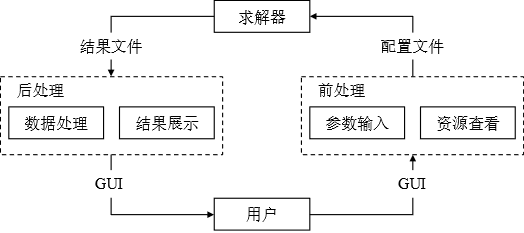
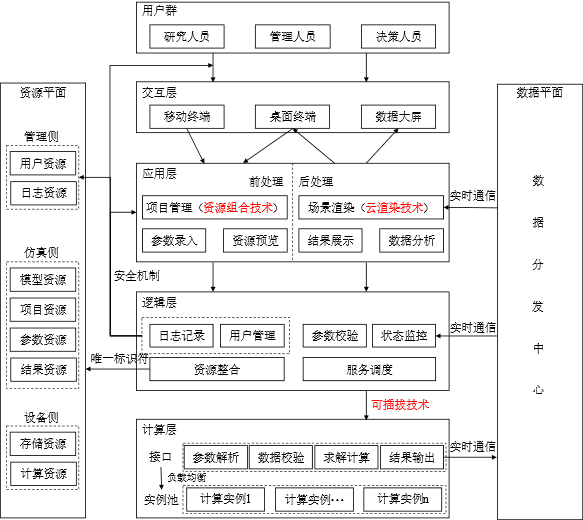
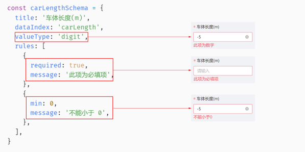
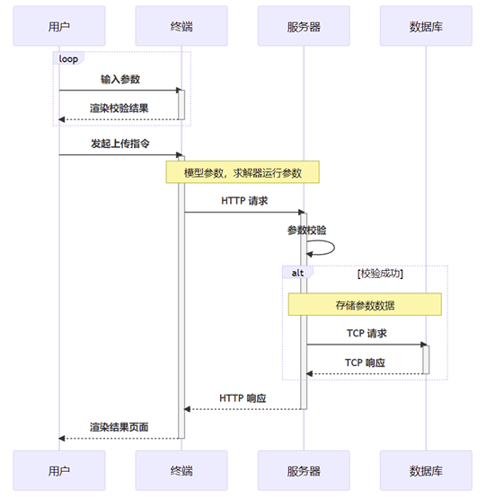
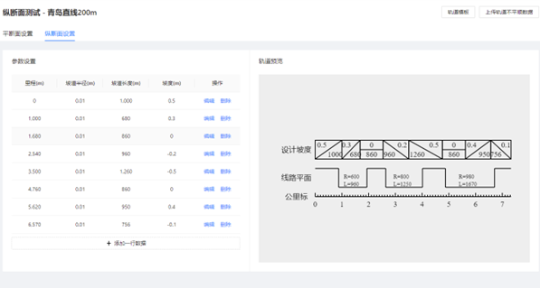
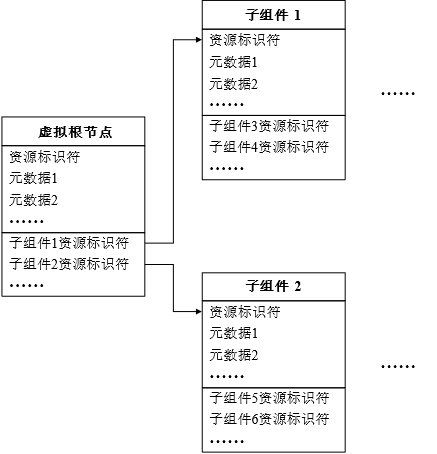
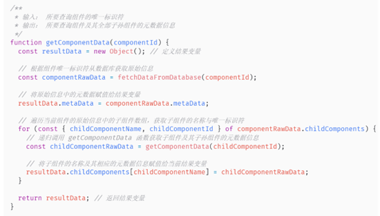

# 铁道车辆动力学仿真系统前后模块开发

## 一、系统设计与实现

### 1.1 设计背景与意义

目前，商业通用多体动力学仿真软件在铁路行业广泛应用，这些软件尽管在仿真效率、建模精度、功能完备程度等方面具有优势，但是也存在仿真资源模型复用程度不高、二次开发困难以及潜在的许可证等问题。

为了发展和完善自研的动力学仿真算法，逐步摆脱对国外仿真软件的依赖，并最终打破国外的仿真技术垄断，开发一款自主可控铁道车辆动力学软件势在必行。

国内的一些研究机构一直在致力于开发自主可控的，或者针对铁路领域特定研究方向的多体动力学仿真软件。但研究人员往往把开发的重心放在算法求解上，在前后处理上只实现基础的输入输出，而缺乏并行计算，数据共享，跨平台访问等功能特性；在架构上也会选择最为简单的单体架构，即将算法和数据模型的前后处理耦合在一起。这种on-the-fly的开发模式虽然具有较高的灵活性和可控性，但是任何代码的变动都需要重新编译整个程序，开发效率低，代码重用度不高。因此，这些仿真软件虽然具有商业推广的价值，但是由于用户交互体验不佳，功能单一，通常只在机构内部使用。

此项目基于云计算概念，将云仿真应用到铁路车辆动力学仿真软件的设计与开发中，可以实现将复杂的仿真计算、结果分析等核心求解逻辑与软件界面、用户交互等前后处理逻辑相分离，有助于推动算法自主可控，用户交互良好，具有应用价值与商业推广价值的动力学仿真软件的进一步发展。

### 1.2 系统功能设计

如图1-1所示，一个完整的仿真流程总体上可以分为前处理，求解计算和后处理三个步骤。根据研究目的的不同，用户首先通过仿真软件的GUI界面建立相应的仿真模型，具体过程包括研究对象的物理参数输入，研究对象之间约束条件的建立，以及必要的模型交互和编辑；接着，软件内部将用户的参数输入以及必要的求解器设置参数整合成配置文件的形式，传输给核心的求解器进行计算；最终，求解器输出结果文件，再由相应的后处理程序对结果进行可视化展示。



图1‑1 通用仿真流程示意图

#### 1.2.1 主要功能

在前处理阶段，系统应该具有以下功能：

（1）以项目为聚合根的管理机制。构建抽象的仿真项目主体，关联用户以明确管理权限，向下包含列车车辆、运行线路、轨道参数、轮轨耦合参数等模型资源，明确仿真资源与仿真项目主体之间的引用关系，提供统一的查看、编辑、删除、增加功能页面。

（2）项目主体的状态同步。用户在任意终端对仿真项目建模状态的更改，在明确的同步操作后，需要在其它终端设备上实现建模状态的实时同步，确保单用户异地、跨设备地同步仿真过程，多用户实时同步仿真过程。

（3）资源复用。在构建新仿真项目的过程中，允许用户从现有仿真项目或者团队构建的仿真资源数据库中快速地克隆已有模型资源，并在该资源的基础上进行任意程度的更改而不影响原资源的状态。

（4）模型状态预览。针对运行线路、轨道型面等标准化的模型资源，提供一定程度的状态预览功能，根据用户输入的参数实时渲染相应的轨道线路图、钢轨型面等预览图，方便用户直观地查看数据的正确性与合理性。将资源预览的能力组件化，实现在不同场景下同一个资源预览逻辑的复用。

在求解计算阶段，系统应该具有以下功能：

（1）数据预校验。对于计算耗时、资源消耗严重的求解过程，有必要在真正的求解计算开始之前，对输入的参数进行预校验，避免错误的参数设置或不合理的精度要求导致求解过程发散、结果不精确等问题，造成计算资源的浪费。

（2）多求解过程并行运行。保持仿真过程之间的独立性，允许同时响应多个用户发起的仿真计算请求，建立仿真计算请求与用户、仿真项目主体之间的一一对应关系，确保并行运行的求解过程与仿真项目之间正确的匹配关系。

（3）算法的无感知更新机制。系统中仿真算法的迭代升级不应对用户的使用造成影响，在算法更新过程中，对于空闲的求解器立即进行算法的更新操作；对于仍在运行中的求解器使用原有算法完成整个流程后再进行算法的更新操作。

在后处理阶段，系统应该具有以下功能：

（1）仿真结果可视化交互。对于时序性的仿真过程，允许在结果查看界面以视频的形式播放仿真结果的渲染效果，用户可以选择性地暂停、回放仿真过程，点击研究对象模型查看更加详细的结果数据。

（2）仿真过程的实时与可回放机制。用户在查看仿真项目的结果时，对于正在运行中的仿真过程，能够实时地获取求解器计算得出的最新结果，并进行场景渲染和数据驱动；对于已经完成的仿真过程，能够获取到对应的完整计算结果，并进行场景渲染和数据驱动，允许用户快速地获取到某一时间点的结果数据及之后的连续数据。

除了前处理、求解计算和后处理三个阶段各自的功能外，系统整体还应该具有以下功能：

（1）权限管理机制。通过基于用户角色的权限管理机制明确匿名用户、普通用户、管理员用户之间的权限界限，通过基于资源的权限管理机制保障项目参与人员对仿真项目主体的增删改查能力，避免权限泄漏导致的资源安全问题。

（2）跨平台，跨终端能力。确保系统可以有效运行在Windows、Linux、Mac等操作系统下，确保系统功能页面在手机、平板、笔记本、PC、数据大屏等不同尺寸的显示设备下具有良好的自适应能力。

#### 1.2.2 网络构架

选择基于B/S架构进行系统的开发。针对系统安全性问题，引入业界广泛使用的OpenID身份认证机制与OAuth2.0客户端授权协议；针对响应速度慢问题，采用内容分发网络(Content Delivery Network, CDN)和浏览器缓存技术提高用户首次访问应用时的响应速度。

### 1.3 总体框架



## 二、前处理模块功能

### 2.1 参数录入功能

#### 2.1.1 技术选型

基于B/S架构进行前处理模块前端页面的开发，首先需要解决的是页面元素和参数数据的绑定与更新问题。目前，业界广泛应用于解决此类问题的框架或JavaScript库主要包括Vue2/3和React。综合考虑各项因素，选择基于**React**进行进一步的Web开发。

此外，进行跨平台、跨终端的应用开发，还需要解决自适应的尺寸适配问题。为此，引入企业级的UI设计系统**Ant Design**进行响应式的界面布局，在采用React技术的前提下，依赖相应的开源UI组件库antd进行本系统用户交互界面的设计与排版。

此外，配合antd，基于react，采用umi基础前端框架，特别适合企业级别的平台管理系统开发。

#### 2.1.2 功能实现

借助React及相应的UI组件库，本系统可以根据预先约定的数据交换格式快速地创建相应的用户交互界面元素，并且实现用户输入数据与内存中变量的绑定。而为了适应复杂的铁道车辆动力学仿真参数录入需求，需要考虑三个层面的数据校验能力。

第一个层面是单个独立数据的校验，如输入数据的类型，最大最小值，可选择的枚举类型等。针对此类校验需求，本系统通过Json Schema格式的中间语言声明式地定义了每个输入数据的校验规则，并依赖代码逻辑完成每个规则的校验。如图2‑1所示，页面根据左侧的表单数据配置选项渲染生成右侧的输入框，根据选项中的valueType、required和min字段完成了输入数据的校验以及必要的错误信息提示。



图2‑1 参数录入和数据校验示意图

第二个层面是相关联数据的一致性校验，如在车线耦合动力学仿真过程中需要对运行轨道的平断面和纵断面进行参数设置，那么就需要保证平断面参数设置时各段圆曲线、缓和曲线和夹直线之间的连续性以及平断面和纵断面总长度的一致性。针对此类校验需求，本系统通过基于已有数据进行推导的方式实现待录入参数的预填充。以运行轨道的平断面参数为例，运行轨道主要由直线段以及圆曲线段构成，且直线段和圆曲线段之间需要连接一段缓和曲线，因此设计运行轨道平断面数据由开始里程、轨道型式、曲线半径、长度、缓和曲线长度和超高组成，且满足以下预填充原则：（1）若当前线路段是运行轨道的第一段线路，预填充开始里程为0，否则预填充开始里程为前一线路段平断面参数的开始里程、长度和缓和曲线长度之和；（2）若前一线路段为圆曲线段（曲线半径大于0），则当前线路段为直线段，预填充曲线半径为0，超高为0。

第三个层面是输入参数的合理性校验，该层面的数据校验逻辑往往需要专业的铁道车辆背景知识，如缓和曲线的长度需要根据曲线半径，结合该地段的行车速度和地形条件进行合理选用，至少应保证曲线超高在缓和曲线范围内顺完。考虑到这类数据校验的需求往往需要综合整个仿真项目的参数设置，无法在单个页面完成，因此本系统在前处理模块的前端应用中设计了单独的系统参数自检页面，在此页面终端设备将当前仿真项目的全部仿真资源参数数据上传到服务器，由服务器整合全部数据进行参数校验。若预定义的数据校验通过，则将上传的全部数据进行持久化存储并渲染校验成功页面，否则不执行持久化存储并直接渲染校验失败页面。

最终，前处理模块的参数录入校验功能的时序图如图2‑2所示。其中，第一、二两个层面的数据校验发生在用户与终端之间输入参数和渲染校验结果的循环中；第三个层面的数据校验发生在服务器内部的参数校验环节。



图2-2 参数录入校验功能时序图

### 2.2 资源预览功能

考虑到数据校验不能完全避免参数录入过程中的错误输入，提出了根据用户输入的参数实时渲染相应的资源预览图的方式以更加直观、高效地帮助用户查看所输入数据的正确性与合理性。

#### 2.2.1 技术选型

具体的资源预览图绘制过程依托于浏览器原生提供的canvas接口，通过第三方工具库fabric.js提供的上层封装实现，因此兼具良好的性能和易用性。

#### 2.2.2 功能实现

对于线路纵断面预览图，其输入为运行轨道的平断面参数中各条线路段的开始里程、曲线半径、长度和纵断面参数中各条线路段的开始里程、坡道长度和坡度，输出主要分为公里标绘制区域、线路平面绘制区域和设计坡度绘制区域，整个过程分为绘制阶段和自适应阶段。

在预览图的绘制阶段，不考虑图像超出画布边界的问题，完成三块区域的绘制内容。对于公里标绘制区域，通过计算平断面线路段的总里程和纵断面线路段的总里程，取二者的较大值为公里标的总长度，并按照100米为基础刻度绘制小刻度线，1000米为基础刻度绘制大刻度线。对于线路平面绘制区域，迭代各条线路段的输入参数，根据直线（曲线半径等于0）和圆曲线（曲线半径大于0）的不同绘制相应的图像区域，以当前图像区域中画笔的末端坐标为下一图像区域中画笔的首端坐标，并为圆曲线段添加相应的标注。对于设计坡度绘制区域，采用与线路平面绘制区域一致的绘制思路迭代完成。

在预览图的自适应阶段，首先计算三块绘制区域总体的长度和高度，结合Web页面中画布元素的长度和宽度计算相应的缩放因子，为整个画布绘制上下文环境设定该缩放因子。随后，通过三块绘制区域的边界计算中心坐标，结合Web页面中画布元素的中心坐标计算相应的平移偏移量，为整个画布绘制上下文环境设定该平移偏移量。最终，形成如图2‑3所示的线路纵断面预览图。



图2‑3 线路纵断面预览图

### 2.3  项目管理功能

#### 2.3.1 技术选型

针对传统的桌面端动力学仿真软件提供的仿真资源库不完善、可扩展性不足导致的在多个仿真项目中复用之前的仿真资源不方便的问题，提出了一套组合粒度更加精细化、扩展性更强的基于元数据的仿真资源组合技术。

#### 2.3.2  功能实现

**项目复用**

首先，根据理论知识对模型资源进行粒度的划分，并建立表征资源特性的元数据。接着，为所有的模型资源建立全局唯一的资源标识符，用以在仿真的全流程中快速而精确地获取任意资源的全部元数据。最后，根据模型资源的组合关系建立相应的资源标识符的索引关系，形成如图2-4所示的资源组合结构。通过该技术，将不同仿真项目对同一仿真资源的使用转换为不同的仿真项目元数据对同一仿真资源标识符的包含关系，有效地避免了在不同的仿真项目中重复地输入同一个仿真模型资源的各种参数，同时用户对特定模型资源的更新可以有效地立即应用到任何仿真项目中。



图2-4 基于元数据的仿真资源组合技术示意图

**多人协同仿真**

针对传统的桌面端动力学仿真软件采用操作系统自带的文件管理系统进行仿真项目资源的存储导致的个人跨设备同步仿真内容，团队成员之间共享仿真项目更改不方便的问题，提出了采用基于中心化的资源存储方式进行仿真项目信息的存储与管理，并结合基于元数据的仿真资源组合技术进行内容的获取。

在具体的实现上，由于为解决仿真资源复用问题而开发的基于元数据的仿真资源组合技术已经将仿真资源之间的组合关系转换成仿真资源元数据对仿真资源唯一标识符的包含关系。因此，在系统架构图中，通过在资源平面引入关系型数据库将这种包含关系序列化到数据表中，作为唯一标识仿真项目信息的存储资源；在逻辑层开发相应的服务端程序为项目仿真资源的管理提供统一的接口；随后，在应用层通过如图2-5所示的代码逻辑，根据虚拟根组件的唯一标识符一次性递归式地获取整个仿真项目的所有信息；最后，将这些信息通过网络传输给交互层进行渲染与展示。



图2-5 查询组件元数据代码

通过上述的实现方式，每当某一个用户在一台终端设备上进行了仿真项目信息的更改，在显式的上传操作之后，最新的更改将被存储到资源平面的关系型数据库中，当任何用户在任何终端设备上再次访问该仿真项目时，应用程序将会获得最新的仿真资源数据。此外，借助这种中心化的资源存取形式，再结合逻辑层提供的用户权限管理功能，可以实现更高层面的仿真项目资源管理能力。

## 三、前处理模块具体实现

### 3.1 初始化与本地储存

#### 3.1.1 布局初始化

umi中的@umijs/plugin-layout将布局通过 umi 插件的方式内置，只需通过简单的配置即可拥有 Ant Design 的 Layout，包括导航以及侧边栏。从而做到用户无需关心布局。

app.tsx中：

```typescript
import type { RunTimeLayoutConfig } from '@@/plugin-layout/layoutExports';

export const layout: RunTimeLayoutConfig = (state) => {
  const { initialState, setInitialState } = state;
return {
  footerRender: () => <Footer />, 
  //自定义页脚
  logout: async () => { 
  //退出按钮设置，默认里面无操作，本项目需清空本地存储以及状态，并回到登陆界面
    saveToSession('token', '');
    await setInitialState({});
    history.push(loginPath);
  },
  onPageChange: () => { 
  //页面改变判断有无用户，没有则回到登陆界面
    const { currentUser } = initialState ?? {};
    const { location } = history;
    if (!currentUser) {
      if (location.pathname !== loginPath) {
        history.push(loginPath);}}},};
```

#### 3.1.2 数据初始化

在src/app.ts中导出getInitialState() 约定生产初始化数据，在登录组件中搭配@umijs/plugin-model消费初始化数据。通常该插件会配置 @umijs/plugin-layout 和 @umijs/plugin-access 插件一起使用，和 Layout 插件一起使用的时候返回的数据要符合 Layout 的要求。

> getInitialState是一个 async 的 function，会在整个应用最开始执行，返回值会作为全局共享的数据，其他组件通过useModel('@@initialState') 直接获取到这份数据。

在app.tsx中获得初始化数据：

```typescript
export async function getInitialState(): Promise<InitialStateType> {

  //如果当前地址等于登录页面地址返回空
  if (history.location.pathname.toLowerCase() === loginPath) return {}; 
  
  //获得本地token（请求头）
   const configuration = await getConfiguration();
   
  //没有token，重新登录
   if (!configuration.currentUser.isAuthenticated) 
     history.push(loginPath);

  //返回成功，将数据存入currentUser，id存入currentProjectId
  return 
      {
        currentUser: configuration.currentUser,
      };
  }
```

在@/pages/Account/Login/index.tsx中使用初始化数据：

```typescript
const Login: React.FC = () => {

/*const { initialState, loading, error, refresh, setInitialState } = useModel('@@initialState')，可获得5个参数：
     initialState：getInitialState 的返回值
     refresh：重新执行 getInitialState 方法，并获取新数据
     setInitialState：手动设置 initialState 的值*/

  const { setInitialState } = useModel('@@initialState');
  
   const handleSubmit = async (values: LoginDto) => {
    const loginResult = await login(values);
    if (loginResult.access_token) {
      message.success('登录成功');
      sessionStorage.setItem(
        'token',
        `${loginResult.token_type} ${loginResult.access_token}`
      );
      const configuration = await getConfiguration();
      //将登录成功得到的数据设置为初始化数据
      await setInitialState((s) => ({
        ...s,
        currentUser: configuration.currentUser,
      }));

      if (!history) return;
      const { query } = history.location;
      const { redirect } = query as { redirect: string };
      history.push(redirect ?? '/');
    } else {
      message.error('登陆失败');
    }
  };
```

#### 3.1.3 本地储存

localStorage用于持久化的本地存储，除非主动删除数据，否则数据是永远不会过期的。

sessionStorage和cookie存储的数据只有在同一个会话中的页面才能访问并且当会话结束后数据也随之销毁。打开一个页面时记录sessionStorage,当你把页面或者浏览器关闭时session中的数据即销毁。

**html4：cookie和session**

cookie保存在浏览器端，session保存在服务器端，关闭浏览器后数据销毁。

cookie：如果不在浏览器中设置过期时间，cookie被保存在内存中，生命周期随浏览器的关闭而结束，这种cookie简称会话cookie。如果在浏览器中设置了cookie的过期时间，cookie被保存在硬盘中，关闭浏览器后，cookie数据仍然存在，直到过期时间结束才消失。cookie是服务器发给客户端的特殊信息，以文本的方式保存在客户端，每次请求时都带上它。

session：当服务器收到请求需要创建session对象时，首先会检查客户端请求中是否包含sessionid。如果有sessionid，服务器将根据该id返回对应session对象。如果客户端请求中没有sessionid，服务器会创建新的session对象，并把sessionid在本次响应中返回给客户端。

cookie只能保存字符串类型，以文本的方式；session通过类似与Hashtable的数据结构来保存，能支持任何类型的对象(session中可含有多个对象)

**html5：Web Storage与本地数据库**

Web Storage存储机制是对HTML4中cookie存储机制的一个改善。本地数据库是HTML5中新增的一个功能，使用它可以在客户端本地建立一个数据库，原本必须保存在服务器端数据库中的内容现在可以直接保存在客户端本地了，这大大减轻了服务器端的负担，同时也加快了访问数据的速度。

webStorage：

1.sessionStorage：将数据保存在session对象中。所谓session，是指用户在浏览某个网站时，从进入网站到浏览器关闭所经过的这段时间，也就是用户浏览这个网站所花费的时间。session对象可以用来保存在这段时间内所要求保存的任何数据。

2.localStorage：将数据保存在客户端本地的硬件设备(通常指硬盘，也可以是其他硬件设备)中，即使浏览器被关闭了，该数据仍然存在，下次打开浏览器访问网站时仍然可以继续使用。

这两者的区别在于，sessionStorage为临时保存，而localStorage为永久保存。localStorage和sessionStorage都保存在客户端，不与服务器进行交互通信。localStorage和sessionStorage只能存储字符串类型，对于复杂的对象可以使用ECMAScript提供的JSON对象的**stringify**和**parse**来处理。

webStorage方法：

`setItem (key, value)` ——  保存数据，以键值对的方式储存信息。

`getItem (key)` ——  获取数据，将键值传入，即可获取到对应的value值。

 `removeItem (key)` ——  删除单个数据，根据键值移除对应的信息。

 `clear () `——  删除所有的数据

 `key (index)` —— 获取某个索引的key

### 3.2 登录权限与网络请求

#### 3.2.1 登录与token

Token 是在服务端产生的。如果前端使用用户名/密码向服务端请求认证，服务端认证成功，那么在服务端会返回 Token 给前端。前端可以在每次请求的时候带上 Token 证明自己的合法地位。一旦 Token 过期，就反馈给前端，前端使用 Refresh Token 申请一个全新 Token 继续使用。

此项目采用分离认证服务。前端登录后，后端创建返回token和refresh token，前端将传参和token一起发送给后端进行业务请求，后端根据token判断认证前端身份，token有效，处理业务，返回给前端。当Token 过期了，前端仍然需要去认证服务更新 Token。

```typescript
const handleSubmit = async (values: LoginDto) => {
    const loginResult = await login(values);
    //判断是否返回token
    if (loginResult.access_token) {
      message.success('登录成功');
      //保存token
      sessionStorage.setItem(
        'token',
        `${loginResult.token_type} ${loginResult.access_token}`
      );
      const configuration = await getConfiguration();
      await setInitialState((s) => ({
        ...s,
        currentUser: configuration.currentUser,
      }));

      if (!history) return;
      const { query } = history.location;
      const { redirect } = query as { redirect: string };
      history.push(redirect ?? '/');
    } else {
      message.error('登陆失败');
    }
  };
```

#### 3.2.2 网络请求

@umijs/plugin-request 基于 umi-request 和 ahooks 的 useRequest 提供了一套统一的网络请求和错误处理方案。

在app.tsx中：

```typescript
import type { RequestConfig } from '@@/plugin-request/request';

export const request: RequestConfig = {

  //ip地址
  prefix:'http://192.168.155.12:44359' ,
  
  errorConfig: {
    adaptor: (res) => {
      console.log(res)
      return {
        data: res,
        success: !res.error,
        errorMessage: res.error?.message ?? '操作失败',
        errorCode: res.error?.code,
      };
    },
  },
  
  //请求前的拦截，判断请求头是否有token，没有就设置加上
  requestInterceptors: [
    (url, options) => {
      const headers = options.headers as Record<string, string>;
      if (!headers.authorization) {
        headers.authorization = sessionStorage.getItem('token') ?? '';
      }
      headers['Accept-Language'] = 'zh-Hans';
      return { 
        url, 
        options: { ...options, headers } 
      };
    },
  ],
};
```

每个页面的网络请求可在service.ts中封装好，再在各页面中调用。

service.ts中封装：

```typescript
//ts，对各类数据定义数据类型
import type {
  AppConfiguration,
  LoginDto,
  LoginResultDto,
  ResetPasswordDto,
  UserCreateDto,
  UserRoleDto,
} from '@/pages/Account/data';

import { request } from 'umi';
import { request as requestConfig } from '@/app';
import type { RequestOptionsInit } from 'umi-request';

//有参数的post
export async function login(
  credential: LoginDto,
  options?: RequestOptionsInit
): Promise<LoginResultDto> {
  return request('/connect/token', {
    ...options,
    prefix: requestConfig.prefix?.replace('44359', '44390'),
    method: 'POST',
    requestType: 'form',
    data: {
      ...credential,
      grant_type: 'password',
      client_id: 'Cttsim_App',
      client_secret: '1q2w3e*',
    },
  });
}

//get请求
export async function getConfiguration(
  options?: RequestOptionsInit
): Promise<AppConfiguration> {
  return request('/api/abp/application-configuration', {
    ...options,
    prefix: requestConfig.prefix?.replace('44359', '44390'),
    method: 'GET',
  });
}
export async function fetchUsers(
  options?: RequestOptionsInit
): Promise<UserRoleDto[]> {
  return request('/api/app/user-roles', {
    ...options,
    prefix: requestConfig.prefix?.replace('44359', '44390'),
    method: 'GET',
  });
}
//拼接在请求头get
const gethash=(
    projectId:String,
    options?: RequestOptionsInit
  ) =>{
    return request(`/api/cttsim/calculate/times/${projectId}`, {
      ...options,
      method: 'GET',
    });
  }

//url后加参数的delete请求
export async function deleteUserById(id: string, options?: RequestOptionsInit) {
  return request(`/api/identity/users/${id}`, {
    ...options,
    prefix: requestConfig.prefix?.replace('44359', '44390'),
    method: 'DELETE',
  });
}

export async function createUser(
  data: UserCreateDto,
  options?: RequestOptionsInit
) {
  return request(`/api/identity/users`, {
    ...options,
    prefix: requestConfig.prefix?.replace('44359', '44390'),
    method: 'POST',
    data,
  });
}

//put请求
export async function resetPassword(
  data: ResetPasswordDto,
  options?: RequestOptionsInit
) {
  return request(`/api/app/reset-password`, {
    ...options,
    prefix: requestConfig.prefix?.replace('44359', '44390'),
    method: 'PUT',
    data,
  });
}

```

登录页面中index.tsx中应用：

```typescript
import { getConfiguration, login } from '@/pages/Account/service';

const Login: React.FC = () => {
  const { setInitialState } = useModel('@@initialState');

  const handleSubmit = async (values: LoginDto) => {
    const loginResult = await login(values);
    if (loginResult.access_token) {
      message.success('登录成功');
      sessionStorage.setItem(
        'token',
        `${loginResult.token_type} ${loginResult.access_token}`
      );
      const configuration = await getConfiguration();
      await setInitialState((s) => ({
        ...s,
        currentUser: configuration.currentUser,
      }));

      if (!history) return;
      const { query } = history.location;
      const { redirect } = query as { redirect: string };
      history.push(redirect ?? '/');
    } else {
      message.error('登陆失败');
    }
  };
```

管理页面表格数据获得：

```typescript
 格式：const { run } = useRequest(async (看接口文档是否需要传参) => 数据请求方法（传参），{
 manual：true 开启手动请求后，useRequest 不会默认执行，需要通过 run 来触发执行。
 onSuccess：data => {  //data为返回的数据，可有可无，取决于后端有没有回应
    成功后的操作
 }
 })
```

```typescript
import { deleteUserById, fetchUsers } from '@/pages/Account/service';
//利用umi的plugin-request插件进行后端数据的交互
import { useRequest } from '@@/plugin-request/request';

const UserManagement = () => {
  const [userRoles, setUserRoles] = useState<UserRoleDto[]>([]);

  const { loading, run: getUsers } = useRequest(fetchUsers, {
    manual: true,
    onSuccess: setUserRoles,
  });

  const { run: deleteUser } = useRequest(async (id) => deleteUserById(id), {
    manual: true,
    onSuccess: () => {
      message.success('删除用户成功').then();
      getUsers().then();
    },
  });

  //在挂载前执行获取数据，实现初始化数据显示
  useEffect(() => {
    getUsers().then();
  }, [getUsers]);
  //[]--组件mount时请求数据;[变量]--变量发生变化，则useEffect会再次运行
```

### 3.3 路由跳转与权限

#### 3.3.1 路由跳转

```typescript
import type { IBestAFSRoute } from '@umijs/plugin-layout';

export const routes: IBestAFSRoute[] = [
  {
    path: '/',
    redirect: '/project',
  },
  {
    path: '/project',
    component: './Project',
    name: '项目列表',
    icon: 'dashboard',
  },
  {
    path: '/vehicle',
    component: './Vehicle',
    name: '车辆设置',
    icon: 'global',
  },
  。。。。。
  {
    path: '/account',
    menu: {
      flatMenu: true,
      name: '用户',
    },
    routes: [
      {
        path: '/account/login',
        component: './Account/Login',
        layout: false,
      },
      {
        path: '/account/management',
        component: './Account/Management',
        name: '用户管理',
        icon: 'user-switch',
        access: 'isAdmin',
      },
    ],
  },
];
```

```typescript
history：
//用于保证在刷新页面后，重新定向到刷新前的页面
 if (!history) return;
  const { query } = history.location; //历史记录里的location对象
  const { redirect } = query as { redirect: string };
  history.push(redirect ?? '/');
```

#### 3.3.2 路由权限

保证只有管理员身份才能显示管理者界面。

1.在路由配置文件config/routes.ts中对需要进行管理的路由界面加上：

    access:"isAdmin"

2.在src文件夹下新建access.ts文件：

    其中 initialState 是通过初始化状态插件 @umijs/plugin-initial-state 提供的数据，你可以使用该数据来初始化你的用户权限，在青岛项目中，initialState是指src/app.tsx中的InitialStateType类型的数据，它通过getInitialState()返回初始的项目数据。

```typescript
import type { InitialStateType } from './app';

export default function Access(initialState: InitialStateType) {
//为什么用??{}：在app.tsx文件中，对InitialStateType中的参数为可选参数，所以initialState有可能为undefined，??{}可保证当initialState不为空时就为本身，为空就等于{}
  const { currentUser } = initialState ?? {};
  return {
//为什么用currentUser && 。。。：道理同initialState，currentUser有可能为空，只执行到&&前，isAdmin为false，无权限；当currentUser不为空，继续执行&&后面的代码
  isAdmin: currentUser && currentUser.roles.includes('管理员'),
  };
}
```

### 3.4 全局数据共享

一种基于 hooks 范式的简易数据管理方案（部分场景可以取代 dva），通常用于中台项目的全局共享数据。
约定在 src/models 目录下的文件为项目定义的 model 文件。每个文件需要默认导出一个 function，该 function 定义了一个 Hook，不符合规范的文件我们会过滤掉。文件名则对应最终 model 的 name，你可以通过插件提供的 API 来消费 model 中的数据。

@umijs/plugin-model 把model文件夹里的状态变成了『全局状态』，多个组件中使用该 model 时，拿到的同一份状态。

/models/vehicle.ts：

```typescript
import type { VehicleDto } from '@/pages/Vehicle/data';
import { useCallback, useState } from 'react';

export default function useVehicle() {
  const initialVehicle = JSON.parse(sessionStorage.getItem('vehicle')!) ?? {};
  const [vehicle, setVehicle] = useState<VehicleDto>(initialVehicle);

  const saveVehicle = useCallback((dto: Partial<VehicleDto>) => {
    setVehicle((prevState) => ({
      ...prevState,
      ...dto,
    }));
    sessionStorage.setItem('vehicle', JSON.stringify(dto));
  }, []);

  return {
    vehicle,
    saveVehicle,
  };
}
```

使用：

```typescript
import { useModel } from '@@/plugin-model/useModel';

 const { project } = useModel('project');
 const { vehicle, saveVehicle } = useModel('vehicle');
 
```

使用案例：

```typescript
import { useModel } from 'umi';
 export default () => {
 const { user, fetchUser } = useModel('user', model => ({ user: model.user, fetchUser: model.fetchUser }));
 return <>hello</>
 };
 useModel 有两个参数，namespace 和 updater。
 namespace - 就是 hooks model 文件的文件名，如上面例子里的 useAuthModel
 updater - 可选参数。在 hooks model 返回多个状态，但使用组件仅引用了其中部分状态，并且希望仅在这几个状态更新时 rerender 时使用（性能相关）。
```

### 3.5 antd与antd pro

#### 3.5.1 EditableProTable

```typescript
//定义公共弹框，点击编辑框出现的弹框
const commonProps: ProColumns = {
align: 'center',
valueType: 'text', //保持输入的数据类型
formItemProps: {  //弹框组件
  rules: [
    {
      required: true,
      message: '必填项',
    },],}, };
```

```typescript
 //函数组件
  const Manage: React.FC = () => {
    const [editableKeys, setEditableRowKeys] = useState<React.Key[]>([]); //固定
    //设置用户数组状态，储存用户信息
    const [users, setUsers] = useState<UserInfo[]>([]);
    //获取用户信息
    const {run: fetchUserList} = useRequest(async () => fetchUsers(1,1000),{...});
    //删除用户
    const {run: delteUser} = useRequest(async (id) => deleteUserById(id),{...});
    //更新用户
    const {run: updateUser} = useRequest(async (id) => updateUserById(id),{...});
    //创建用户
    const {run: createUserCom} = useRequest(async (data) => createUser(data),{...});
   //初始化获取数据
    useEffect(() => {
        fetchUserList().then()
    }, [])
  
//定义列表元素
 const columns: ProColumns<UserInfo>[] = [
    {
      title: '编号',
      renderText: (text, record, index) => index + 1,
      //renderText是protable自带属性，提供text、record、index属性，record是UserInfo类型，所以record里存的是当前的用户信息，index为每一行索引值。此行代码只用了index，用于给该行内容填充一个值，为index+1
      width:'10%',
      editable:false, //是否可编辑
      ...commonProps, //复用公共弹框
    },
    {....},
    {
      title: '用户名',
      dataIndex: 'username', //数据索引
      width:'30%',
      //editable:false,
      ...commonProps,
    },
    {
      title: '操作',
      valueType: 'option',
      align: 'center',
      render: (text, record, index, action) => [
  
        <a
          key='editable'
          onClick={() => { 
             //固定用法，record.id为UserInfo中的id
              action?.startEditable?.(record.id)}}>编辑</a>,
   
       <a
          key='delete'
          onClick={() => {
            //调用delteUser方法，传入id，这里规定是workNumber，删除用户
            delteUser(record.workNumber);}}>删除</a>,
  
        <a
        key='reset'
        onClick={() => {
        //更新密码为默认值，要求传入UserInfo，所以需...record，再对password赋值，覆盖原来的password
          updateUser({
              ...record,
              password: '1q2w3E*' })}}>重置密码</a>,
      ],},];
```

```typescript
 return (
<> //需包含在一个根标签上
<ProCard  //设置卡片内容与卡片四边的距离
bodyStyle={{ padding: '0', paddingTop: '24px' }}>
  <EditableProTable<UserInfo> //加入泛型，在里面打入有关此类型会有提示
    rowKey='id' //每行key
    columns={columns} //上面定义的列表元素
    value={users} //列表要显示的值，传入的参数为用户数组状态
    onChange={(value) => setUsers(value)}
    editable={{ //对当前编辑行进行设置
      type: 'multiple', //多行修改
      editableKeys,
      onChange: setEditableRowKeys, //固定
      onSave: async (_, row) => {  //按保存后触发事件
         //如果有两个用户信息，index值为0，1；length为2；当需要的是新建一行，index变成0.1.2，等于未上传数据库的length（2），则调用创建用户的方法，随后length变为3
         if(row.index == users.length){ 
            createUserCom(row);
         } else {
         //当需求是更新数据，index依旧为1，length依旧为2，不相等，所以直接调用上传用户的方法
            updateUser(row);
         }}}}
    recordCreatorProps={{
      record: (index) => ({
        id: index + 1,
        } as unknown as UserInfo), //此id赋值为数字，userinfo中为string
    }}/>
</ProCard>
</>)
```

#### 3.5.2 BetaSchemaForm

```typescript
import type { Control, ControlDto } from '@/pages/Control/data';
import { useModel } from '@@/plugin-model/useModel';
import type { ProFormColumnsType } from '@ant-design/pro-form';
import { BetaSchemaForm } from '@ant-design/pro-form';

//公共设置
const commonProps: ProFormColumnsType = {
  width: '200px',
  valueType: 'digit',
};
//valueType 是 ProComponents 的灵魂，ProComponents 会根据 valueType 来映射成不同的表单项。
const columns: ProFormColumnsType[] = [
  {
    valueType: 'group',
    columns: [
      {
        ...commonProps,
        title: '积分步长',
        dataIndex: 'ot',
      },
      {
        ...commonProps,
        title: '初始速度(m/s)',
        dataIndex: 'initialVelocity',
      },
      {
        ...commonProps,
        title: '预平衡轨道长度(m)',
        dataIndex: 'beginDis',
      },
      {
        ...commonProps,
        title: '运行时间(s)',
        dataIndex: 'totalTime',
      },
      {
        ...commonProps,
        title: '总运行距离(m)',
        dataIndex: 'totalDis',
      },
    ],
  },
];

export default ({ control }: { control: ControlDto }) => {
  const { saveControl } = useModel('control');

  return (
    <BetaSchemaForm<Control>
      submitter={false} //提交按钮相关配置
      layoutType={'Form'}
      columns={columns}
      initialValues={control}
      onValuesChange={saveControl}
    />
  );
};
```

#### 3.5.3 Select

```typescript
 return (
    <PageContainer
      loading={loading}
      title={`${project.name} - 激励设置`}
      header={{
        extra: [<UploadBox type={UploadType.EXCITATION} key={'upload'} />],
      }}
    >

      {excitation.id && project.excitationId === excitation.id && (
        <>
          <ProCard split={'vertical'}> //卡片分布方式
            <ProCard title={'车轮多边形参数'} colSpan='60%'>
              <Select
                className='a'
                style={{
                  width: '120px',
                  marginRight: '15px',
                  marginBottom: '15px',
                }}
                key={excitation.id}
                defaultValue={excitation.ptype ?? "0"}
                onSelect={(value) => setpTypes(value)}
              >
                <Select.Option value={"0"}>无</Select.Option>
                <Select.Option value={"1"}>拟合</Select.Option>
                <Select.Option value={"2"}>实测</Select.Option>
              </Select>
              //为1时才显现
              { excitation.ptype==="1"?<PolygonInput excitation={excitation} />:<></>}
            </ProCard>
         </ProCard>
        </>
      )}
    </PageContainer>
  );
};

```

#### 3.5.4 Cascader

```typescript
import { Cascader } from 'antd';
import type { FC } from 'react';

//interface（接口） 是 TS 设计出来用于定义对象类型的，可以对对象的形状进行描述
interface Option {
  value: string | number;
  label: string;
  children?: Option[];
}

//type (类型别名)，顾名思义，类型别名只是给类型起一个新名字。它并不是一个类型，只是一个别名而已
type Props = {
  title: string;
  onChange: (value: any) => void;
  option: Option[];
  value: string[][];
};

export const CascaderButton: FC<Props> = ({
  onChange,
  title,
  option,
  value,
}) => {
  return (
    <>
      <div>{title}</div>
      <Cascader
        style={{ width: '100%', margin: '10px' }}
        options={option}
        onChange={onChange}
        multiple
        maxTagCount='responsive'
        showCheckedStrategy={Cascader.SHOW_CHILD}
        placeholder='请点击选择下载选项'
        value={value}
      />
    </>
  );
};

```

interface 和 type 被 TS 设计出来，是完全不同的东西，有各自的职责。

interface 是**接口**，用于描述一个对象。

type 是**类型别名**，用于给各种类型定义别名，让 TS 写起来更简洁、清晰。

平时开发中，一般**使用联合或者交叉类型**的时候，用 type。

```typescript
type arrItem = number | string                  // 联合类型

const arr: arrItem[] = [1,'2', 3]

type Person = { 
  name: Name 
}

type Student = Person & { grade: number  }       // 交叉类型

type Teacher = Person & { major: string  } 

type StudentAndTeacherList = [Student, Teacher]  // 元组类型
```

一般要用类的 **extends** 或 **implements** 时，用 interface。

```typescript
interface Person { 
  name: string 
}
interface Student extends Person { 
  grade: number 
}

const person:Student = {
  name: 'lin',
  grade: 100
}
```

```typescript
type Person = { 
  name: string 
}
type Student = Person & { grade: number  }    用交叉类型
```

```typescript
type Person = { 
  name: string 
}

interface Student extends Person { 
  grade: number 
}
```

```typescript
interface Person { 
  name: string 
}

type Student = Person & { grade: number  }    用交叉类型
```

### 3.6 组件封装与使用

封装，cascaderButton.tsx：

```typescript
//React.FC是函数式组件，是在TypeScript使用的一个泛型
export const CascaderButton: FC<Props> = ({
  onChange,
  title,
  option,
  value,
}) => {
  return (
    <>
      <div>{title}</div>
      <Cascader
        style={{ width: '100%', margin: '10px' }}
        options={option}
        onChange={onChange}
        multiple
        maxTagCount='responsive'
        showCheckedStrategy={Cascader.SHOW_CHILD}
        placeholder='请点击选择下载选项'
        value={value}
      />
    </>
  );
};

```

使用，downloadModal.tsx：

```typescript
 <CascaderButton
     onChange={(value)=>onChange(value,"cgzb")}
     title={'常规参数 ( 时间、位移、速度 )'}
     option={cgcs}
     value={cgzb1}
     />
  <CascaderButton
     onChange={(value)=>onChange(value,"jsd")}
     title={'加速度'}
     option={jsd}
     value={jsd1}
    />
```

### 3.7 canvas与fabric.js

Canvas提供一个好的画布能力, 但是Api不够友好。绘制简单图形其实还可以, 不过做一些复杂的图形绘制, 编写一些复杂的效果，就不是那么方便了。Fabric.js是一个可以简化Canvas程序编写的库。它主要就是用对象的方式去编写代码。

#### 3.7.1 新建页面并引入 Fabric.js

```typescript
import { fabric } from 'fabric'
```

#### 3.7.2 创建 canvas 容器

```typescript
//法1
const canvasRef = React.createRef<HTMLCanvasElement>();
//法2
<canvas width="400" height="400" id="c" style="border: 1px solid #ccc;"></canvas>
```

#### 3.7.3 使用 fabric 接管容器，并画一个矩形

```typescript
<script setup>
import { onMounted } from 'vue'
import { fabric } from 'fabric' // 引入 fabric

function init() {
  
  // 第一个参数传入的是canvas的id,和画布配置
  const canvas = new fabric.Canvas(canvasRef.current / 'c'，{
    width: 300, // 画布宽度
    height: 300, // 画布高度
    backgroundColor: '#eee' // 画布背景色
  }) 
  
  // 使用 StaticCanvas 创建一个不可操作的画布
  //const canvas = new fabric.StaticCanvas('canvas') // 这里传入的是canvas元素的id
 
 // 创建一个长方形
  const rect = new fabric.Rect({
    top: 30, // 距离容器顶部 30px
    left: 30, // 距离容器左侧 30px
    width: 100, // 宽 100px
    height: 60, // 高 60px
    fill: 'red' // 填充 红色
  })

  // 在canvas画布中加入矩形（rect）。add是“添加”的意思
  canvas.add(rect)
}

// 需要在页面容器加载完才能开始初始化（页面加载完才找到 canvas 元素）
// onMounted 是 Vue3 提供的一个页面生命周期函数：实例被挂载后调用。
// onMounted 官方文档说明：https://v3.cn.vuejs.org/guide/composition-api-lifecycle-hooks.html
onMounted(() => {
  init() // 执行初始化函数
})
</script>
```

`new fabric.Canvas` 的第二个参数是用来设置画布基础功能的。

**背景图：**

```typescript
  //设置画布背景图
  canvas.setBackgroundImage(
    {
    source：'https://p6-juejin.byteimg.com/tos-cn-i-k3u1fbpfcp/27d1b4e5f8824198b6d51a2b1c2d0d75~tplv-k3u1fbpfcp-zoom-crop-mark:400:400:400:400.awebp'
    repeat: 'repeat', //重复背景图
    }，
    canvas.renderAll.bind(canvas)，
    {
      angle: 15 // 旋转背景图
      scaleX: canvas.width / img.width, // 计算出图片要拉伸的宽度
      scaleY: canvas.height / img.height // 计算出图片要拉伸的高度
    })
    //第三个参数除了旋转，还可以设置 scaleX、scaleY 之类的操作
```

```typescript
canvas.setOverlayImage(
    jailCellBars, // 图片，script开头import进来的
    canvas.renderAll.bind(canvas)
    )//背景图叠在图案元素上面
```

**画图形与文本：**

```typescript
 //画矩形
 const rect = new fabric.Rect({
    top: 100, // 距离容器顶部 100px
    left: 100, // 距离容器左侧 100px
    fill: 'orange', // 填充 橙色
    width: 100, // 宽度 100px
    height: 100 // 高度 100px
  })
  
  //画圆弧矩形，需要添加 rx 和 ry
    rx: 20, // x轴的半径
    ry: 20 // y轴的半径
  
  //画圆形
  const circle = new fabric.Circle({
    top: 100,
    left: 100,
    radius: 50, // 圆的半径 50
    fill: 'green'
  })
  
  //画椭圆形
  const ellipse = new fabric.Ellipse({
    top: 20,
    left: 20,
    rx: 70,
    ry: 30,
    fill: 'hotpink'
  })
  
  //画三角形
  const triangle = new fabric.Triangle({
    top: 100,
    left: 100,
    width: 80, // 底边长度
    height: 100, // 底边到对角的距离
    fill: 'blue'
  })
  
  //画线段
  const line = new fabric.Line(
    [
      10, 10, // 起始点坐标
      200, 300 // 结束点坐标
    ],
    {
      stroke: 'red', // 笔触颜色
    }
  )
  
  //画折线
   const polyline = new fabric.Polyline([
    {x: 30, y: 30},
    {x: 150, y: 140},
    {x: 240, y: 150},
    {x: 100, y: 30}
  ], {
    fill: 'transparent', // 如果画折线，需要填充透明
    stroke: '#6639a6', // 线段颜色：紫色
    strokeWidth: 5 // 线段粗细 5
  })

  // 画路径
  const path = new fabric.Path('M 0 0 L 200 100 L 170 200 z')
  path.set({
    top: 50, // 距离容器顶部距离 50px
    left: 50, // 距离容器左侧距离 50px
    fill: 'hotpink', // 填充 亮粉色
    opacity: 0.5, // 不透明度 50%
    stroke: 'black', // 描边颜色 黑色
    strokeWidth: 10 // 描边粗细 10px
  })
  M：可以理解为新的起始点x，y坐标
  L：每个折点的x，y坐标
  z：自动闭合（自动把结束点和起始点连接起来）

  //画普通文本
   const text = new fabric.Text('雷猴啊')
   
  //画可编辑文本
   const itext = new fabric.IText('雷猴啊')
   
  //画文本框
   const textbox = new fabric.Textbox('Lorum ipsum dolor sit amet', {
    width: 250
  })
```

最后 `canvas.add(图像)`将图像加入到画布中。

**基本样式：**

```css
   图像：
    top: 100,
    left: 100,
    radius: 50, // 半径：50px
    backgroundColor: 'green', // 背景色：绿色
    fill: 'orange', // 填充色：橙色
    stroke: '#f6416c', // 边框颜色：粉色
    strokeWidth: 5, // 边框粗细：5px
    strokeDashArray: [20, 5, 14], // 边框虚线规则：填充20px 空5px 填充14px 空20px 填充5px ……
    shadow: '10px 20px 6px rgba(10, 20, 30, 0.4)', // 投影：向右偏移10px，向下偏移20px，羽化6px，投影颜色及透明度
    transparentCorners: false, // 选中时，角是被填充了。true 空心；false 实心
    borderColor: '#16f1fc', // 选中时，边框颜色：天蓝
    borderScaleFactor: 5, // 选中时，边的粗细：5px
    borderDashArray: [20, 5, 10, 7], // 选中时，虚线边的规则
    cornerColor: "#a1de93", // 选中时，角的颜色是 青色
    cornerStrokeColor: 'pink', // 选中时，角的边框的颜色是 粉色
    cornerStyle: 'circle', // 选中时，叫的属性。默认rect 矩形；circle 圆形
    cornerSize: 20, // 选中时，角的大小为20
    cornerDashArray: [10, 2, 6], // 选中时，虚线角的规则
    selectionBackgroundColor: '#7f1300', // 选中时，选框的背景色：朱红
    padding: 40, // 选中时，选择框离元素的内边距：40px
    borderOpacityWhenMoving: 0.6, // 当对象活动和移动时，对象控制边界的不透明度 
  
   文本：
    top: 40,
    left: 40,
    fontSize: 120,
    backgroundColor: 'green', // 背景色：绿色
    fill: 'orange', // 填充色：橙色
    stroke: '#f6416c', // 边框颜色：粉色
    strokeWidth: 3, // 边框粗细：3px
    strokeDashArray: [20, 5, 14], // 边框虚线规则：填充20px 空5px 填充14px 空20px 填充5px ……
    shadow: '10px 20px 6px rgba(10, 20, 30, 0.4)', // 投影：向右偏移10px，向下偏移20px，羽化6px，投影颜色及透明度
    transparentCorners: false, // 选中时，角是被填充了。true 空心；false 实心
    borderColor: '#16f1fc', // 选中时，边框颜色：天蓝
    borderScaleFactor: 5, // 选中时，边的粗细：5px
    borderDashArray: [20, 5, 10, 7], // 选中时，虚线边的规则
    cornerColor: "#a1de93", // 选中时，角的颜色是 青色
    cornerStrokeColor: 'pink', // 选中时，角的边框的颜色是 粉色
    cornerStyle: 'circle', // 选中时，叫的属性。默认rect 矩形；circle 圆形
    cornerSize: 20, // 选中时，角的大小为20
    cornerDashArray: [10, 2, 6], // 选中时，虚线角的规则
    selectionBackgroundColor: '#7f1300', // 选中时，选框的背景色：朱红
    padding: 40, // 选中时，选择框离元素的内边距：40px
    borderOpacityWhenMoving: 0.6, // 当对象活动和移动时，对象控制边界的不透明度 
  
    overline: true, // 上划线
    underline: true, // 下划线
    linethrough: true, // 删除线
    textAlign: 'left', // 左对齐
    lineHeight: 1, // 行高
```

**放缩** **scaleX 和 scaleY**：

```
    scaleX: 2, // x轴方向放大2倍
    scaleY: 2 // y轴方向放大2倍
    scaleY: -1 // scale是负数时，图形会反转
```

**操作组：**

```
   getObjects() 返回一组中所有对象的数组
   size() 所有对象的数量
   contains() 检查特定对象是否在 group 中
   item() 组中元素
   forEachObject() 遍历组中对象
   add() 添加元素对象
   remove() 删除元素对象
   fabric.util.object.clone() 克隆
```

**缩放画布：**

```typescript
   let zoom = canvas.getZoom() // 获取画布当前缩放值
   canvas.setZoom(zoom)// 设置画布缩放比例
   
   // 设置画布缩放比例
   // 关键点！！！
   // 参数1：将画布的所放点设置成鼠标当前位置
   // 参数2：传入缩放值
   canvas.zoomToPoint(
      {
        x: opt.e.offsetX, // 鼠标x轴坐标
        y: opt.e.offsetY  // 鼠标y轴坐标
      },
      zoom // 最后要缩放的值
    )
  })
```

**序列化：**

```typescript
  console.log('canvas stringify ', JSON.stringify(canvas))
  
  // 提供了 toJSON 和 toObject 两个方法，把画布及内容转换成 JSON
  console.log('canvas toJSON', canvas.toJSON())
  console.log('canvas toObject', canvas.toObject())
  
  console.log('toPng', canvas.toDataURL('png')) // 在控制台输出 png（base64）
  canvas.requestRenderAll()
  使用 canvas.toDataURL('png') 可以输出 png 图片。但这个操作可能会打断 canvas 的渲染，所以之后要再执行以下 canvas.requestRenderAll() 。
  
  输出 SVG 很简单，直接调用 canvas.toSVG() 即可。
  
  使用 canvas.loadFromJSON() 可以进行反序列化，里面传入一个 JSON格式 的字符串 即可
```

#### 3.7.4 项目中运用

```typescript
rect = objects[i].getBoundingRect();//返回相对于左上角的left、top、width、height
canvas.absolutePan({ x: panX, y: panY });//平移画布至xy点
```

```typescript
import type { HorizontalTrack, Vector2 } from '@/pages/Track/data';
import { STROKE_WIDTH, zoomToCenter } from '@/utils/canvas';
import { useModel } from '@@/plugin-model/useModel';
import { fabric } from 'fabric';
import React, { useEffect } from 'react';

type Props = {
  horizontalTrack?: HorizontalTrack[];
  width: number;
  height: number;
};

type EndPointInfo = {
  position: Vector2; // 终点的坐标
  slopeAngle: number; // 终点所在线（对于曲线，对应的是终点的切线）与水平方向的夹角
};

/**
 * 根据上一段曲线终点的信息以及当前曲线的信息生成当前曲线对应的 fabric 对象（直线，圆）以及当前曲线终点的信息
 * @param startPointInfo 上一段曲线终点的信息，当前曲线起点的信息
 * @param line 当前曲线的信息
 * @returns [生成的 fabric 对象，当前曲线终点的信息]
 */
function calcNext(
  startPointInfo: EndPointInfo,
  line: HorizontalTrack
): [fabric.Object, EndPointInfo] {
  if (line.radius === 0) {
    const endPointInfo = {
      position: {
        x:
          startPointInfo.position.x +
          line.length * Math.cos(startPointInfo.slopeAngle),
        y:
          startPointInfo.position.y +
          line.length * Math.sin(startPointInfo.slopeAngle),
      },
      slopeAngle: startPointInfo.slopeAngle,
    };
    //根据初始和终点画弦
    const curvy = new fabric.Line(
      [
        startPointInfo.position.x,
        startPointInfo.position.y,
        endPointInfo.position.x,
        endPointInfo.position.y,
      ],
      {
        fill: 'red',
        stroke: 'red',
        strokeWidth: STROKE_WIDTH,
      }
    );

    return [curvy, endPointInfo];
  }

  // 垂线对应的角度
  const angle = Math.PI / 2 + startPointInfo.slopeAngle;
  // 曲线圆心的坐标
  const centerPoint: Vector2 = {
    x: startPointInfo.position.x + line.radius * Math.cos(angle),
    y: startPointInfo.position.y + line.radius * Math.sin(angle),
  };
  // 曲线的弧度
  const radian = line.length / line.radius;
  // 圆心与圆弧终点连线的角度
  const endLineAngle = startPointInfo.slopeAngle + radian - Math.PI / 2;
  // 圆弧终点的坐标
  const endPoint: Vector2 = {
    x: centerPoint.x + line.radius * Math.cos(endLineAngle),
    y: centerPoint.y + line.radius * Math.sin(endLineAngle),
  };
  // 圆弧终点处切线的角度
  const endAngle = endLineAngle + Math.PI / 2;

  const endPointInfo = {
    position: endPoint,
    slopeAngle: endAngle,
  };
  const curvy = new fabric.Circle({
    left: centerPoint.x,
    top: centerPoint.y,
    radius: line.radius,
    fill: '#eee',
    strokeWidth: STROKE_WIDTH,
    stroke: 'red',
    startAngle: Math.PI + angle,
    endAngle: endLineAngle,
  });

  return [curvy, endPointInfo];
}

const HorizontalTrackRender: React.FC<Props> = (props) => {
  const canvasRef = React.createRef<HTMLCanvasElement>();
  const { track } = useModel('track');

  useEffect(() => {
    const data = props.horizontalTrack ?? track.horizontalTracks ?? [];

    const canvas = new fabric.Canvas(canvasRef.current, {
      width: props.width,
      height: props.height,
      selection: false,
      backgroundColor: '#eee',
    });

    let currentEndPoint: EndPointInfo = {
      position: {
        x: 150,
        y: 200,
      },
      slopeAngle: 0,
    };

    for (let i = 0; i < data.length; i += 1) {
      const line = data[i];
      const [curvy, endPointInfo] = calcNext(currentEndPoint, line);
      canvas.add(curvy);
      currentEndPoint = endPointInfo;
    }
    zoomToCenter(canvas);//对画布进行放缩平移，使之位于合适位置
  }, [track, canvasRef, props.horizontalTrack, props.width, props.height]);

  return <canvas ref={canvasRef} />;
};

export default HorizontalTrackRender;

```

图像的自适应可参考[Fabric.js - 画布视图viewport的自适应（内容自动缩放并居中） (hangge.com)](https://www.hangge.com/blog/cache/detail_1861.html)

```typescript
import { fabric } from 'fabric';

fabric.Object.prototype.originX = 'center';
fabric.Object.prototype.originY = 'center';
fabric.Object.prototype.selectable = false;

export const STROKE_WIDTH = 2;
export const FONT_SIZE = 20;

export function zoomToCenter(canvas: fabric.Canvas) {
  const canvasWidth = canvas.width!;
  const canvasHeight = canvas.height!;

  const objects = canvas.getObjects();
  if (objects.length === 0) return;

  // 寻找图像边界
  let rect = objects[0].getBoundingRect();
  let minX = rect.left;
  let minY = rect.top;
  let maxX = rect.left + rect.width;
  let maxY = rect.top + rect.height;
  for (let i = 1; i < objects.length; i += 1) {
    rect = objects[i].getBoundingRect();
    minX = Math.min(minX, rect.left);
    minY = Math.min(minY, rect.top);
    maxX = Math.max(maxX, rect.left + rect.width);
    maxY = Math.max(maxY, rect.top + rect.height);
  }

  // 平移
  const panX = (maxX - minX - canvasWidth) / 2 + minX;
  const panY = (maxY - minY - canvasHeight) / 2 + minY;
  canvas.absolutePan({ x: panX, y: panY });

  // 缩放
  const zoom = Math.min(
    (canvasWidth - 50) / (maxX - minX),
    (canvasHeight - 50) / (maxY - minY)
  );
  const zoomPoint = new fabric.Point(canvasWidth / 2, canvasHeight / 2);
  canvas.zoomToPoint(zoomPoint, zoom);

  // 重新设置线条宽度
  objects.forEach((o) => {
    // eslint-disable-next-line no-param-reassign
    o.strokeWidth = o.strokeWidth! / zoom;
  });
}

```

### 3.8 three.js

#### 3.8.1 初始化设置

设置场景、相机、光源和渲染器

```js
const scene = new Three.Scene();

//设置摄像机可视范围（为锥体），PerspectiveCamera（fov, aspect, near, far）:摄像机视锥体垂直视野j角度，长宽比，近端面，远端面
const camera = new Three.PerspectiveCamera(
  25,
  (window.innerWidth * 3) / 4 / (window.innerHeight / 2),
  0.1,
  1000
);
camera.position.set(0, 0, 10);
scene.add(camera);

const light = new Three.SpotLight();
scene.add(light);
const ambient = new Three.AmbientLight(0xffffff, 0.4);
scene.add(ambient);

const renderer = new Three.WebGLRenderer();
renderer.setClearColor(0xffffff, 0.01);
```

#### 3.8.2 模型加载

借助插件STLLoader

```js
  function loadSTL() {
      const objLoader = new STLLoader();
      objLoader.load(props.stlurl, function (geometry) {
        const material = new Three.MeshPhongMaterial({ color: 0xa0a0a0 });
        mesh = new Three.Mesh(geometry, material);
        mesh.scale.set(props.scale, props.scale, props.scale);
        mesh.rotateY(props.rotateY);
        mesh.rotateX(props.rotateX);
        mesh.rotateZ(props.rotateZ);
        mesh.position.set(props.positionX, props.positionY, props.positionZ);
        scene.add(mesh);
        render();
      });
    }
```

#### 3.8.3 拖拽旋转功能

轨道控制插件OrbitControls

```js
//控制视角
const controls = new OrbitControls(camera, renderer.domElement); //传入要控制的相机和监视的对象
controls.enableDamping = true; //给控制器增加阻尼感,配合动画render()中加update（）

// 每一帧都渲染，适用于改变视角后，重新渲染内容
function render() {
  controls.update();
  renderer.render(scene, camera);
  //渲染下一帧执行
  requestAnimationFrame(render);
  document.getElementById('12')?.appendChild(renderer.domElement);
}
```

## 四、后处理模块功能
