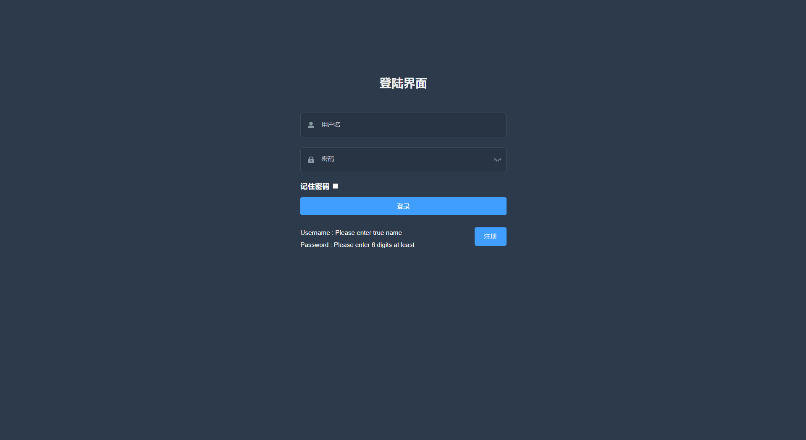

# 研究生小组周报系统开发

本系统开发用于研究生小组每周组会汇报使用

* 周报前台：提交当周周报、展示个人所有周报、各周所有周报
* 周报后台：增加修改、删除周报功能、草稿箱功能、用户管理功能
* 后端：实现周报内容、用户信息、照片、文件增删改查功能

作用：用于研究生小组汇报，可有效提高组会探讨效率

## 一、周报前台

### 1.1 技术选型

周报前台页面基于Vue2 + ElementUI + mavonEditor + axios开发

### 1.2 具体实现

#### 1.2.1 初始化

#### 1.2.2 路由跳转与权限

#### 1.2.3 注册与登录


#### 1.2.4 组件使用


#### 1.2.5 mavonEditor使用


## 二、周报后台

### 2.1 技术选型

周报后台管理系统选用Vue-admin-template中后台框架，基于Vue2 + elementUI + mavonEditor + axios + vueX开发

### 2.2 具体实现




## 三、周报后端

### 3.1 技术选型

周报后端基于node.js，采用express + mysql开发，使用joi设置验证规则，cors解决跨域，express-jwt解析token等

### 3.2 具体实现

#### 3.2.1 express框架

Express是一个最小的，灵活的Node.js Web应用程序框架，它提供了一套强大的功能来开发Web和移动应用程序，有助于基于Node.js的Web应用程序的快速开发。

Express框架的核心功能是：

1. 允许设立中间件响应HTTP请求
2. 定义了用于执行基于HTTP方法和URL不同动作的路由表
3. 允许动态渲染基于参数传递给模板HTML页面

实现流程：

1. 安装

`$ npm install -g express-generator`

2. 创建express框架

` $ express xxx`

3. 在app.js中创建express应用

```js

const express = require('express')
const app = express()

app.listen(3000, console.log('server is running on port 3000'))
```

#### 3.2.2 MySQL

[node.js对数据库mysql的连接与操作（增、删、改、查、五种SQL语法）](https://blog.csdn.net/2301_76669854/article/details/138500828)

数据库连接：

```js
const mysql = require('mysql')
const db = mysql.createPool({
    // host: '127.0.0.1',
    host:'localhost',
    user:'root',
    password:'xxxx',
    database:'my_db_01'
})

db.getConnection((err, connection) => {
    if (err) {
        console.error('Error connecting to MySQL database: '+err.stack);
        return;
    }  
    console.log('Connected to MySQL database with connection id: '+connection.threadId);
    connection.release();
});

module.exports = db
```

数据库操作：

```js
//获取当前用户信息
exports.getUserInfo = (req, res) => {
  db.query(
    "select id, username, nickname, email, user_pic from ev_users where id=?",
    req.user.id,
    (err, results) => {
      if (err) returnres.cc(err);
      // 2. 执行 SQL 语句成功，但是查询到的数据条数不等于 1
      if (results.length!==1) returnres.cc("获取用户信息失败！");
      res.send({
        status:0,
        message:"获取用户基本信息成功！",
        data:results[0],
      });
    }
  );
};
```

#### 3.2.3 joi数据校验

joi是一个强大的数据校验模块，可以对数据进行格式和数据类型上的校验，支持正则表达式

常用验证规则：

1. string() 值必须是字符串
2. alphanum() 值只能是包含 a-zA-Z0-9 的字符串
3. min(length) 最小长度
4. max(length) 最大长度
5. required() 值是必填项，不能为 undefined
6. pattern(正则表达式) 值必须符合正则表达式的规则

登录验证示例：

```js
const joi = require('joi')

// 用户名的验证规则
const username = joi.string().min(1).max(10).required()
// 密码的验证规则
const password = joi.string().pattern(/^[\S]{6,12}$/).required()  
// dataUri() 指的是如下格式的字符串数据：
// data:image/png;base64,VE9PTUFOWVNFQ1JFVFM=
const avatar = joi.string().dataUri().required()

// 注册和登录表单的验证规则对象
exports.reg_login_schema = {  
  // 表示需要对 req.body 中的数据进行验证
  body: {
    username,
    password,
  },
}
// 验证规则对象 - 重置密码
exports.update_password_schema = {
  body: {
    // 使用 password 这个规则，验证 req.body.oldPwd 的值
    oldPwd:password,
    // 使用 joi.not(joi.ref('oldPwd')).concat(password) 规则，验证 req.body.newPwd 的值
    // 解读：
    // 1. joi.ref('oldPwd') 表示 newPwd 的值必须和 oldPwd 的值保持一致
    // 2. joi.not(joi.ref('oldPwd')) 表示 newPwd 的值不能等于 oldPwd 的值
    // 3. .concat() 用于合并 joi.not(joi.ref('oldPwd')) 和 password 这两条验证规则
    newPwd:joi.not(joi.ref('oldPwd')).concat(password),
  },
}
// 验证规则对象 - 更新头像
exports.update_avatar_schema = {
  body: {
    avatar,
  },
}
```

#### 3.2.4 cors跨域

```js
app.use((req, res, next) => {
    res.setHeader('Access-Control-Allow-Origin', '*')  //允许所有来源的请求
    res.header('Access-Control-Allow-Headers', 'Authorization,X-API-KEY, Origin, X-Requested-With, Content-Type, Accept, Access-Control-Request-Method')
    res.header('Access-Control-Allow-Methods', 'GET, POST, OPTIONS, PATCH, PUT, DELETE')
    res.header('Allow', 'GET, POST, PATCH, OPTIONS, PUT, DELETE')
    res.header("Access-Control-Allow-Credentials", "true");
    next();
});
```

#### 3.2.5 身份验证

express-jwt 是 Node.js 的一个开源库，是专用于 express 框架下解析 JWT 的中间件。

JWT 全称 JSON Web Token，是代替传统 session 认证的解决方案。其原理是服务端生成一个包含用户唯一标识的 JSON 对象，颁发给客户端。客户端请求需要权限的接口时，只要把这个 JSON 再原样发回给服务端，服务器通过解析就可识别用户。

这个 JSON 对象通过 `.` 分成三段，包含了请求头Header（加密算法）、负载信息Payload（如 userId、过期时间），还有通过服务端密钥生成的签名Signature来保证不被篡改。这种机制使服务端不再需要存储 Token，因此是非常轻量的用户认证方案。

1. JWT设置token

```js
const jwt = require("jsonwebtoken");

const tokenStr = jwt.sign(user, config.jwtSecretKey, {
  expiresIn:"10h", // token 有效期为 10 个小时
});
res.send({
  status: 0,
  message: "登录成功！",
  // 为了方便客户端使用 Token，在服务器端直接拼接上 Bearer 的前缀
  // Bearer 是一种身份验证方案类型（Authentication Scheme），Bearer 作为一个字符串附加到 Token 前面，构成了一种规范的表示方式，即 Bearer Token
  token: "Bearer " + tokenStr,
  user
});
```

2. express-jwt解析token

```js
const expressJWT = require('express-jwt')
// 使用 .unless({ path: [/^\/api\//] }) 指定哪些接口不需要进行 Token 的身份认证
app.use(expressJWT({ secret:config.jwtSecretKey }).unless({ path: [/^\/api\//] }))
```

3. 验证错误

```js
// 配置验证错误中间件
app.use(function (err, req, res, next) {
    // 数据验证失败
    if (errinstanceofjoi.ValidationError) returnres.send(err)
    if (err.name==='UnauthorizedError') returnres.send('身份认证失败！')
    // 未知错误
    res.send(err)
  })
```
