# 基于混合现实的产品设计方案可视化验证系统开发

## 一、系统设计与实现

### 1.1 设计背景与意义

在产品的设计研发过程中，对产品的有效验证与分析评价不可或缺，其决定着产品迭代优化频率及效果与真实用户体验质量，通过合适的可视化产品分析和验证工具可以有效进行信息的快速整合，检查设计是否符合需求，并帮助技术人员做出妥善的决策。

目前的个性化定制产品设计过程中存在着性能试验验证和设计方案评价成本高昂、实体验证效率低、缺乏有效的可视化验证手段和评价技术造成的主体满意度低、参数反馈不准确、分析评价不全面等问题。

目前三维可视化技术中，混合现实技术可以在物理规律的作用下将虚拟模型与真实空间叠加，实地构造出逼真的模拟场景。除了仿真度高以外，目前的一些混合现实设备在人机交互上已经足够自然而有效，用户可以随时访问自己感兴趣的内容，并且可以自由地和虚拟模型交互。将智能设计的评价验证阶段和当前的混合现实技术有效结合能将三维交互可视化的优势发挥出来，从而提高定制产品设计生产效率和质量。

此项目从多层次、多模块、多领域来设计仿真分析流程和验证仿真结果，针对特定型号的电力机车进行设计优化，内容涉及到列车有限元仿真、虚拟装配等多个领域，分模块进行仿真验证评价。

### 1.2 系统功能设计

系统可实现功能如图1-1所示，主要分为两个模块：

* 有限元仿真指标的可视化验证
* 虚拟装配验证与结果评价

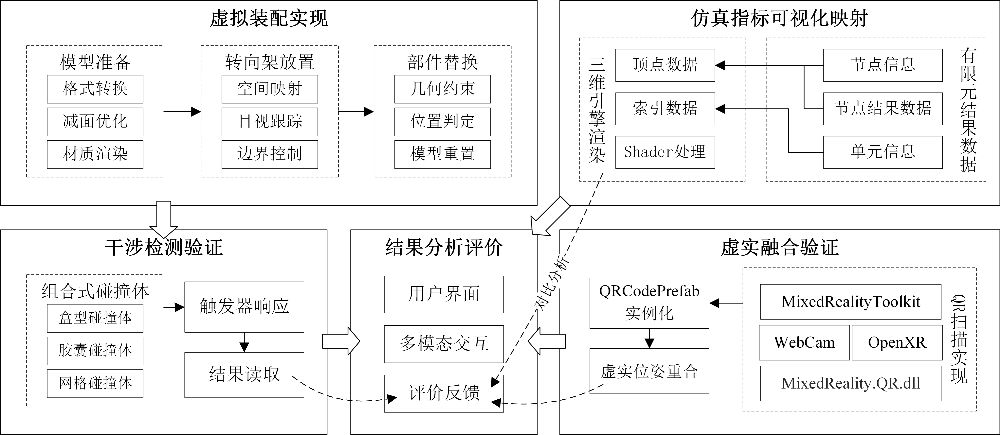

图1‑1 系统功能技术路线图

#### 1.2.1 主要功能

有限元仿真指标的可视化验证中，系统应具有以下功能：

（1）仿真指标的三维可视化映射。在混合现实环境中，将有限元仿真结果转换为三维的全息影像，以三维立体的形式呈现有限元结果信息，给用户带来更加逼真和沉浸的混合现实体验。

（2）虚实融合验证。通过混合现实设备的摄像头对周围环境中的 QR 码进行扫描检测，从而在每个二维码的真实位置建立坐标系统，并将虚拟物体与二维码进行相对定位，实现虚拟物体与现实物体的重合，提供更加真实的可视化验证手段。

虚拟装配验证与结果评价中，系统应具有以下功能：

（1）装配模型的准备。在混合现实设备中，结合真实的空间环境，对转向架及替换零件模型进行真实的光照烘培和材质渲染，使得用户可以任意角度的观察转向架的整体构造和各个替换零件的具体细节。

（2）转向架虚拟放置。通过混合现实的空间映射将转向架放置在真实环境中的桌面或地面上，进一步增加模型的真实感。

（3）模型装配替换。通过手势交互实现替换模型的移动，并通过添加约束实现模型的装配。

（4）干涉检测验证。在模型装配到正确位置后，通过组合式碰撞体检测替换模型和转向架其他零部件之间是否发生干涉，并给出相应提示。

除了以上各自的功能外，系统整体还应具有以下功能：

（1）二维用户界面与模型管理。为用户提供触发相应事件的入口按钮，管理所有三维模型的显示与隐藏，并提供评价反馈窗口用以记录结果。

（2）与虚拟物体的多模态交互。通过MRTK实现易于理解与使用的交互方式，如手势交互、凝视交互、语音输入等，使用户的验证和分析评价过程更加流畅。

### 1.3 总体框架

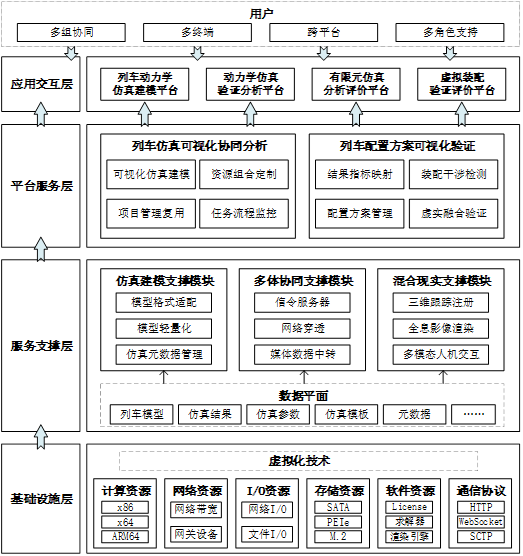

## 二、有限元仿真指标可视化验证模块功能

### 2.1 仿真结果可视化映射功能

**数据映射**

实现三维全息影像的前提是在应用程序中创建三维实体模型，而在三维可视化引擎Unity3D中，每个三维实体都必须包含MeshFilter和MeshRenderer组件，MeshFilter组件用于定义模型网格，MeshRenderer组件实现网格的渲染。模型网格的获取方法可以是直接导入从其他建模软件中绘制好的三维模型，也可以利用C#脚本进行自定义绘制。其中，直接导入模型再添加贴图的方式无法保证结果数据对应节点的准确映射，因此采用自定义绘制网格的方式来完成三维模型的实体化，将结果数值转化为顶点颜色值，如图2-1所示，最终渲染到三维模型上的对应位置。

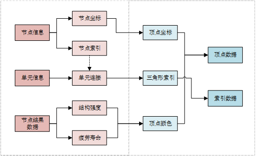

图2-1 数据转换

**模型渲染**

Unity3D的渲染工作流程一共分为三个阶段：应用程序阶段、几何阶段、光栅化阶段。CPU负责执行应用程序阶段，GPU负责几何阶段与光栅化阶段，渲染流程如图2-2。

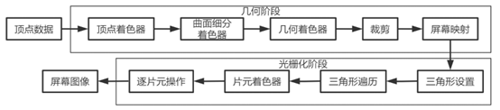

图2-2 模型渲染流程

为实现模型的有效渲染，需要确保顶点颜色传入Shader中并选取合适的光照模型。本项目选取MRTK中提供的Standard Shader，并勾选顶点颜色选项，使自定义的顶点颜色数据可以通过GPU进行对应的渲染，获得的疲劳寿命云图示例如图2-3所示。

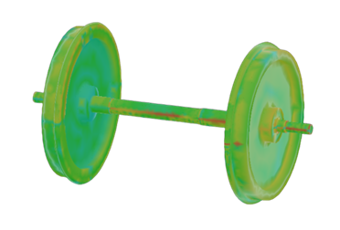

图2-3 轮对疲劳寿命云图

### 2.2 虚实融合验证功能

有限元结果云图与转向架实物的虚实融合验证采用QR码跟踪的方式实现，通过混合现实设备的摄像头对周围环境中的 QR 码进行扫描检测，从而在每个二维码的真实位置建立坐标系统，并将虚拟物体与二维码进行相对定位，实现虚拟物体与现实物体的重合。

在启动虚实融合模块时，二维码扫描器初始化，与混合现实设备的摄像头进行通信，并准备好接收图像流，并在应用执行时通过该DLL进行视频流中QR码的检测与识别。识别到二维码后，就可以获得该二维码的位置和姿态，以及对其携带的文本、URL或其他信息数据进行解码，并通过QRCodePrefab预制件的实例化对其坐标及信息进行可视化，如图2-4所示。

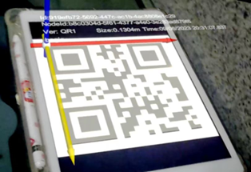

图2-4 QR码识别

将虚拟的轮对模型定位到转向架实体的对应位置后，就可以将可视化结果展示在实物上，实现虚实融合的效果，如图2-5所示。

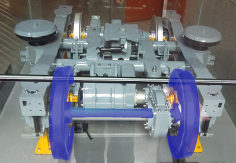

图2-5 可视化结果虚实融合

## 三、虚拟装配验证与结果评价模块功能

### 3.1 虚拟装配替换功能

通过对基于几何的约束方法的利用，实现当手势移动替换零部件模型靠近原零部件模型时的自动装配替换，流程如图3-1所示。

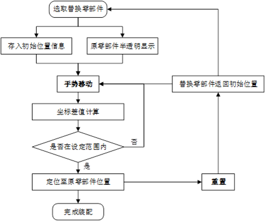

图3-1 装配流程

### 3.2 转向架虚拟放置功能

虚拟物体放置功能利用混合现实设备的空间映射技术，当空间映射功能开启时，系统会不断地扫描周围的环境并快速更新空间网格信息来感知到现实物体，从而为虚拟物体提供它们被放置的物体表面信息。

在HoloLens2中使用空间映射时，通过MRTK中的 Spatial Mesh Observer 对象获取空间信息，将凝视射线投射在空间映射网格的位置坐标赋值给场景内的虚拟物体对象，使虚拟物体在真实空间映射的网格中跟随视线的移动而移动，实现虚拟物体在真实物体表面的移动和放置，放置结果如图3-2所示。

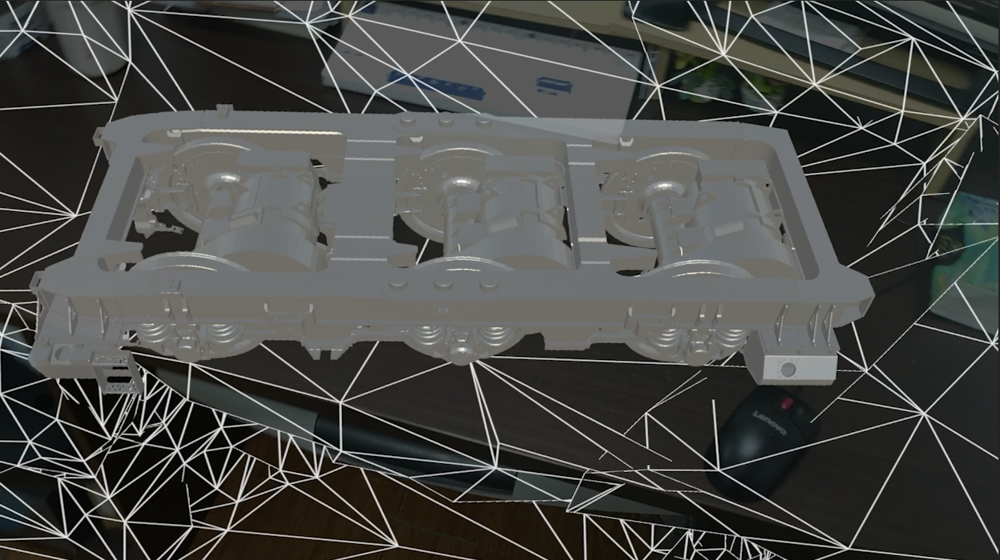

图3-2 转向架虚拟放置示意图

### 3.3 干涉检测验证功能

**组合式干涉检测**

在虚拟装配完成后，需要对替换零部件和转向架其他零部件进行干涉检测。Unity3D中基本碰撞体结构简单，干涉检测效率相较于其他碰撞体有明显优势，但是因其结构简单而导致包围盒包裹性较差。网格碰撞体虽然可以通过零部件的形状构建包裹性极强的包围盒，但是其干涉检测性能消耗大。因此，针对转向架零部件替换对零部件干涉检测的要求，使用组合式检测方法处理零部件之间的干涉检测。

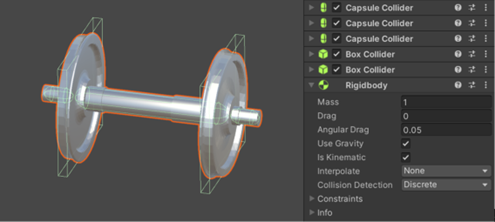

图3-3 轮对模型组合式碰撞体

**干涉检测实现**

根据Unity3D中虚拟物体之间干涉检测的实现原理与方法，结合组合式干涉检测方法，虚拟装配方案通过干涉检测进行验证的简化流程如图3-4所示，实现效果如图3-5所示。

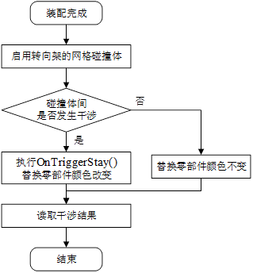

图3-4 干涉检测流程

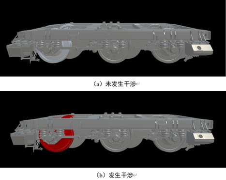

图3-5 干涉检测示例

## 四、用户交互设计

在HoloLens2中，用户手部被识别并理解为左右手关节骨架模型，在食指上放置一个碰撞体，如图4-1所示。

通过对用户手部进行实时扫描识别获取到用户的手势，可以通过手势进行按下按钮、点击对象、滚动菜单以及对虚拟物体进行移动、缩放、旋转等自然的操作。

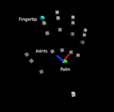

图4-1 HoloLens2 右手关节模型

### 4.1 二维交互界面

**二维面板**

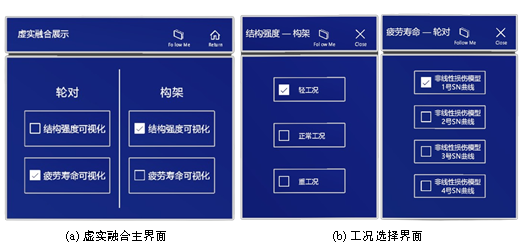

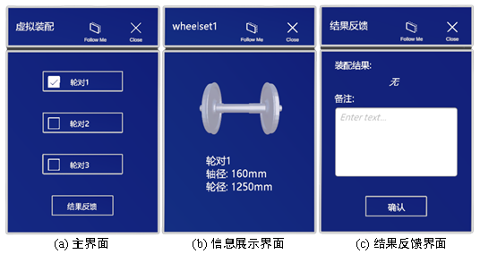

**手部菜单**

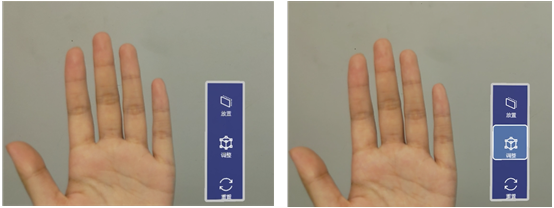

**应用栏**

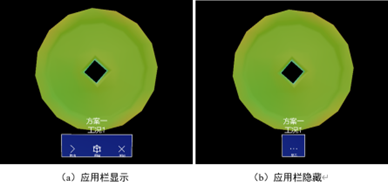

### 4.2 三维对象交互

**边界框**

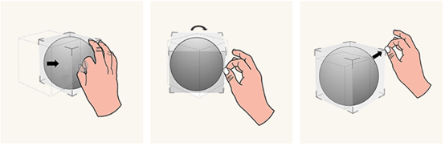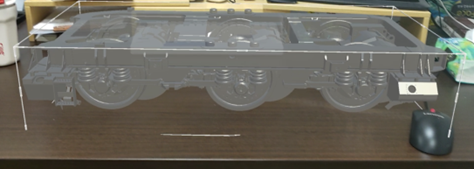
